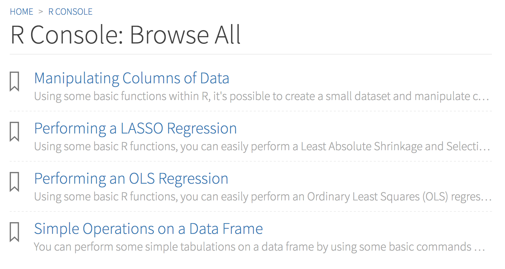

# STT5100 Modèles Linéaires Appliqués (Hiver 2019)

Arthur Charpentier, [@freakonometrics](https://twitter.com/freakonometrics)

Pour plus d'information : [https://freakonometrics.hypotheses.org](https://freakonometrics.hypotheses.org/category/courses/stt5100)

Plan de cours : [Plan_STT5100_H2019.pdf](docs/Plan%20STT5100%20H2019.pdf)

Démonstrateur : *a confirmer*

```diff
- (12 Fev. 2019) les instructions pour le premier devoir sont en ligne et mises a jour
```

**Références** 
* William H. Greene, 2011, Econometric Analysis, [Prentice Hall](http://www.prenhall.com/greene/)
* Colin Cameron & Pravin K. Trivedi, 2013, Regression Analysis of Count Data, [Cambridge University Press](http://faculty.econ.ucdavis.edu/faculty/cameron/racd/count.html)
* Christoph Hanck, Martin Arnold, Alexander Gerber & Martin Schmelzer, 2018, Introduction to Econometrics with R, [https://econometrics-with-r.org/](https://www.econometrics-with-r.org/)
* Julian, J. Faraway, 2002, Practical Regression and Anova using R, [CRAN](https://cran.r-project.org/doc/contrib/Faraway-PRA.pdf)
* James H. Stock & Mark W. Watson, 2007, Introduction to Econometrics, [Addison Wesley](https://www.pearson.com/us/higher-education/product/Stock-Introduction-to-Econometrics-3rd-Edition/9780138009007.html)
* Achim Zeileis, 2008, Applied Econometrics with R, [Springer Verlag](https://eeecon.uibk.ac.at/~zeileis/teaching/AER/index.html)
* Yihui Xie, J. J. Allaire & Garrett Grolemund, R Markdown: The Definitive Guide [https://bookdown.org/yihui/rmarkdown/](https://bookdown.org/yihui/rmarkdown/)

**Notes de cours (2014 et 2017)**
*  introduction : [STT5100_part_1.pdf](docs/STT5100_part_1.pdf)

**Projets**
* Modeles de régression - OLS : [devoir1.md](code/STT5100-H2019-devoir1.md)
* Regression logistique - GLM : [devoir2.md](code/STT5100-H2019-devoir2.md)

**Examens passés**
(il s'agit d'un "nouveau cours" du programme : le premier a été donné à l'automne 2018)
* OLS énoncé hiver 2012 [H2012E.pdf](https://github.com/freakonometrics/STT5100/archives/A2018/raw/master/act6410-h2012-enonce.pdf) [csv](http://freakonometrics.blog.free.fr/public/data/basket-exam-v2.csv) pas d'annexes, désolé
* OLS _correction_ hiver 2012 [H2012C.pdf](https://github.com/freakonometrics/STT5100/archives/A2018/raw/master/act6410-h2012-correc.pdf)
* OLS énoncé automne 2012 [A2012E.pdf](https://github.com/freakonometrics/STT5100/archives/A2018/raw/master/act6410-a2012-enonce.pdf)
* OLS _correction_ automne 2012 [A2012C.pdf](https://github.com/freakonometrics/STT5100/archives/A2018/raw/master/act6410-a2012-correc.pdf)
* OLS énoncé automne 2018 [A2018-1E.pdf](devoirs/Exam_STT5100_Aut_2018_intra-A.pdf)
* OLS _correction_ automne 2018 [A2018-1C.pdf](devoirs/Exam_STT5100_Aut_2018_intra-A-correction.pdf)
* GLM énoncé 2013 [2013E.pdf](https://github.com/freakonometrics/STT5100/raw/master/archives/A2018/act2040-2013-enonce.pdf) [Annexes](https://f-origin.hypotheses.org/wp-content/blogs.dir/253/files/2013/03/EXAMEN-INTRA-annexe-2040-H2013.pdf)
* GLM _correction_ 2013 [2013C.pdf](https://github.com/freakonometrics/STT5100/raw/master/archives/A2018/act2040-2013-correc.pdf)
* GLM énoncé automne 2018 [A2018-2E.pdf](devoirs/Examen_STT5100_Aut_2018_final-correction.pdf)
* GLM _correction_ automne 2018 [A2018-2C.pdf](devoirs/Examen_STT5100_Aut_2018_final.pdf)

**Exam S - CAS**
* page "study tools" [https://casact.org/examS/](https://www.casact.org/admissions/studytools/examS/)

**Exam SRM - SOA**
* ACTEX "study notes" (sample) [https://actexmadriver.com/samples/ACTEX_SRM.pdf](https://www.actexmadriver.com/samples/ACTEX_SRM-ACT-18FSMP-E_sample_6-27-18.pdf)

**R Toolbox - SOA**
* page "R console" [https://actuarialtoolkit.soa.org/](https://actuarialtoolkit.soa.org/tool/r-console/learn-more)



**Seances**

"It's not magic; it's code", [Ben Welsh](https://source.opennews.org/articles/how-we-found-new-patterns-la-homeless-arrest/).
Install [R](https://cran.r-project.org/) and [Rstudio](https://www.rstudio.com/products/rstudio/download/). 

1. Motivation et rappels (probabilités et statistiques) [STT5100-0.md](code/STT5100-0.md) et [STT5100-0.Rmd](code/STT5100-0.Rmd)
2. Le modele linéaire simple 
3. Le modele linéaire multiple [STT5100-1.md](code/STT5100-H2019-1.md) et [STT5100-1.Rmd](code/STT5100-H2019-1.Rmd)
4. Le modele linéaire multiple
5. Incertitude dans le modele lineaire  [STT5100-2.md](code/STT5100-H2019-2.md) et [STT5100-2.Rmd](code/STT5100-H2019-2.Rmd)
6. Choix de modeles, tests statistiques et significativite [STT5100-3.md](code/STT5100-H2019-3.md)
7. Regression locale et lissage
8. **Examen Intra**
9. Regression logistique
10. Regression logistique 
11. Regression de Poisson 
12. Regression de Poisson 
13. GLM - Modeles Lineaires Generalises
14. GLM - Modeles Lineaires Generalises
15. **Examen Final**

**Exercices**

**"Curve Fitting"**


[https://xkcd.com/2048/](https://xkcd.com/2048/)
