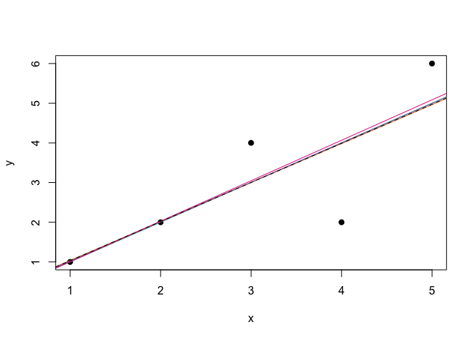
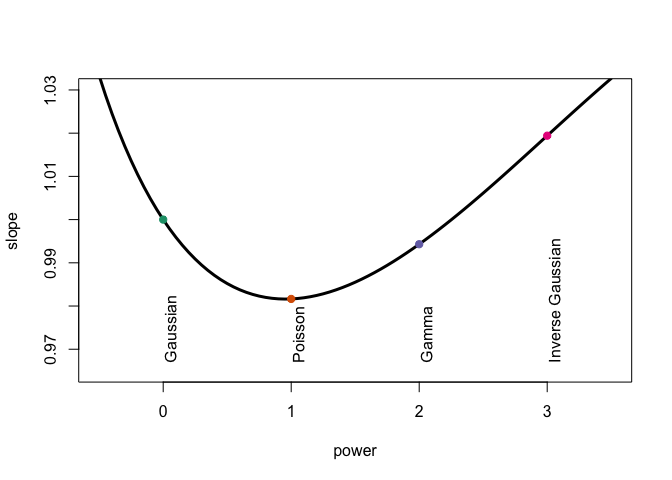
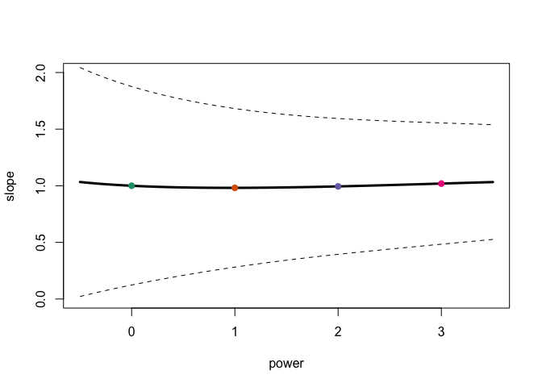

STT5100 \#10 - GLM
================
Arthur Charpentier

``` r
x <- c(1,2,3,4,5)
y <- c(1,2,4,2,6)
base <- data.frame(x,y)
regN <- lm(y~x,data=base)
regNId <- glm(y~x,family=gaussian(link="identity"),data=base)
regNlog <- glm(y~x,family=gaussian(link="log"),data=base)
regPId <- glm(y~x,family=poisson(link="identity"),data=base)
regPlog <- glm(y~x,family=poisson(link="log"),data=base)
regGId <- glm(y~x,family=Gamma(link="identity"),data=base)
regGlog <- glm(y~x,family=Gamma(link="log"),data=base)
regIGId <- glm(y~x,family=inverse.gaussian(link="identity"),data=base)
regIGlog <- glm(y~x,family=inverse.gaussian(link="log"),data=base)
library(statmod)
regTwId <- glm(y~x,family=tweedie(var.power=1.5,link.power=1),data=base)
regTwlog <- glm(y~x,family=tweedie(var.power=1.5,link.power=0),data=base)
```

``` r
summary(regN)
```

    ## 
    ## Call:
    ## lm(formula = y ~ x, data = base)
    ## 
    ## Residuals:
    ##          1          2          3          4          5 
    ## -5.551e-17  2.049e-16  1.000e+00 -2.000e+00  1.000e+00 
    ## 
    ## Coefficients:
    ##              Estimate Std. Error t value Pr(>|t|)
    ## (Intercept) 1.986e-15  1.483e+00   0.000    1.000
    ## x           1.000e+00  4.472e-01   2.236    0.111
    ## 
    ## Residual standard error: 1.414 on 3 degrees of freedom
    ## Multiple R-squared:  0.625,  Adjusted R-squared:    0.5 
    ## F-statistic:     5 on 1 and 3 DF,  p-value: 0.1114

``` r
summary(regNId)
```

    ## 
    ## Call:
    ## glm(formula = y ~ x, family = gaussian(link = "identity"), data = base)
    ## 
    ## Deviance Residuals: 
    ##  1   2   3   4   5  
    ##  0   0   1  -2   1  
    ## 
    ## Coefficients:
    ##              Estimate Std. Error t value Pr(>|t|)
    ## (Intercept) 1.986e-15  1.483e+00   0.000    1.000
    ## x           1.000e+00  4.472e-01   2.236    0.111
    ## 
    ## (Dispersion parameter for gaussian family taken to be 2)
    ## 
    ##     Null deviance: 16  on 4  degrees of freedom
    ## Residual deviance:  6  on 3  degrees of freedom
    ## AIC: 21.101
    ## 
    ## Number of Fisher Scoring iterations: 2

``` r
cbind(coefficients(regNId),coefficients(regPId),coefficients(regGId),coefficients(regIGId),coefficients(regTwId))
```

    ##                     [,1]       [,2]       [,3]        [,4]       [,5]
    ## (Intercept) 1.986027e-15 0.05508318 0.02707408 -0.01245022 0.04517992
    ## x           1.000000e+00 0.98163894 0.99430419  1.01941679 0.98551315

``` r
library(RColorBrewer)
darkcols = brewer.pal(8, "Dark2")
plot(x,y,pch=19)
abline(regNId,col=darkcols[1])
abline(regPId,col=darkcols[2])
abline(regGId,col=darkcols[3])
abline(regIGId,col=darkcols[4])
abline(regTwId,lty=2)
```



``` r
pente=function(gamma) summary(glm(y~x,family=tweedie(var.power=gamma,link.power=1),data=base))$coefficients[2,1:2]
Vgamma = seq(-.5,3.5,by=.05)
Vpente = Vectorize(pente)(Vgamma)
plot(Vgamma,Vpente[1,],type="l",lwd=3,ylim=c(.965,1.03),xlab="power",ylab="slope")
text(0,.967,"Gaussian",srt=90,pos=4)
text(1,.967,"Poisson",srt=90,pos=4)
text(2,.967,"Gamma",srt=90,pos=4)
text(3,.967,"Inverse Gaussian",srt=90,pos=4)
for(i in 0:3) points(i,pente(i)[1],pch=19,col=darkcols[i+1])
```



``` r
plot(Vgamma,Vpente[1,],ylim=c(0,2),type="l",lwd=3,xlab="power",ylab="slope")
lines(Vgamma,Vpente[1,]+1.96*Vpente[2,],lty=2)
lines(Vgamma,Vpente[1,]-1.96*Vpente[2,],lty=2)
for(i in 0:3) points(i,pente(i)[1],pch=19,col=darkcols[i+1])
```



``` r
plot(x,y,pch=19)
u=seq(.8,5.2,by=.01)
lines(u,predict(regNlog,newdata=data.frame(x=u),type="response"),col=darkcols[1])
lines(u,predict(regPlog,newdata=data.frame(x=u),type="response"),col=darkcols[2])
lines(u,predict(regGlog,newdata=data.frame(x=u),type="response"),col=darkcols[3])
lines(u,predict(regIGlog,newdata=data.frame(x=u),type="response"),col=darkcols[4])
lines(u,predict(regTwlog,newdata=data.frame(x=u),type="response"),lty=2)
```


``` r
pente=function(gamma) summary(glm(y~x,family=tweedie(var.power=gamma,link.power=1),data=base))$coefficients[2,1:2]
pente=function(gamma) summary(glm(y~x,family=tweedie(var.power=gamma,link.power=1),data=base))$coefficients[2,1:2]

pente=function(gamma) summary(glm(y~x,family=tweedie(var.power=gamma,link.power=0),data=base))$coefficients[2,1:2]
Vpente = Vectorize(pente)(Vgamma)
plot(Vgamma,Vpente[1,],type="l",lwd=3,ylim=c(.3,.48),xlab="power",ylab="slope")
text(0,.3,"Gaussian",srt=90,pos=4)
text(1,.3,"Poisson",srt=90,pos=4)
text(2,.3,"Gamma",srt=90,pos=4)
text(3,.3,"Inverse Gaussian",srt=90,pos=4)
for(i in 0:3) points(i,pente(i)[1],pch=19,col=darkcols[i+1])
```


``` r
plot(Vgamma,Vpente[1,],ylim=c(0,.8),type="l",lwd=3,xlab="power",ylab="slope")
lines(Vgamma,Vpente[1,]+1.96*Vpente[2,],lty=2)
lines(Vgamma,Vpente[1,]-1.96*Vpente[2,],lty=2)
for(i in 0:3) points(i,pente(i)[1],pch=19,col=darkcols[i+1])
```


Error for the first observation

``` r
erreur=function(gamma) predict(glm(y~x,family=tweedie(var.power=gamma,link.power=1),data=base),newdata=data.frame(x=1),type="response")-y[x==1] 
Verreur = Vectorize(erreur)(Vgamma)
plot(Vgamma,Verreur,type="l",lwd=3,ylim=c(-.1,.04),xlab="power",ylab="error")
abline(h=0,lty=2)
text(0,-.1,"Gaussian",srt=90,pos=4)
text(1,-.1,"Poisson",srt=90,pos=4)
text(2,-.1,"Gamma",srt=90,pos=4)
text(3,-.1,"Inverse Gaussian",srt=90,pos=4)
for(i in 0:3) points(i,erreur(i)[1],pch=19,col=darkcols[i+1])
```


``` r
erreur=function(gamma) predict(glm(y~x,family=tweedie(var.power=gamma,link.power=0),data=base),newdata=data.frame(x=1),type="response")-y[x==1] 
Verreur = Vectorize(erreur)(Vgamma)
plot(Vgamma,Verreur,type="l",lwd=3,ylim=c(.001,.32),xlab="power",ylab="error")
text(0,.001,"Gaussian",srt=90,pos=4)
text(1,.001,"Poisson",srt=90,pos=4)
text(2,.001,"Gamma",srt=90,pos=4)
text(3,.001,"Inverse Gaussian",srt=90,pos=4)
for(i in 0:3) points(i,erreur(i)[1],pch=19,col=darkcols[i+1])
```


