STT5100 \#3 - Regression Lineaire
================
Arthur Charpentier

``` r
data(cars)
```

## Hypotheses du Modele Lineaire

\[
(y_i=\boldsymbol{x}_i^{\text{T}}\boldsymbol{\beta}+\varepsilon_i=\beta_0 + [\beta_1 x_{1,i}+\cdots+
\beta_k x_{k,i}]+\varepsilon_i)
\] Cf <a href=https://en.wikipedia.org/wiki/Linear_regression>linear
model</a></span>, avec \(\varepsilon_i\sim\mathcal{N}(0,\sigma^2)\)
i.id.

\[
(Y\vert \boldsymbol{X}=\boldsymbol{x})\sim
\mathcal{N}(\boldsymbol{x}^{\text{T}}\boldsymbol{\beta},
\sigma^2)
\] i.e. \[
\mathbb{E}[Y\vert\boldsymbol{X}=\boldsymbol{x}]=\boldsymbol{x}^{\text{T}}\boldsymbol{\beta}
\] and homoscedastic model, \[
\text{Var}[Y\vert\boldsymbol{X}=\boldsymbol{x}]=\sigma^2
\]

Least squares (and maximum likelihood) estimator \[
\widehat{\boldsymbol{\beta}}=\text{argmin}
\left\lbrace
\sum_{i=1}^n (y_i-\boldsymbol{x}_i^{\text{T}}\boldsymbol{\beta})^2
\right\rbrace
=(\boldsymbol{X}^{\text{T}}\boldsymbol{X})^{-1}\boldsymbol{X}^{\text{T}}\boldsymbol{y}\]

``` r
plot(cars)
```

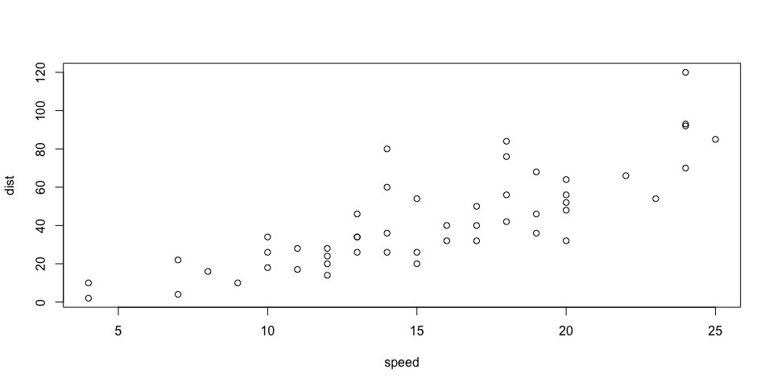

``` r
model <- lm(dist ~ speed, data=cars)
```

``` r
summary(model)
```

    ## 
    ## Call:
    ## lm(formula = dist ~ speed, data = cars)
    ## 
    ## Residuals:
    ##     Min      1Q  Median      3Q     Max 
    ## -29.069  -9.525  -2.272   9.215  43.201 
    ## 
    ## Coefficients:
    ##             Estimate Std. Error t value Pr(>|t|)    
    ## (Intercept) -17.5791     6.7584  -2.601   0.0123 *  
    ## speed         3.9324     0.4155   9.464 1.49e-12 ***
    ## ---
    ## Signif. codes:  0 '***' 0.001 '**' 0.01 '*' 0.05 '.' 0.1 ' ' 1
    ## 
    ## Residual standard error: 15.38 on 48 degrees of freedom
    ## Multiple R-squared:  0.6511, Adjusted R-squared:  0.6438 
    ## F-statistic: 89.57 on 1 and 48 DF,  p-value: 1.49e-12

``` r
X=cbind(1,cars$speed)
Y=cars$dist
solve(crossprod(X,X),crossprod(X,Y))
```

    ##            [,1]
    ## [1,] -17.579095
    ## [2,]   3.932409

``` r
model$coefficients
```

    ## (Intercept)       speed 
    ##  -17.579095    3.932409

``` r
summary(model)$sigma^2*solve(crossprod(X,X))
```

    ##           [,1]       [,2]
    ## [1,] 45.676514 -2.6588234
    ## [2,] -2.658823  0.1726509

``` r
vcov(model)
```

    ##             (Intercept)      speed
    ## (Intercept)   45.676514 -2.6588234
    ## speed         -2.658823  0.1726509

``` r
n=nrow(cars)
```

``` r
confint(model)
```

    ##                  2.5 %    97.5 %
    ## (Intercept) -31.167850 -3.990340
    ## speed         3.096964  4.767853

``` r
model$coefficients[1]+qt(c(.025,.975),n-2)* summary(model)$coefficients[1,2]
```

    ## [1] -31.16785  -3.99034

<a href=https://en.wikipedia.org/wiki/Coefficient_of_determination>coefficient
of determination</a></span>
\(\displaystyle{R^2 = \frac{\text{explained variance}}{\text{total variance}}}\)

``` r
summary(model)$r.squared
```

    ## [1] 0.6510794

``` r
1-deviance(model)/sum((Y-mean(Y))^2)
```

    ## [1] 0.6510794

\[
\text{Var}[Y]=
\text{Var}[\mathbb{E}[Y\vert X]]+
\mathbb{E}[\text{Var}[Y\vert X]]
\]

see <a href=https://en.wikipedia.org/wiki/Analysis_of_variance>analysis
of variance</a></span>

\[
\overline{r}^2 = 
1-[1-R^2]\cdot \frac{n-1}{n-(k-1)-1}
\]

``` r
summary(model)$adj.r.squared
```

    ## [1] 0.6438102

``` r
anova(lm(dist~speed,data=cars),lm(dist~1,data=cars))
```

    ## Analysis of Variance Table
    ## 
    ## Model 1: dist ~ speed
    ## Model 2: dist ~ 1
    ##   Res.Df   RSS Df Sum of Sq      F   Pr(>F)    
    ## 1     48 11354                                 
    ## 2     49 32539 -1    -21186 89.567 1.49e-12 ***
    ## ---
    ## Signif. codes:  0 '***' 0.001 '**' 0.01 '*' 0.05 '.' 0.1 ' ' 1

``` r
plot(cars)
abline(model,col="red")
```


``` r
plot(cars)
abline(model,col="red")
x=seq(2,26)
y=predict(model, newdata=data.frame(speed=x))
lines(x,y,lwd=2,col="blue")
```

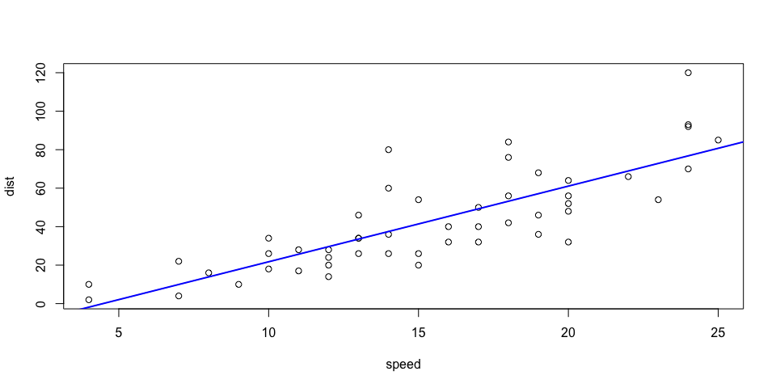

``` r
y=predict(model, newdata=data.frame(speed=x), interval = "confidence")
head(y)
```

    ##         fit        lwr       upr
    ## 1 -9.714277 -21.733068  2.304513
    ## 2 -5.781869 -17.026591  5.462853
    ## 3 -1.849460 -12.329543  8.630624
    ## 4  2.082949  -7.644150 11.810048
    ## 5  6.015358  -2.973341 15.004056
    ## 6  9.947766   1.678977 18.216556

\[
\text{Var}[\widehat{Y}(\boldsymbol{x})]=\text{Var}[\boldsymbol{x}^{\text{T}}\widehat{\boldsymbol{\beta}}]=\boldsymbol{x}^{\text{T}}\text{Var}[\widehat{\boldsymbol{\beta}}]\boldsymbol{x}
=\widehat{\sigma}^2 \boldsymbol{x}^{\text{T}}[\boldsymbol{X}^{\text{T}}\boldsymbol{X}]^{-1}\boldsymbol{x}
\]

``` r
plot(cars)
polygon(c(x,rev(x)),c(y[,2],rev(y[,3])),col=rgb(0,0,1,.4),border=NA)
lines(x,y[,1],lwd=2,col="blue")
```

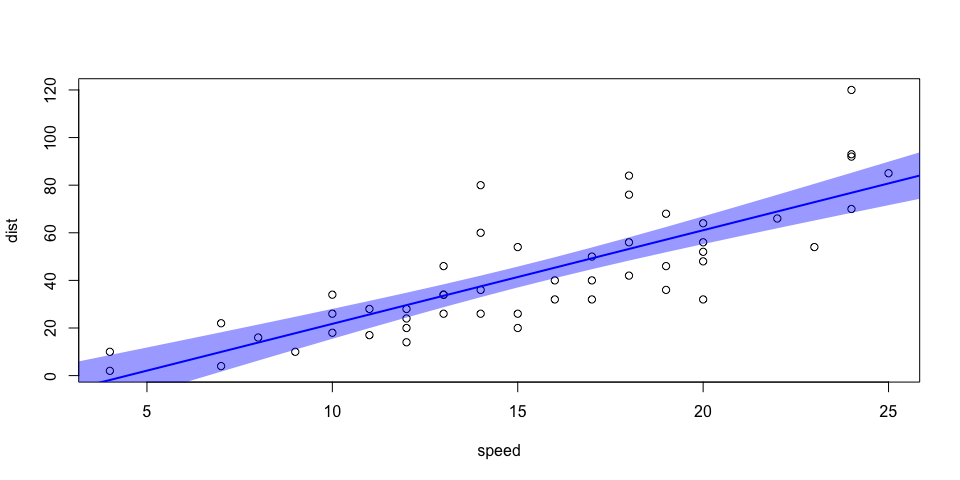

## Incertitude dans le modele lineaire

Method 1

``` r
Y=matrix(NA,1000,length(x))
for(b in 1:1000){
  idx <- sample(1:nrow(cars),size=nrow(cars),replace=TRUE)
  modelb <- lm(dist ~ speed, data=cars[idx,])
  Y[b,] <- predict(modelb, newdata=data.frame(speed=x))
}
```

See
<a href=https://en.wikipedia.org/wiki/Bootstrapping_(statistics)>bootstrap</a></span>,
based on pseudo-sample \[
\lbrace(\boldsymbol{x}_{i_1},y_{i_1}),
\cdots,(\boldsymbol{x}_{i_n},y_{i_n})
\rbrace
\] where \((i_1,\cdots,i_n)\in\lbrace 1,2,\cdots,n\rbrace\).

``` r
plot(cars)
for(b in 1:100) lines(x,Y[b,],col=rgb(0,0,1,.4))
```


``` r
plot(cars)
lines(x,apply(Y,2,mean),col="blue",lwd=2)
lines(x,apply(Y,2,function(x) quantile(x,.025)),col="red",lty=2)
lines(x,apply(Y,2,function(x) quantile(x,.975)),col="red",lty=2)
```

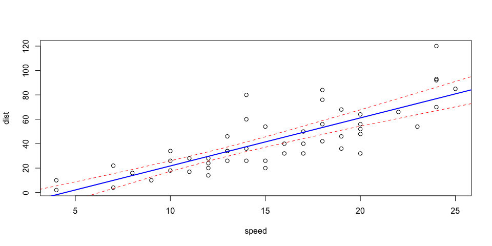

Method 2

``` r
pred_dist=predict(model)
epsilon  =residuals(model)
Y=matrix(NA,1000,length(x))
for(b in 1:1000){
  idx <- sample(1:nrow(cars),size=nrow(cars),replace=TRUE)
  carsb=data.frame(speed=cars$speed,
                   dist=pred_dist+epsilon[idx])
  modelb <- lm(dist ~ speed, data=carsb)
  Y[b,] <- predict(modelb, newdata=data.frame(speed=x))
}
```

See
<a href=https://en.wikipedia.org/wiki/Bootstrapping_(statistics)>bootstrap</a></span>,
based on pseudo-sample \[
\lbrace(\boldsymbol{x}_{1},\widehat{y}_{1}+\widehat{\varepsilon}_{i_1}),
\cdots,(\boldsymbol{x}_{n},\widehat{y}_{n}+\widehat{\varepsilon}_{i_n})
\rbrace
\] where \((i_1,\cdots,i_n)\in\lbrace 1,2,\cdots,n\rbrace\).

``` r
plot(cars)
for(b in 1:100) lines(x,Y[b,],col=rgb(0,0,1,.4))
```


``` r
plot(cars)
lines(x,apply(Y,2,mean),col="blue",lwd=2)
lines(x,apply(Y,2,function(x) quantile(x,.025)),col="red",lty=2)
lines(x,apply(Y,2,function(x) quantile(x,.975)),col="red",lty=2)
```


``` r
plot(cars)
abline(model,col="red")
segments(cars$speed,cars$dist,cars$speed,predict(model),col="blue")
```


\#\# Moindre Carres ?

``` r
cars2=cars; cars2[,2]=cars[,2]/10
plot(cars2,ylab="dist/10")
acp=princomp(cars2)
b=acp$loadings[2,1]/acp$loadings[1,1]
a=acp$center[2]-b*acp$center[1]
abline(a,b,col="red")
```

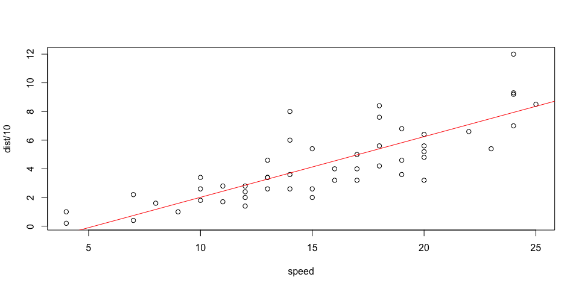

``` r
plot(cars2,ylab="dist/10",xlim=c(0,30),ylim=c(-1,12))
abline(a,b,col="red")
t <- acp$loadings[,1] %*% (t(cars2)-acp$center)
X1 <- acp$center[1] +t * acp$loadings[1,1]
X2 <- acp$center[2] +t * acp$loadings[2,1]
segments(cars2$speed,cars2$dist,X1,X2,col="blue")
```

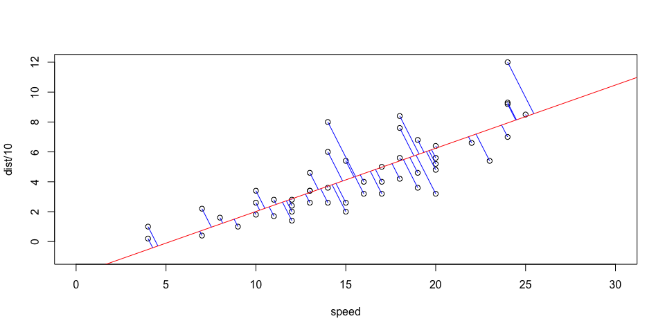

``` r
  f <- function(a) sum(abs(cars$dist-(a[1]+a[2]*cars$speed))) 
  opt <- optim( c(0,0), f )$par
  plot(cars)
  abline(model, col='red', lty=2)
  abline(opt[1], opt[2],col="blue")
```

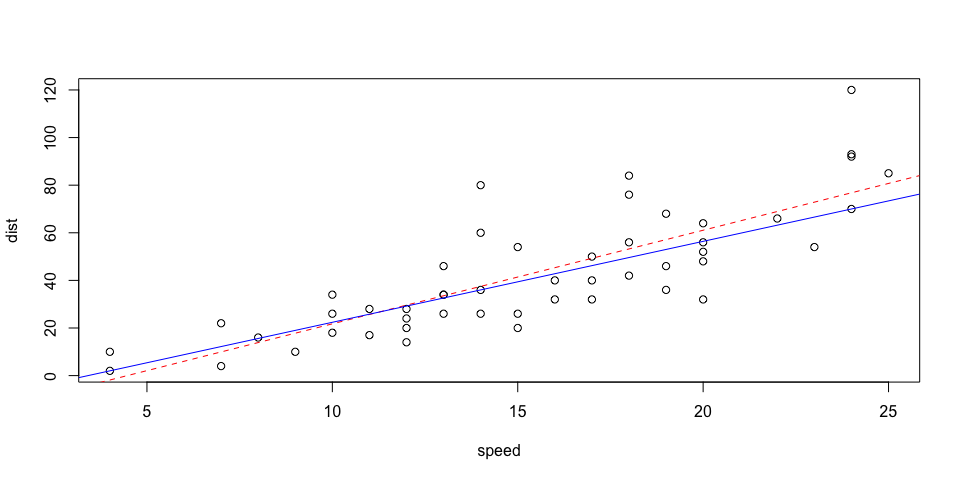

``` r
library(quantreg,verbose=FALSE,quietly=TRUE,warn.conflicts=FALSE)
```

    ## Warning: package 'quantreg' was built under R version 3.4.4

``` r
plot(cars)
abline(model, col="blue")
abline(rq(dist ~ speed,data=cars, tau=.5),col="red",lty=2)
```


\#\#
Diagnostiques

``` r
plot(model,which=1)
```

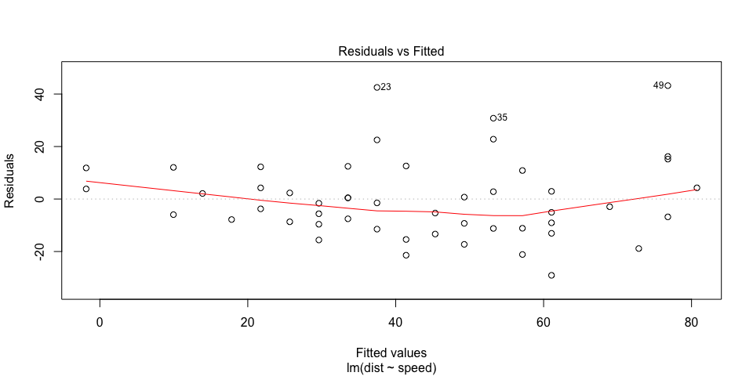

Scatterplot
\((\widehat{Y}_i,\widehat{\varepsilon}_i)\)

``` r
plot(model,which=2)
```

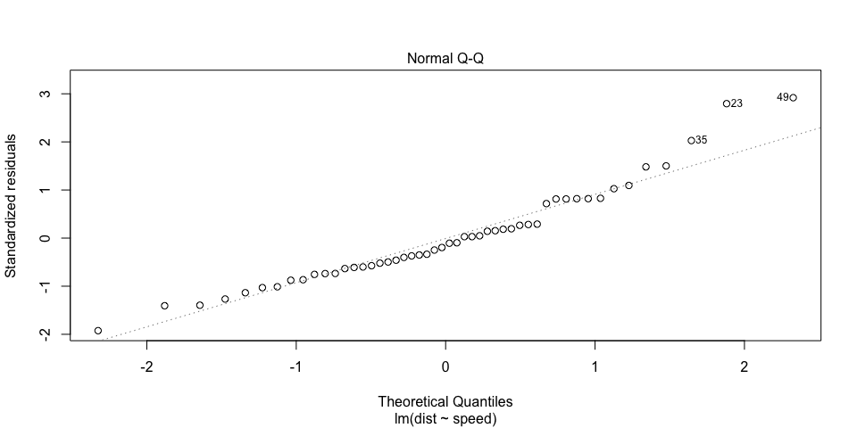

Scatterplot
\(\displaystyle{\left(\widehat{\varepsilon}_{i:n},\Phi^{-1} \left(\frac{i}{n}\right)\right)}\)

``` r
plot(model,which=3)
```

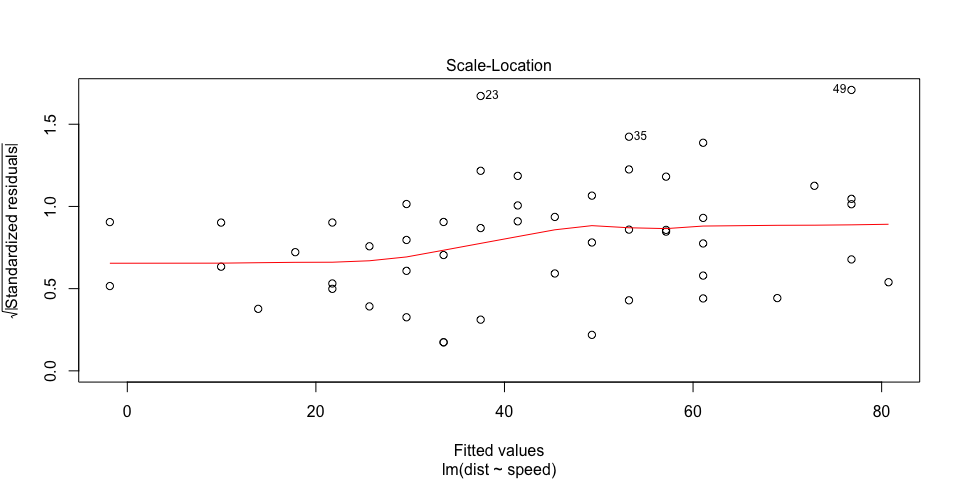

Scatterplot
\((\widehat{Y}_i,\sqrt{\vert\widehat{\varepsilon}_i\vert})\)

``` r
plot(model,which=4)
```

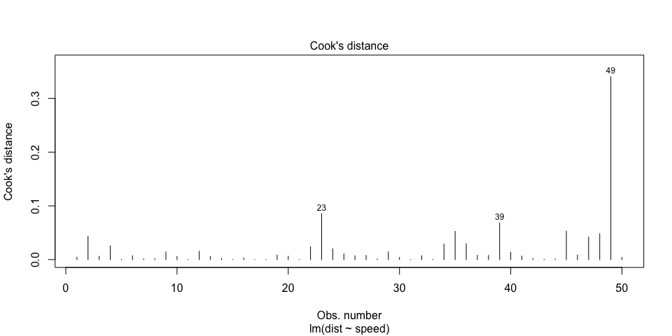

Cook distance,
\(\displaystyle{C_i=\frac{\widehat{\varepsilon}_i^2}{p\cdot\text{MSE}}\cdot\left(\frac{H_{i,i}}{(1-H_{i,i})^2}\right)}\)
with
\(\boldsymbol{H}=\boldsymbol{X}(\boldsymbol{X}^{\text{T}}\boldsymbol{X})^{-1}\boldsymbol{X}^{\text{T}}=[H_{i,i}]\)

``` r
C=cooks.distance(model)
```

\(H_{i,i}\) are
<a href=https://en.wikipedia.org/wiki/Leverage_(statistics)>leverages</a></span>,
and define Studentized residuals as \[
\widehat{r}_i=\frac{\widehat{\varepsilon}_i}{
\widehat{\sigma} \sqrt{1-H_{i,i}}}
\]

``` r
rstudent(model)
```

    ##           1           2           3           4           5           6 
    ##  0.26345000  0.81607841 -0.39781154  0.81035256  0.14070334 -0.51716052 
    ##           7           8           9          10          11          12 
    ## -0.24624632  0.27983408  0.81090388 -0.57004675  0.15209173 -1.03037790 
    ##          13          14          15          16          17          18 
    ## -0.62992492 -0.36670509 -0.10509307 -0.49251696  0.02981715  0.02981715 
    ##          19          20          21          22          23          24 
    ##  0.81716230 -0.75078438 -0.09592079  1.49972043  3.02282876 -1.42097720 
    ##          25          26          27          28          29          30 
    ## -1.01227617  0.82440767 -0.87411459 -0.34752195 -1.13903469 -0.60553485 
    ##          31          32          33          34          35          36 
    ##  0.04737114 -0.73422040  0.18222855  1.52145888  2.09848208 -1.40929208 
    ##          37          38          39          40          41          42 
    ## -0.73145948  0.71330941 -1.98238877 -0.86293622 -0.59637646 -0.33247538 
    ##          43          44          45          46          47          48 
    ##  0.19208548 -0.19393283 -1.27493857 -0.45557342  1.02773460  1.09701943 
    ##          49          50 
    ##  3.18499284  0.28774529

``` r
plot(model,which=5)
```

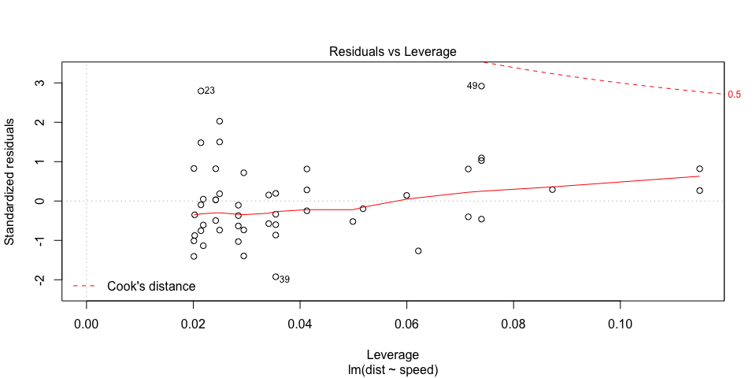

Scatterplot
\((H_{i,i},\widehat{r, error=TRUE}_i)\)

``` r
plot(model,which=6)
```

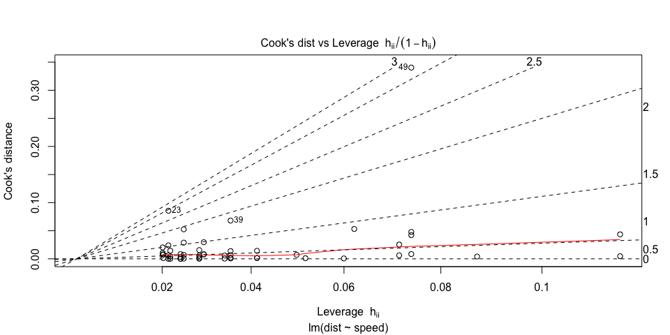

Scatterplot \((H_{i,i},C_i)\)

``` r
hist(residuals(model),probability=TRUE, col="light green")
lines(density(residuals(model)),lwd=2,col="red")
boxplot(residuals(model),horizontal=TRUE,add=TRUE,at=.024, 
  pars=list(boxwex=.004),col=rgb(0,0,1,.25))
```

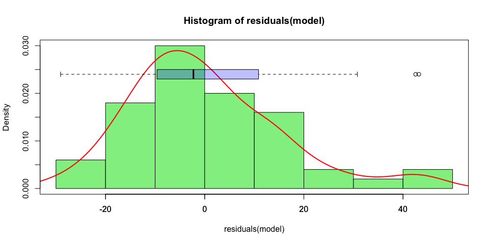

``` r
sigma=summary(model)$sigma
plot(ecdf(residuals(model)/sigma))
lines(seq(-3,3,by=.1),pnorm(seq(-3,3,by=.1)),lwd=2,col="red")
```


<a href=https://en.wikipedia.org/wiki/Kolmogorov%E2%80%93Smirnov_test>Kolmogorov-Smirnov</a></span>
$ d=\_{x}(x)-\_n(x)
    $

``` r
ks.test(residuals(model)/sigma,"pnorm")
```

    ## Warning in ks.test(residuals(model)/sigma, "pnorm"): ties should not be
    ## present for the Kolmogorov-Smirnov test

    ## 
    ##  One-sample Kolmogorov-Smirnov test
    ## 
    ## data:  residuals(model)/sigma
    ## D = 0.13067, p-value = 0.3605
    ## alternative hypothesis: two-sided

<a href=https://en.wikipedia.org/wiki/Anderson%E2%80%93Darling_test>Anderson-Darling</a></span>,
<a href=https://en.wikipedia.org/wiki/Cram%C3%A9r%E2%80%93von_Mises_criterion>Cramer-von
Mises</a></span>,

``` r
library(nortest,verbose=FALSE,quietly=TRUE,warn.conflicts=FALSE)
ad.test(residuals(model))
```

    ## 
    ##  Anderson-Darling normality test
    ## 
    ## data:  residuals(model)
    ## A = 0.79406, p-value = 0.0369

``` r
cvm.test(residuals(model))
```

    ## 
    ##  Cramer-von Mises normality test
    ## 
    ## data:  residuals(model)
    ## W = 0.12573, p-value = 0.0483

## Choix de modele / Choix de variables

<a href=https://en.wikipedia.org/wiki/Akaike_information_criterion>AIC</a></span>
\(AIC = 2k - 2\log(\mathcal{L}) = 2k + n\left[\log\left(2\pi \frac{1}{n}\sum_{i=1}^n \widehat{\varepsilon}_i^2 \right) + 1\right]\)

<a href=https://en.wikipedia.org/wiki/Bayesian_information_criterion>BIC</a></span>
\(BIC = { k \log(n) -2 \log(\mathcal{L}) } = k \log(n) + n\left[\log\left(2\pi \frac{1}{n}\sum_{i=1}^n \widehat{\varepsilon}_i^2 \right) + 1\right]\)

``` r
AIC(model)
```

    ## [1] 419.1569

``` r
AIC(model,k=log(n))
```

    ## [1] 424.8929

## Test d’hypotheses

``` r
library(splines,verbose=FALSE,quietly=TRUE,warn.conflicts=FALSE)
model_brk <- lm(dist ~ bs(speed,degree=1,knots=(c(4,15,25))), data=cars)
x=seq(4,25,by=.1)
y=predict(model_brk, newdata=data.frame(speed=x))
```

    ## Warning in predict.lm(model_brk, newdata = data.frame(speed = x)):
    ## prediction from a rank-deficient fit may be misleading

see
<a href=https://en.wikipedia.org/wiki/B-spline>\(b\)-splines</a></span>,
\[
y_i=\beta_0+\beta_1 x_i + \beta_2 (x_i-15)_+ + \varepsilon_i
\]

``` r
plot(cars)
lines(x,y,lwd=2,col="blue")
```


``` r
positive=function(x,s) ifelse(x>s,x-s,0)
model_brk <- lm(dist ~ speed + positive(speed,15), data=cars)
x=seq(4,25,by=.1)
y=predict(model_brk, newdata=data.frame(speed=x))
plot(cars)
abline(model,col="red",lty=2)
lines(x,y,lwd=2,col="blue")
```


``` r
plot(cars)
abline(model,col="red",lty=2)
lines(x,y,lwd=2,col="blue")
abline(coefficients(model_brk)[1],coefficients(model_brk)[2],col="blue",lty=2)
```


``` r
summary(model_brk)$coefficients
```

    ##                      Estimate Std. Error    t value    Pr(>|t|)
    ## (Intercept)         -7.651916 10.6253642 -0.7201557 0.474995540
    ## speed                3.018648  0.8626766  3.4991649 0.001032415
    ## positive(speed, 15)  1.756247  1.4551278  1.2069365 0.233496132

``` r
library(strucchange,verbose=FALSE,quietly=TRUE,warn.conflicts=FALSE)
```

    ## Warning: package 'zoo' was built under R version 3.4.4

``` r
plot(Fstats(dist ~ speed,data=cars,from=7/50))
```

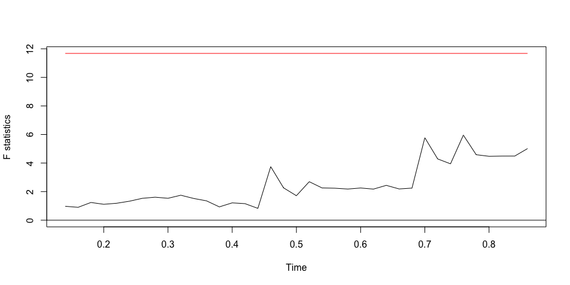

see <a href=https://en.wikipedia.org/wiki/Chow_test>Chow Test</a></span>

\[
W_t=\frac{1}{\widehat{\sigma}\sqrt{n}}\sum_{i=1}^{
\lfloor nt \rfloor} \widehat{\varepsilon}_i
\]

``` r
cusum <- efp(dist ~ speed, type = "OLS-CUSUM",data=cars)
plot(cusum,ylim=c(-2,2))
```


``` r
plot(cusum, alpha = 0.05, alt.boundary = TRUE,ylim=c(-2,2))
```

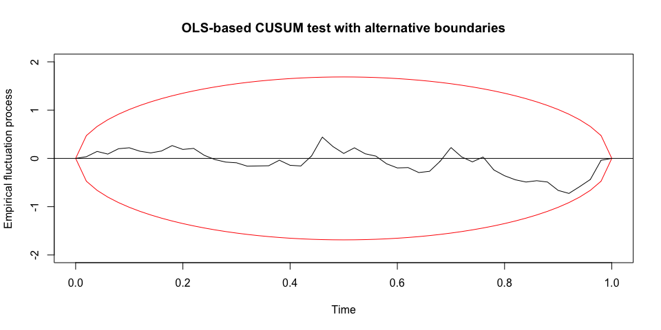

see <a href=https://en.wikipedia.org/wiki/CUSUM>CUSUM test</a></span>

## Regression avec des variables explicatives factorielles

``` r
model_cut=lm(dist~ cut(speed, breaks=c(0,10,15,20,25)),data=cars)
y=predict(model_cut, newdata=data.frame(speed=x))
plot(cars)
abline(model,col="red",lty=2)
lines(x,y,lwd=2,col="blue",type="s")
```

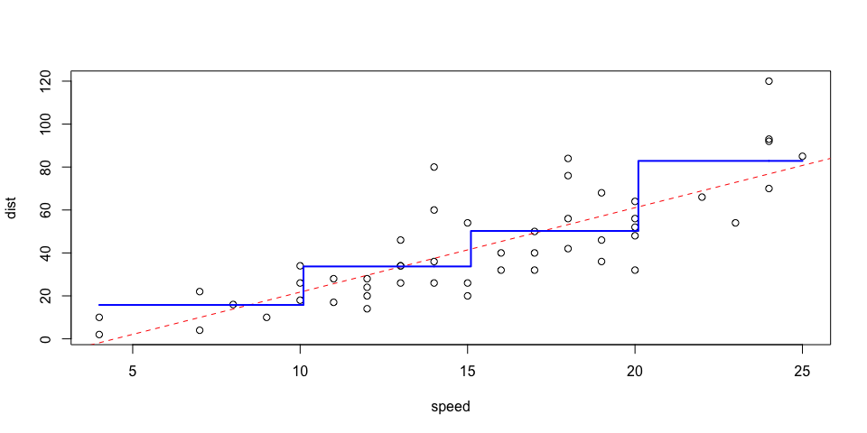

``` r
library(rpart,verbose=FALSE,quietly=TRUE,warn.conflicts=FALSE)
tree=rpart(dist~speed,data=cars)
y=predict(tree,newdata=data.frame(speed=x))
plot(cars)
abline(model,col="red",lty=2)
lines(x,y,lwd=2,col="blue",type="s")
```

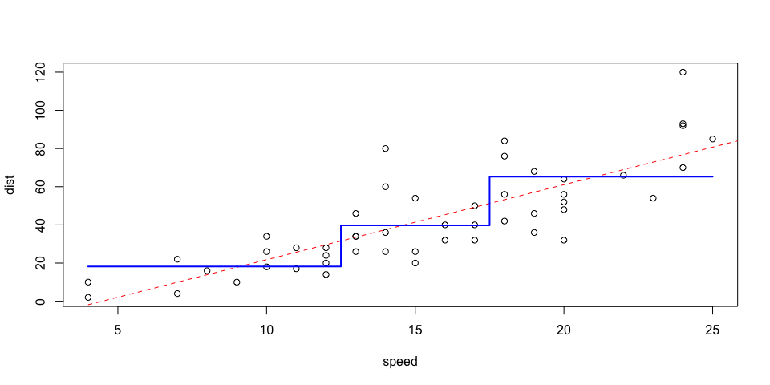

## Lissage et regression polynomiale

``` r
model_poly=lm(dist~ poly(speed, df=3),data=cars)
y=predict(model_poly, newdata=data.frame(speed=x))
plot(cars)
abline(model,col="red",lty=2)
lines(x,y,lwd=2,col="blue")
```


## Lissage et regression locale

``` r
library(KernSmooth,verbose=FALSE,quietly=TRUE,warn.conflicts=FALSE)
plot(cars)
bw <- dpill(cars$speed,cars$dist) 
lines( locpoly(cars$speed,cars$dist,degree=0, bandwidth=bw), col='red' )
lines( locpoly(cars$speed,cars$dist,degree=1, bandwidth=bw), col='green' )
lines( locpoly(cars$speed,cars$dist,degree=2, bandwidth=bw), col='blue' )
```

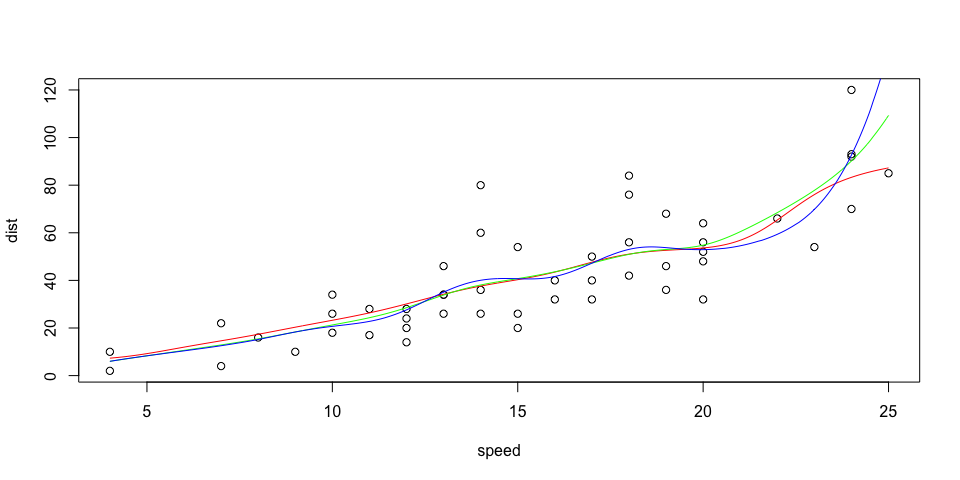

## Lissage et \(k\) plus proches voisins

``` r
library(FNN,verbose=FALSE,quietly=TRUE,warn.conflicts=FALSE)
knn=knn.reg(train=cars$speed,y=cars$dist,k=5)
plot(cars)
lines(cars$speed,knn$pred,col="red")
```


## Lissage et splines

``` r
library(splines,verbose=FALSE,quietly=TRUE,warn.conflicts=FALSE)
model_bs <- lm(dist ~ bs(speed), data=cars)
y=predict(model_bs, newdata=data.frame(speed=x))
plot(cars)
abline(model,col="red",lty=2)
lines(x,y,lwd=2,col="blue")
```

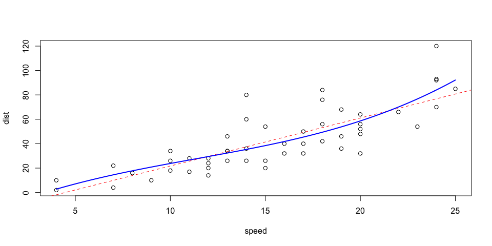

Tuning parameter selection, Silverman’s Rule \[
b^\star=0.9 \cdot\frac{ \min\lbrace \sigma,F^{-1}(.75)-F^{-1}(.25)\rbrace}{1.34 \cdot n^{1/5}}
\]

``` r
bw.nrd0(cars$speed)
```

    ## [1] 2.150016

See <a href=https://en.wikipedia.org/wiki/Kernel_regression>kernel
regression</a></span>

Tuning parameter selection, Cross Validation \[
b^\star=\text{argmin}\left\lbrace
\sum_{i=1}^n \left(y_i - \widehat{m}_{(i)}(\boldsymbol{x}_i)\right)^2\right\rbrace
\]

``` r
bw.ucv(cars$speed)
```

    ## Warning in bw.ucv(cars$speed): minimum occurred at one end of the range

    ## [1] 2.748934

``` r
library(KernSmooth,verbose=FALSE,quietly=TRUE,warn.conflicts=FALSE)
Nadaraya_Watson =with(cars,ksmooth(speed, dist, "normal",bandwidth=2.75))
plot(cars)
abline(model,col="red",lty=2)
lines(Nadaraya_Watson,lwd=2,col="blue")
```


``` r
library(KernSmooth,verbose=FALSE,quietly=TRUE,warn.conflicts=FALSE)
model_loess=loess(dist~ speed, data=cars,degree=1, family="gaussian")
y=predict(model_loess, newdata=data.frame(speed=x))
plot(cars)
abline(model,col="red",lty=2)
lines(x,y,lwd=2,col="blue")
```


## Regression Multiple

Life Expectancy (1), Homicide Rate (2), Illiteracy Rate
(3)

``` r
chicago=read.table("http://freakonometrics.free.fr/chicago.txt",header=TRUE,sep=";")
model_c = lm(Fire~X_2+X_3,data=chicago)
y=function(x2,x3) predict(model_c,newdata=data.frame(X_2=x2,X_3=x3))
VX2=seq(0,80,length=26); VX3=seq(5,25,length=26)
VY=outer(VX2,VX3,y)
persp(VX2,VX3,VY,xlab="Homicide",ylab="Illiteracy",zlab="Fire",theta=20)
```

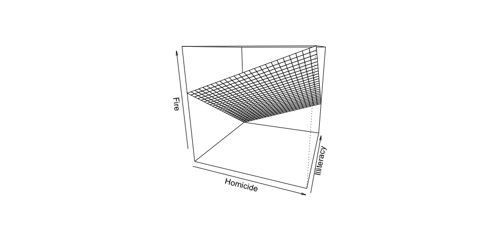

``` r
VX2=seq(0,80,length=251); VX3=seq(5,25,length=251)
VY=outer(VX2,VX3,y)
image(VX2,VX3,VY,xlab="Homicide",ylab="Illiteracy")
contour(VX2,VX3,VY,add=TRUE)
```


``` r
model_c = lm(Fire~.,data=chicago)
summary(model_c)$r.squared
```

    ## [1] 0.4416723

``` r
summary(model_c)$adj.r.squared
```

    ## [1] 0.4027192

``` r
logLik(model_c)
```

    ## 'log Lik.' -152.7678 (df=5)

``` r
AIC(model_c, k=2)               # AIC
```

    ## [1] 315.5357

``` r
AIC(model_c, k=log(nrow(cars))) # BIC
```

    ## [1] 325.0958

``` r
library(car)
```

    ## Warning: package 'car' was built under R version 3.4.4

    ## Warning: package 'carData' was built under R version 3.4.4

``` r
data(prestige)
```

    ## Warning in data(prestige): data set 'prestige' not found

``` r
model_lm = lm(prestige~income+education, data=Prestige)
y=function(x1,x2) predict(model_lm,newdata=data.frame(income=x1,education=x2))
VX1=seq(min(Prestige$income),max(Prestige$income),length=26)
VX2=seq(min(Prestige$education),max(Prestige$education),length=26)
VY=outer(VX1,VX2,y)
persp(VX1,VX2,VY,xlab="Income",ylab="Education",zlab="Prestige",theta=20, shade=.5)
```

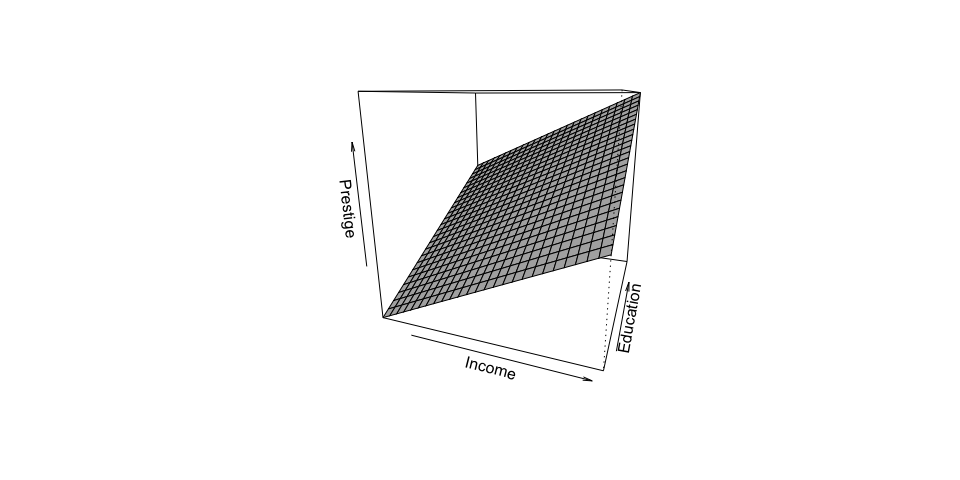

``` r
contour(VX1,VX2,VY,xlab="Income",ylab="Education",zlab="Prestige")
```

    ## Warning in plot.window(xlim, ylim, ...): "zlab" n'est pas un paramètre
    ## graphique

    ## Warning in title(...): "zlab" n'est pas un paramètre graphique

    ## Warning in axis(side = side, at = at, labels = labels, ...): "zlab" n'est
    ## pas un paramètre graphique
    
    ## Warning in axis(side = side, at = at, labels = labels, ...): "zlab" n'est
    ## pas un paramètre graphique

    ## Warning in box(...): "zlab" n'est pas un paramètre graphique


``` r
data(prestige)
```

    ## Warning in data(prestige): data set 'prestige' not found

``` r
model_loess = loess(prestige~income+education, span=.5, degree=1, data=Prestige)
y=function(x1,x2) predict(model_loess,newdata=data.frame(income=x1,education=x2))
VY=outer(VX1,VX2,y)
persp(VX1,VX2,VY,xlab="Income",ylab="Education",zlab="Prestige",theta=20, shade=.5)
```

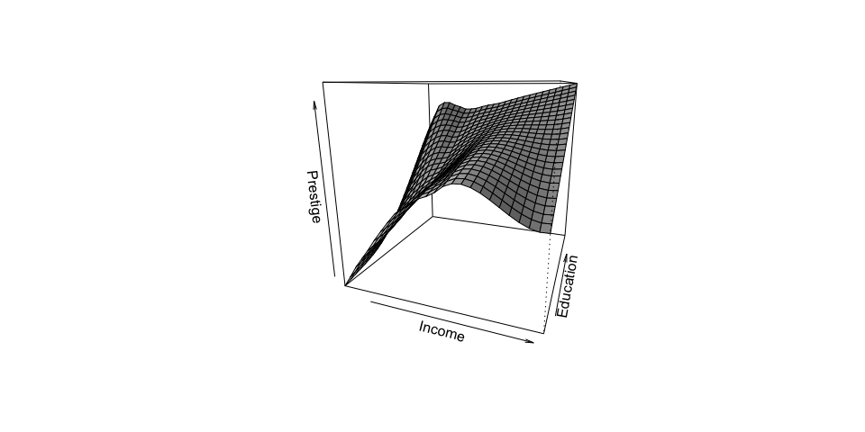

``` r
contour(VX1,VX2,VY,xlab="Income",ylab="Education",zlab="Prestige")
```

    ## Warning in plot.window(xlim, ylim, ...): "zlab" n'est pas un paramètre
    ## graphique

    ## Warning in title(...): "zlab" n'est pas un paramètre graphique

    ## Warning in axis(side = side, at = at, labels = labels, ...): "zlab" n'est
    ## pas un paramètre graphique
    
    ## Warning in axis(side = side, at = at, labels = labels, ...): "zlab" n'est
    ## pas un paramètre graphique

    ## Warning in box(...): "zlab" n'est pas un paramètre graphique

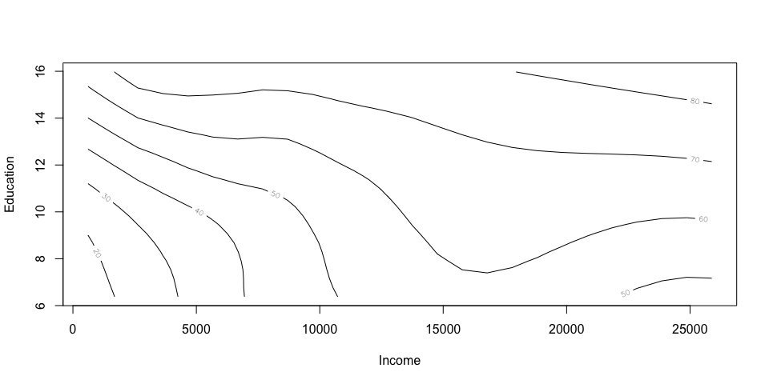

``` r
library(mgcv)
```

    ## Warning: package 'mgcv' was built under R version 3.4.4

    ## Warning: package 'nlme' was built under R version 3.4.4

``` r
model_gam = gam(prestige ~ s(income) + s(education), data=Prestige)
y=function(x1,x2) predict(model_gam,newdata=data.frame(income=x1,education=x2))
VY=outer(VX1,VX2,y)
persp(VX1,VX2,VY,xlab="Income",ylab="Education",zlab="Prestige",theta=20, shade=.5)
```

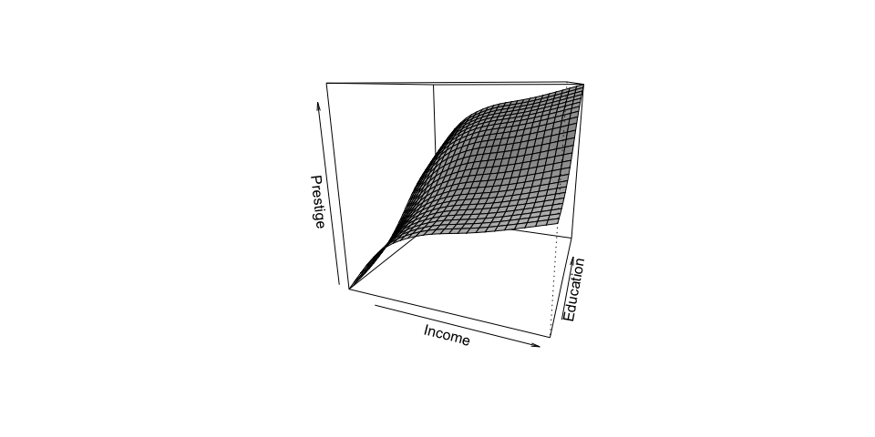

``` r
contour(VX1,VX2,VY,xlab="Income",ylab="Education",zlab="Prestige")
```

    ## Warning in plot.window(xlim, ylim, ...): "zlab" n'est pas un paramètre
    ## graphique

    ## Warning in title(...): "zlab" n'est pas un paramètre graphique

    ## Warning in axis(side = side, at = at, labels = labels, ...): "zlab" n'est
    ## pas un paramètre graphique
    
    ## Warning in axis(side = side, at = at, labels = labels, ...): "zlab" n'est
    ## pas un paramètre graphique

    ## Warning in box(...): "zlab" n'est pas un paramètre graphique

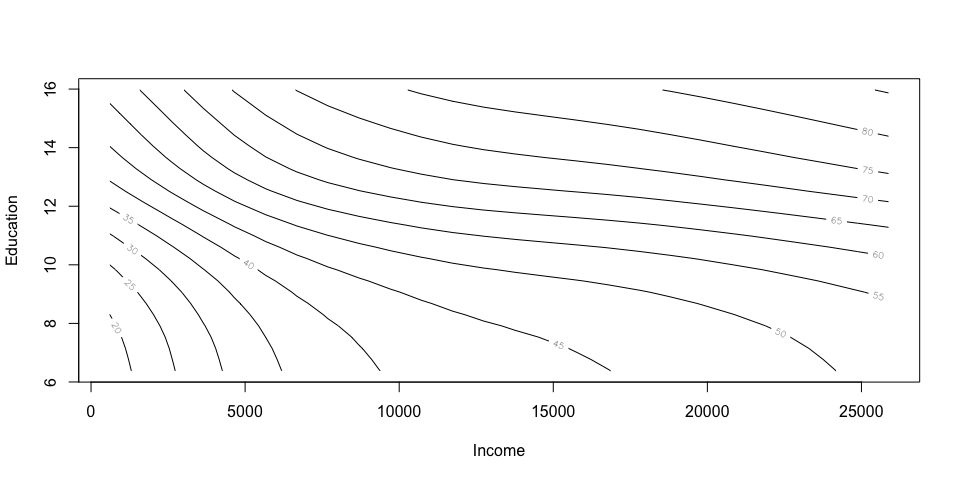

``` r
plot(model_gam)
```


## Penalisation

\[
\widehat{\boldsymbol{\beta}} = \text{argmin}\left\lbrace
\sum_{i=1}^n \left[y_i- \left(\beta_0+\sum_{j=1}^k \beta_j x_{j,i} \right)\right] + \color{red}{\lambda} \sum_{j=1}^k  \beta_j ^2\right\rbrace
\] with an explicit solution
\(\widehat{\boldsymbol{\beta}}=(\boldsymbol{X}^{\text{T}}\boldsymbol{X}-\color{red}{\lambda} \mathbb{I})^{-1} \boldsymbol{X}^{\text{T}}\boldsymbol{Y}\).

``` r
library(MASS,verbose=FALSE,quietly=TRUE,warn.conflicts=FALSE)
```

    ## Warning: package 'MASS' was built under R version 3.4.4

``` r
model_ridge <- lm.ridge(Fire ~ ., data=chicago, lambda=1)
```

see more generally
<a href=https://en.wikipedia.org/wiki/Tikhonov_regularization>Tikhonov
regularization</a></span>

``` r
mse <- NULL
n=100
v <- matrix(c(0,coefficients(model_c)[-1]), nr=n, nc=4, byrow=TRUE)
kl <- c(1e-4, 2e-4, 5e-4, 1e-3, 2e-3, 5e-3, 1e-2, 2e-2, 5e-2, 
        .1, .2, .3, .4, .5, .6, .7, .8, .9, 1, 1.2, 1.4, 1.6, 1.8, 2)
for (k in kl) {
  r <- matrix(NA, nr=n, nc=4)
  for (i in 1:n) {
    boot_c <- chicago[sample(1:nrow(chicago),nrow(chicago),replace=TRUE),]
    r[i,2:4] <- model_ridge <- lm.ridge(Fire ~ ., data=boot_c, lambda=k)$coef
    r[i,1] <- mean(boot_c[,"Fire"])
  }
  mse <- append(mse, apply( (r-v)^2, 2, mean )[2])
}
```

``` r
plot( mse ~ kl, type='l' )  
```

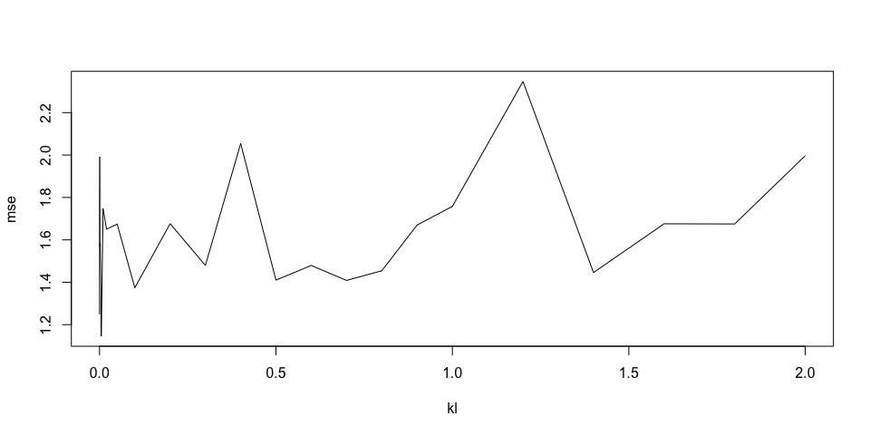

``` r
step(lm(Fire ~ .,data=chicago))
```

    ## Start:  AIC=180.16
    ## Fire ~ X_1 + X_2 + X_3
    ## 
    ##        Df Sum of Sq    RSS    AIC
    ## - X_1   1      0.60 1832.4 178.17
    ## <none>              1831.8 180.16
    ## - X_2   1    561.94 2393.7 190.73
    ## - X_3   1    702.09 2533.8 193.41
    ## 
    ## Step:  AIC=178.17
    ## Fire ~ X_2 + X_3
    ## 
    ##        Df Sum of Sq    RSS    AIC
    ## <none>              1832.4 178.17
    ## - X_2   1    620.98 2453.3 189.89
    ## - X_3   1   1003.70 2836.1 196.70

    ## 
    ## Call:
    ## lm(formula = Fire ~ X_2 + X_3, data = chicago)
    ## 
    ## Coefficients:
    ## (Intercept)          X_2          X_3  
    ##     21.4965       0.2213      -1.5248

<a href=https://en.wikipedia.org/wiki/Lasso_(statistics)>LASSO</a></span>
(least absolute shrinkage and selection operator) \[
\widehat{\boldsymbol{\beta}} = \text{argmin}\left\lbrace
\sum_{i=1}^n \left[y_i- \left(\beta_0+\sum_{j=1}^k \beta_j x_{j,i} \right)\right] + \color{blue}{\lambda} \sum_{j=1}^k \vert\beta_j\vert\right\rbrace
\]

``` r
library(glmnet,verbose=FALSE,quietly=TRUE,warn.conflicts=FALSE)
```

    ## Warning: package 'glmnet' was built under R version 3.4.4

    ## Warning: package 'Matrix' was built under R version 3.4.4

``` r
fit = glmnet(x = as.matrix(chicago[,2:4]), y = chicago[,1], family = "gaussian", alpha = 1)
```

``` r
plot(fit, xvar="lambda", label = TRUE )
```

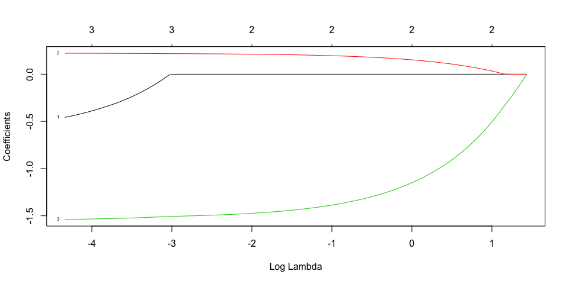

``` r
step(model)
```

    ## Start:  AIC=275.26
    ## dist ~ speed
    ## 
    ##         Df Sum of Sq   RSS    AIC
    ## <none>               11354 275.26
    ## - speed  1     21186 32539 325.91

    ## 
    ## Call:
    ## lm(formula = dist ~ speed, data = cars)
    ## 
    ## Coefficients:
    ## (Intercept)        speed  
    ##     -17.579        3.932

``` r
model_acp=lm(Fire ~ princomp(cbind(X_1,X_2,X_3))$scores[,1:3],data=chicago)
predict(model_c)[1:5]
```

    ##         1         2         3         4         5 
    ##  9.975499 16.985083 14.244580 13.411960 18.337225

``` r
predict(model_acp)[1:5]
```

    ##         1         2         3         4         5 
    ##  9.975499 16.985083 14.244580 13.411960 18.337225

``` r
model_acp=lm(Fire ~ princomp(cbind(X_1,X_2,X_3))$scores[,1:2],data=chicago)
predict(model_c)[1:5]
```

    ##         1         2         3         4         5 
    ##  9.975499 16.985083 14.244580 13.411960 18.337225

``` r
predict(model_acp)[1:5]
```

    ##        1        2        3        4        5 
    ## 10.01032 17.02103 14.29953 13.43876 18.39402

## Donnees pour s’entrainer

Munich Rent Index, from Fahrmeir *et al.* (2013) Regression: Models,
Methods and Applications

``` r
base = read.table("http://freakonometrics.free.fr/rent98_00.txt")
str(base)
```

    ## 'data.frame':    4572 obs. of  13 variables:
    ##  $ V1 : Factor w/ 4126 levels "1002.188","1003.482",..: 4126 66 2171 1414 739 3952 2577 1118 1568 1598 ...
    ##  $ V2 : Factor w/ 3963 levels ".1840651",".414561",..: 3963 747 992 452 2662 3219 2932 149 1988 1486 ...
    ##  $ V3 : Factor w/ 147 levels "100","101","102",..: 147 82 5 76 86 144 109 78 108 119 ...
    ##  $ V4 : Factor w/ 71 levels "1918","1924",..: 71 13 13 41 42 55 32 35 27 48 ...
    ##  $ V5 : Factor w/ 3 levels "0","1","glocation": 3 1 1 2 2 1 1 1 2 1 ...
    ##  $ V6 : Factor w/ 3 levels "0","1","tlocation": 3 1 1 1 1 1 1 1 1 1 ...
    ##  $ V7 : Factor w/ 3 levels "0","1","nkitchen": 3 1 1 1 1 1 1 1 1 1 ...
    ##  $ V8 : Factor w/ 3 levels "0","1","pkitchen": 3 1 1 1 1 1 1 1 1 1 ...
    ##  $ V9 : Factor w/ 3 levels "0","1","eboden": 3 2 1 2 2 1 1 2 1 1 ...
    ##  $ V10: Factor w/ 3 levels "0","1","year01": 3 1 1 1 1 1 1 1 1 1 ...
    ##  $ V11: Factor w/ 71 levels "3678724","3701776",..: 71 13 13 41 42 55 32 35 27 48 ...
    ##  $ V12: Factor w/ 69 levels "7.06e+09","7.12e+09",..: 69 13 13 40 41 54 31 34 26 47 ...
    ##  $ V13: Factor w/ 147 levels ".0041152",".0045455",..: 147 131 62 137 127 69 104 135 105 94 ...

La variable d’interet est `rent_euro`.
