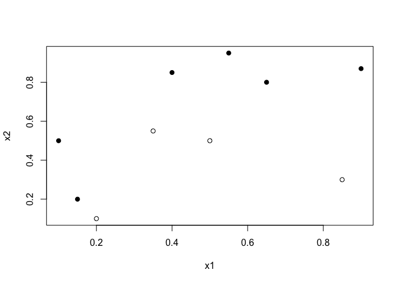
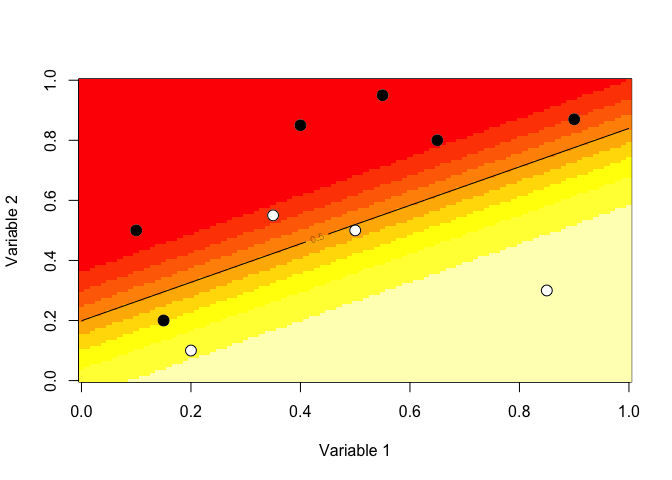
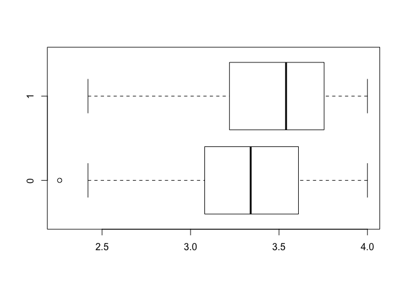
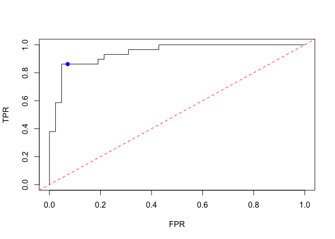
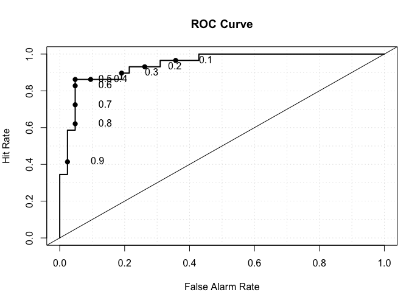

STT5100 \#8 - Regression Logistique
================
Arthur Charpentier

cas covariables continues
=========================

``` r
myocarde = read.table("http://freakonometrics.free.fr/myocarde.csv",head=TRUE, sep=";")
str(myocarde)
```

    ## 'data.frame':    71 obs. of  8 variables:
    ##  $ FRCAR: int  90 90 120 82 80 80 94 80 78 100 ...
    ##  $ INCAR: num  1.71 1.68 1.4 1.79 1.58 1.13 2.04 1.19 2.16 2.28 ...
    ##  $ INSYS: num  19 18.7 11.7 21.8 19.7 14.1 21.7 14.9 27.7 22.8 ...
    ##  $ PRDIA: int  16 24 23 14 21 18 23 16 15 16 ...
    ##  $ PAPUL: num  19.5 31 29 17.5 28 23.5 27 21 20.5 23 ...
    ##  $ PVENT: num  16 14 8 10 18.5 9 10 16.5 11.5 4 ...
    ##  $ REPUL: int  912 1476 1657 782 1418 1664 1059 1412 759 807 ...
    ##  $ PRONO: Factor w/ 2 levels "DECES","SURVIE": 2 1 1 2 1 1 2 2 2 2 ...

``` r
for(i in 1:7) boxplot(myocarde[,i]~myocarde$PRONO,horizontal=TRUE)
```


``` r
summary(glm(PRONO~.,data=myocarde,family=binomial(link = "logit")))
```

    ## 
    ## Call:
    ## glm(formula = PRONO ~ ., family = binomial(link = "logit"), data = myocarde)
    ## 
    ## Deviance Residuals: 
    ##      Min        1Q    Median        3Q       Max  
    ## -2.24911  -0.41613   0.05261   0.39611   2.25781  
    ## 
    ## Coefficients:
    ##               Estimate Std. Error z value Pr(>|z|)
    ## (Intercept) -10.187642  11.895227  -0.856    0.392
    ## FRCAR         0.138178   0.114112   1.211    0.226
    ## INCAR        -5.862429   6.748785  -0.869    0.385
    ## INSYS         0.717084   0.561445   1.277    0.202
    ## PRDIA        -0.073668   0.291636  -0.253    0.801
    ## PAPUL         0.016757   0.341942   0.049    0.961
    ## PVENT        -0.106776   0.110550  -0.966    0.334
    ## REPUL        -0.003154   0.004891  -0.645    0.519
    ## 
    ## (Dispersion parameter for binomial family taken to be 1)
    ## 
    ##     Null deviance: 96.033  on 70  degrees of freedom
    ## Residual deviance: 41.043  on 63  degrees of freedom
    ## AIC: 57.043
    ## 
    ## Number of Fisher Scoring iterations: 7

Estimation des paramètres par maximum de vraimsemblance : ne pas utiliser une fonction d'optimisation (directe)

``` r
y = (myocarde$PRONO=="DECES")
X = cbind(1,as.matrix(myocarde[,1:7]))
negLogLik = function(beta){
 -sum(-y*log(1 + exp(-(X%*%beta))) - (1-y)*log(1 + exp(X%*%beta)))
}
beta_init = lm(PRONO=="DECES"~.,data=myocarde)$coefficients
logistic_opt = optim(par = beta_init, negLogLik, hessian=TRUE, method = "BFGS", control=list(abstol=1e-9))
```

On peut toutefois utiliser l'algorithme de Fisher

``` r
Y=(myocarde$PRONO=="DECES")
X=cbind(1,as.matrix(myocarde[,1:7]))
colnames(X)=c("Inter",names(myocarde[,1:7]))
 beta=as.matrix(lm(Y~0+X)$coefficients,ncol=1)
 for(s in 1:9){
   pi=exp(X%*%beta[,s])/(1+exp(X%*%beta[,s]))
   gradient=t(X)%*%(Y-pi)
   omega=matrix(0,nrow(X),nrow(X));diag(omega)=(pi*(1-pi))
   Hessian=-t(X)%*%omega%*%X
   beta=cbind(beta,beta[,s]-solve(Hessian)%*%gradient)}
beta[,8:10]
```

    ##                [,1]         [,2]         [,3]
    ## XInter 10.187641083 10.187641696 10.187641696
    ## XFRCAR -0.138178115 -0.138178119 -0.138178119
    ## XINCAR  5.862428937  5.862429037  5.862429037
    ## XINSYS -0.717083993 -0.717084018 -0.717084018
    ## XPRDIA  0.073668174  0.073668171  0.073668171
    ## XPAPUL -0.016756516 -0.016756506 -0.016756506
    ## XPVENT  0.106776011  0.106776012  0.106776012
    ## XREPUL  0.003154187  0.003154187  0.003154187

(et l'estimation de l'écart type de nos estimateurs)

``` r
Hessian
```

    ##              Inter        FRCAR        INCAR        INSYS        PRDIA
    ## Inter    -6.399291    -586.5942    -11.23996    -124.1888    -123.3891
    ## FRCAR  -586.594187  -55245.7868  -1043.69898  -11235.5831  -11510.6073
    ## INCAR   -11.239961   -1043.6990    -21.00480    -228.1544    -220.4816
    ## INSYS  -124.188750  -11235.5831   -228.15438   -2541.5217   -2395.8946
    ## PRDIA  -123.389104  -11510.6073   -220.48165   -2395.8946   -2505.3755
    ## PAPUL  -163.361825  -15255.4372   -293.75443   -3187.2732   -3309.2315
    ## PVENT   -68.681260   -6186.2374   -118.50078   -1334.2920   -1315.9193
    ## REPUL -7733.626413 -716116.2773 -13069.24214 -143720.4273 -153850.5927
    ##              PAPUL        PVENT         REPUL
    ## Inter    -163.3618    -68.68126     -7733.626
    ## FRCAR  -15255.4372  -6186.23737   -716116.277
    ## INCAR    -293.7544   -118.50078    -13069.242
    ## INSYS   -3187.2732  -1334.29200   -143720.427
    ## PRDIA   -3309.2315  -1315.91933   -153850.593
    ## PAPUL   -4402.7086  -1712.67324   -203692.896
    ## PVENT   -1712.6732   -854.38907    -82307.441
    ## REPUL -203692.8963 -82307.44065 -10027346.615

ou la version vue en cours (moindres carrés pondérés itérés)

``` r
df = myocarde
beta_init = lm(PRONO=="DECES"~.,data=df)$coefficients
X = cbind(1,as.matrix(myocarde[,1:7]))
beta = beta_init
for(s in 1:1000){
p = exp(X %*% beta) / (1+exp(X %*% beta))
omega = diag(nrow(df))
diag(omega) = (p*(1-p))
df$Z = X %*% beta + solve(omega) %*% ((df$PRONO=="DECES") - p)
beta = lm(Z~.,data=df[,-8], weights=diag(omega))$coefficients
}
beta
```

    ##  (Intercept)        FRCAR        INCAR        INSYS        PRDIA 
    ## 10.187641696 -0.138178119  5.862429037 -0.717084018  0.073668171 
    ##        PAPUL        PVENT        REPUL 
    ## -0.016756506  0.106776012  0.003154187

On peut le faire sur un petit exemple, pour illustrer

``` r
x1 = c(.4,.55,.65,.9,.1,.35,.5,.15,.2,.85)
x2 = c(.85,.95,.8,.87,.5,.55,.5,.2,.1,.3)
y = c(1,1,1,1,1,0,0,1,0,0)
df = data.frame(x1=x1,x2=x2,y=as.factor(y))
plot(x1,x2,pch=c(1,19)[1+y])
```



On obtient comme classification

``` r
clr10 = rev(heat.colors(10))
reg = glm(y~x1+x2,data=df,family=binomial(link = "logit"))
u = seq(0,1,length=101)
p = function(x,y) predict.glm(reg,newdata=data.frame(x1=x,x2=y),type="response")
v = outer(u,u,p)
image(u,u,v,xlab="Variable 1",ylab="Variable 2",col=clr10,breaks=(0:10)/10)
points(x1,x2,pch=19,cex=1.5,col="white")
points(x1,x2,pch=c(1,19)[1+y],cex=1.5)
contour(u,u,v,levels = .5,add=TRUE)
```



Petite remarque

``` r
summary(glm((PRONO=="DECES")~.,data=myocarde,family=binomial(link = "logit")))
```

    ## 
    ## Call:
    ## glm(formula = (PRONO == "DECES") ~ ., family = binomial(link = "logit"), 
    ##     data = myocarde)
    ## 
    ## Deviance Residuals: 
    ##      Min        1Q    Median        3Q       Max  
    ## -2.25781  -0.39611  -0.05261   0.41613   2.24911  
    ## 
    ## Coefficients:
    ##              Estimate Std. Error z value Pr(>|z|)
    ## (Intercept) 10.187642  11.895227   0.856    0.392
    ## FRCAR       -0.138178   0.114112  -1.211    0.226
    ## INCAR        5.862429   6.748785   0.869    0.385
    ## INSYS       -0.717084   0.561445  -1.277    0.202
    ## PRDIA        0.073668   0.291636   0.253    0.801
    ## PAPUL       -0.016757   0.341942  -0.049    0.961
    ## PVENT        0.106776   0.110550   0.966    0.334
    ## REPUL        0.003154   0.004891   0.645    0.519
    ## 
    ## (Dispersion parameter for binomial family taken to be 1)
    ## 
    ##     Null deviance: 96.033  on 70  degrees of freedom
    ## Residual deviance: 41.043  on 63  degrees of freedom
    ## AIC: 57.043
    ## 
    ## Number of Fisher Scoring iterations: 7

``` r
summary(glm((PRONO=="SURVIE")~.,data=myocarde,family=binomial(link = "logit")))
```

    ## 
    ## Call:
    ## glm(formula = (PRONO == "SURVIE") ~ ., family = binomial(link = "logit"), 
    ##     data = myocarde)
    ## 
    ## Deviance Residuals: 
    ##      Min        1Q    Median        3Q       Max  
    ## -2.24911  -0.41613   0.05261   0.39611   2.25781  
    ## 
    ## Coefficients:
    ##               Estimate Std. Error z value Pr(>|z|)
    ## (Intercept) -10.187642  11.895227  -0.856    0.392
    ## FRCAR         0.138178   0.114112   1.211    0.226
    ## INCAR        -5.862429   6.748785  -0.869    0.385
    ## INSYS         0.717084   0.561445   1.277    0.202
    ## PRDIA        -0.073668   0.291636  -0.253    0.801
    ## PAPUL         0.016757   0.341942   0.049    0.961
    ## PVENT        -0.106776   0.110550  -0.966    0.334
    ## REPUL        -0.003154   0.004891  -0.645    0.519
    ## 
    ## (Dispersion parameter for binomial family taken to be 1)
    ## 
    ##     Null deviance: 96.033  on 70  degrees of freedom
    ## Residual deviance: 41.043  on 63  degrees of freedom
    ## AIC: 57.043
    ## 
    ## Number of Fisher Scoring iterations: 7

cas covariables catégorielles
=============================

On obtient comme classification

``` r
admin = read.csv("https://stats.idre.ucla.edu/stat/data/binary.csv")
str(admin)
```

    ## 'data.frame':    400 obs. of  4 variables:
    ##  $ admit: int  0 1 1 1 0 1 1 0 1 0 ...
    ##  $ gre  : int  380 660 800 640 520 760 560 400 540 700 ...
    ##  $ gpa  : num  3.61 3.67 4 3.19 2.93 3 2.98 3.08 3.39 3.92 ...
    ##  $ rank : int  3 3 1 4 4 2 1 2 3 2 ...

``` r
for(i in 2:4) boxplot(admin[,i]~admin$admit,horizontal=TRUE)
```



On peut faire un tableau de contingence

``` r
xtabs(~admit + rank, data = admin)
```

    ##      rank
    ## admit  1  2  3  4
    ##     0 28 97 93 55
    ##     1 33 54 28 12

Commençons par le cas à deux modalités
--------------------------------------

``` r
library(dplyr)
```

    ## 
    ## Attaching package: 'dplyr'

    ## The following objects are masked from 'package:stats':
    ## 
    ##     filter, lag

    ## The following objects are masked from 'package:base':
    ## 
    ##     intersect, setdiff, setequal, union

``` r
admin$rank = as.factor(admin$rank)
admin$rank = recode_factor(admin$rank,`1`="1+2",`2`="1+2",`3`="3+4",`4`="3+4")
str(admin)
```

    ## 'data.frame':    400 obs. of  4 variables:
    ##  $ admit: int  0 1 1 1 0 1 1 0 1 0 ...
    ##  $ gre  : int  380 660 800 640 520 760 560 400 540 700 ...
    ##  $ gpa  : num  3.61 3.67 4 3.19 2.93 3 2.98 3.08 3.39 3.92 ...
    ##  $ rank : Factor w/ 2 levels "1+2","3+4": 2 2 1 2 2 1 1 1 2 1 ...

``` r
xtabs(~admit + rank, data = admin)
```

    ##      rank
    ## admit 1+2 3+4
    ##     0 125 148
    ##     1  87  40

``` r
chisq.test(xtabs(~admit + rank, data = admin))
```

    ## 
    ##  Pearson's Chi-squared test with Yates' continuity correction
    ## 
    ## data:  xtabs(~admit + rank, data = admin)
    ## X-squared = 17.056, df = 1, p-value = 3.63e-05

``` r
t.test(admin$admit[admin$rank=="1+2"],admin$admit[admin$rank=="3+4"])
```

    ## 
    ##  Welch Two Sample t-test
    ## 
    ## data:  admin$admit[admin$rank == "1+2"] and admin$admit[admin$rank == "3+4"]
    ## t = 4.3725, df = 396.44, p-value = 1.571e-05
    ## alternative hypothesis: true difference in means is not equal to 0
    ## 95 percent confidence interval:
    ##  0.1087621 0.2864607
    ## sample estimates:
    ## mean of x mean of y 
    ## 0.4103774 0.2127660

``` r
u=seq(0,.6,length=601)
p12=mean(admin$admit[admin$rank=="1+2"])
n12=sum(admin$rank=="1+2")
p34=mean(admin$admit[admin$rank=="3+4"])
n34=sum(admin$rank=="3+4")
plot(u,dnorm(u,p12,sqrt(p12*(1-p12)/n12)),col="blue",lwd=2,type="l",ylim=c(0,15))
lines(u,dnorm(u,p34,sqrt(p34*(1-p34)/n34)),col="red",lwd=2,type="l")
```


On rejette ici l'hypothèse nulle d'indépendance entre les deux variables.

On peut aussi tenter une régression logistique

``` r
reg = glm(admit ~ rank, family = "binomial", data = admin)
summary(reg)
```

    ## 
    ## Call:
    ## glm(formula = admit ~ rank, family = "binomial", data = admin)
    ## 
    ## Deviance Residuals: 
    ##     Min       1Q   Median       3Q      Max  
    ## -1.0279  -1.0279  -0.6917   1.3347   1.7593  
    ## 
    ## Coefficients:
    ##             Estimate Std. Error z value Pr(>|z|)    
    ## (Intercept)  -0.3624     0.1396  -2.596  0.00944 ** 
    ## rank3+4      -0.9459     0.2264  -4.178 2.94e-05 ***
    ## ---
    ## Signif. codes:  0 '***' 0.001 '**' 0.01 '*' 0.05 '.' 0.1 ' ' 1
    ## 
    ## (Dispersion parameter for binomial family taken to be 1)
    ## 
    ##     Null deviance: 499.98  on 399  degrees of freedom
    ## Residual deviance: 481.66  on 398  degrees of freedom
    ## AIC: 485.66
    ## 
    ## Number of Fisher Scoring iterations: 4

``` r
## CIs using profiled log-likelihood
confint(reg)
```

    ## Waiting for profiling to be done...

    ##                  2.5 %      97.5 %
    ## (Intercept) -0.6387379 -0.09056309
    ## rank3+4     -1.3968586 -0.50785276

``` r
## CIs using standard errors
confint.default(reg)
```

    ##                  2.5 %      97.5 %
    ## (Intercept) -0.6360594 -0.08875188
    ## rank3+4     -1.3896372 -0.50221724

``` r
library(aod)
wald.test(b = coef(reg), Sigma = vcov(reg), Terms = 2)
```

    ## Wald test:
    ## ----------
    ## 
    ## Chi-squared test:
    ## X2 = 17.5, df = 1, P(> X2) = 2.9e-05

``` r
## odds ratios only
exp(coef(reg))
```

    ## (Intercept)     rank3+4 
    ##   0.6960000   0.3883194

``` r
exp(cbind(OR = coef(reg), confint(reg)))
```

    ## Waiting for profiling to be done...

    ##                    OR     2.5 %    97.5 %
    ## (Intercept) 0.6960000 0.5279583 0.9134167
    ## rank3+4     0.3883194 0.2473729 0.6017864

avec plusieurs modalités
------------------------

``` r
admin = read.csv("https://stats.idre.ucla.edu/stat/data/binary.csv")
xtabs(~admit + rank, data = admin)
```

    ##      rank
    ## admit  1  2  3  4
    ##     0 28 97 93 55
    ##     1 33 54 28 12

``` r
chisq.test(xtabs(~admit + rank, data = admin))
```

    ## 
    ##  Pearson's Chi-squared test
    ## 
    ## data:  xtabs(~admit + rank, data = admin)
    ## X-squared = 25.242, df = 3, p-value = 1.374e-05

``` r
reg = glm(admit ~ as.factor(rank), family = "binomial", data = admin)
summary(reg)
```

    ## 
    ## Call:
    ## glm(formula = admit ~ as.factor(rank), family = "binomial", data = admin)
    ## 
    ## Deviance Residuals: 
    ##     Min       1Q   Median       3Q      Max  
    ## -1.2479  -0.9408  -0.7255   1.1085   1.8546  
    ## 
    ## Coefficients:
    ##                  Estimate Std. Error z value Pr(>|z|)    
    ## (Intercept)        0.1643     0.2569   0.639   0.5225    
    ## as.factor(rank)2  -0.7500     0.3080  -2.435   0.0149 *  
    ## as.factor(rank)3  -1.3647     0.3354  -4.069 4.72e-05 ***
    ## as.factor(rank)4  -1.6867     0.4093  -4.121 3.77e-05 ***
    ## ---
    ## Signif. codes:  0 '***' 0.001 '**' 0.01 '*' 0.05 '.' 0.1 ' ' 1
    ## 
    ## (Dispersion parameter for binomial family taken to be 1)
    ## 
    ##     Null deviance: 499.98  on 399  degrees of freedom
    ## Residual deviance: 474.97  on 396  degrees of freedom
    ## AIC: 482.97
    ## 
    ## Number of Fisher Scoring iterations: 4

``` r
## CIs using profiled log-likelihood
confint(reg)
```

    ## Waiting for profiling to be done...

    ##                       2.5 %     97.5 %
    ## (Intercept)      -0.3384783  0.6740676
    ## as.factor(rank)2 -1.3593568 -0.1487441
    ## as.factor(rank)3 -2.0324691 -0.7142109
    ## as.factor(rank)4 -2.5202351 -0.9071958

``` r
## CIs using standard errors
confint.default(reg)
```

    ##                       2.5 %     97.5 %
    ## (Intercept)      -0.3392869  0.6678930
    ## as.factor(rank)2 -1.3536388 -0.1464212
    ## as.factor(rank)3 -2.0220438 -0.7073522
    ## as.factor(rank)4 -2.4889571 -0.8845020

``` r
library(aod)
wald.test(b = coef(reg), Sigma = vcov(reg), Terms = 2)
```

    ## Wald test:
    ## ----------
    ## 
    ## Chi-squared test:
    ## X2 = 5.9, df = 1, P(> X2) = 0.015

``` r
## odds ratios only
exp(coef(reg))
```

    ##      (Intercept) as.factor(rank)2 as.factor(rank)3 as.factor(rank)4 
    ##        1.1785714        0.4723524        0.2554578        0.1851240

``` r
exp(cbind(OR = coef(reg), confint(reg)))
```

    ## Waiting for profiling to be done...

    ##                         OR      2.5 %    97.5 %
    ## (Intercept)      1.1785714 0.71285426 1.9622026
    ## as.factor(rank)2 0.4723524 0.25682591 0.8617897
    ## as.factor(rank)3 0.2554578 0.13101163 0.4895783
    ## as.factor(rank)4 0.1851240 0.08044069 0.4036546

Courbe ROC
==========

``` r
reg=glm((PRONO=="DECES")~.,data=myocarde,family=binomial(link = "logit"))
seuil = .5
score = data.frame(yobs=(myocarde$PRONO=="DECES"),ypred=predict(reg,type="response"))
head(score)
```

    ##    yobs     ypred
    ## 1 FALSE 0.3986106
    ## 2  TRUE 0.8306231
    ## 3  TRUE 0.6710440
    ## 4 FALSE 0.1182406
    ## 5  TRUE 0.8575781
    ## 6  TRUE 0.9420705

``` r
xtabs(~yobs + (ypred>seuil), data = score)
```

    ##        ypred > seuil
    ## yobs    FALSE TRUE
    ##   FALSE    39    3
    ##   TRUE      4   25

``` r
(FP=sum((score$ypred>seuil)*(score$yobs==0))/sum(score$yobs==0))
```

    ## [1] 0.07142857

``` r
(TP=sum((score$ypred>seuil)*(score$yobs==1))/sum(score$yobs==1))
```

    ## [1] 0.862069

``` r
roc_curve = function(seuil){
FP=sum((score$ypred>seuil)*(score$yobs==0))/sum(score$yobs==0)
TP=sum((score$ypred>seuil)*(score$yobs==1))/sum(score$yobs==1)
return(c(FPR=FP,TPR=TP))}
u=seq(0,1,by=.01)
ROC.curve=t(Vectorize(roc_curve)(u))
plot(ROC.curve,type="s")
abline(a=0,b=1,lty=2,col="red")
points(FP,TP,pch=19,col="blue")
```



``` r
library(verification)
```

    ## Loading required package: fields

    ## Loading required package: spam

    ## Loading required package: dotCall64

    ## Loading required package: grid

    ## Spam version 2.2-0 (2018-06-19) is loaded.
    ## Type 'help( Spam)' or 'demo( spam)' for a short introduction 
    ## and overview of this package.
    ## Help for individual functions is also obtained by adding the
    ## suffix '.spam' to the function name, e.g. 'help( chol.spam)'.

    ## 
    ## Attaching package: 'spam'

    ## The following objects are masked from 'package:base':
    ## 
    ##     backsolve, forwardsolve

    ## Loading required package: maps

    ## See www.image.ucar.edu/~nychka/Fields for
    ##  a vignette and other supplements.

    ## Loading required package: boot

    ## Loading required package: CircStats

    ## Loading required package: MASS

    ## 
    ## Attaching package: 'MASS'

    ## The following object is masked from 'package:dplyr':
    ## 
    ##     select

    ## Loading required package: dtw

    ## Loading required package: proxy

    ## 
    ## Attaching package: 'proxy'

    ## The following object is masked from 'package:spam':
    ## 
    ##     as.matrix

    ## The following objects are masked from 'package:stats':
    ## 
    ##     as.dist, dist

    ## The following object is masked from 'package:base':
    ## 
    ##     as.matrix

    ## Loaded dtw v1.20-1. See ?dtw for help, citation("dtw") for use in publication.

``` r
roc.plot(score$yobs,score$ypred)
```



``` r
library(ROCR)
```

    ## Loading required package: gplots

    ## 
    ## Attaching package: 'gplots'

    ## The following object is masked from 'package:stats':
    ## 
    ##     lowess

``` r
pred = prediction(score$ypred,score$yobs)
rocs = performance(pred, "tpr", "fpr")
plot(rocs)
perf = performance(pred, measure = "auc")
perf@y.values
```

    ## [[1]]
    ## [1] 0.9417077

``` r
perf = performance(pred, "rch")
plot(perf,col="red",add=TRUE)
```


Kolmogorov Smirnov
==================

``` r
f0=c(0,sort(score$ypred[score$yobs==0]),1)
f1=c(0,sort(score$ypred[score$yobs==1]),1)
plot(f0,(0:(length(f0)-1))/(length(f0)-1),col="red",type="s",xlim=0:1)
lines(f1,(0:(length(f1)-1))/(length(f1)-1),col="blue",type="s")
```


Cas binomial
============

``` r
conting = xtabs(~admit + rank, data = admin)
cont_admin = data.frame(y0=conting[1,],y1=conting[2,],x=1:4,n=apply(conting,2,sum))
cont_admin
```

    ##   y0 y1 x   n
    ## 1 28 33 1  61
    ## 2 97 54 2 151
    ## 3 93 28 3 121
    ## 4 55 12 4  67

``` r
attach(cont_admin)
reg=glm(cbind(y1, y0) ~ as.factor(x), data = cont_admin,family="binomial")
summary(reg)
```

    ## 
    ## Call:
    ## glm(formula = cbind(y1, y0) ~ as.factor(x), family = "binomial", 
    ##     data = cont_admin)
    ## 
    ## Deviance Residuals: 
    ## [1]  0  0  0  0
    ## 
    ## Coefficients:
    ##               Estimate Std. Error z value Pr(>|z|)    
    ## (Intercept)     0.1643     0.2569   0.639   0.5225    
    ## as.factor(x)2  -0.7500     0.3080  -2.435   0.0149 *  
    ## as.factor(x)3  -1.3647     0.3354  -4.069 4.72e-05 ***
    ## as.factor(x)4  -1.6867     0.4093  -4.121 3.77e-05 ***
    ## ---
    ## Signif. codes:  0 '***' 0.001 '**' 0.01 '*' 0.05 '.' 0.1 ' ' 1
    ## 
    ## (Dispersion parameter for binomial family taken to be 1)
    ## 
    ##     Null deviance: 25.01  on 3  degrees of freedom
    ## Residual deviance:  0.00  on 0  degrees of freedom
    ## AIC: 27.005
    ## 
    ## Number of Fisher Scoring iterations: 3

Cas multinomial
===============

``` r
library(nnet)
model=multinom(as.factor(rank) ~ gre + gpa, data = admin)
```

    ## # weights:  16 (9 variable)
    ## initial  value 554.517744 
    ## iter  10 value 519.832717
    ## final  value 519.311942 
    ## converged

``` r
summary(model)
```

    ## Call:
    ## multinom(formula = as.factor(rank) ~ gre + gpa, data = admin)
    ## 
    ## Coefficients:
    ##   (Intercept)           gre        gpa
    ## 2    3.211128 -0.0004897883 -0.5894966
    ## 3    1.768934 -0.0031436638  0.2270097
    ## 4    3.751437 -0.0023341470 -0.6725334
    ## 
    ## Std. Errors:
    ##   (Intercept)         gre       gpa
    ## 2   0.7018681 0.001437975 0.3012374
    ## 3   0.7443790 0.001500964 0.3156397
    ## 4   0.7774992 0.001674163 0.3475131
    ## 
    ## Residual Deviance: 1038.624 
    ## AIC: 1056.624

``` r
(z = summary(model)$coefficients/summary(model)$standard.errors)
```

    ##   (Intercept)        gre        gpa
    ## 2    4.575117 -0.3406098 -1.9569170
    ## 3    2.376389 -2.0944293  0.7192052
    ## 4    4.825004 -1.3942171 -1.9352753

``` r
(pval = (1 - pnorm(abs(z), 0, 1)) * 2)
```

    ##    (Intercept)        gre        gpa
    ## 2 4.759549e-06 0.73339738 0.05035723
    ## 3 1.748301e-02 0.03622175 0.47201451
    ## 4 1.400002e-06 0.16325206 0.05295652

``` r
exp(coef(model))
```

    ##   (Intercept)       gre       gpa
    ## 2    24.80706 0.9995103 0.5546064
    ## 3     5.86460 0.9968613 1.2548421
    ## 4    42.58222 0.9976686 0.5104138

``` r
head(predict(model, data = admin, type="probs"))
```

    ##           1         2         3         4
    ## 1 0.1107439 0.2715501 0.4463341 0.1713719
    ## 2 0.1808019 0.3730891 0.3063242 0.1397848
    ## 3 0.2376033 0.3768749 0.2794000 0.1061218
    ## 4 0.1537982 0.4253067 0.2488354 0.1720598
    ## 5 0.1189638 0.4066822 0.2645914 0.2097626
    ## 6 0.1683534 0.4910100 0.1789031 0.1617335
