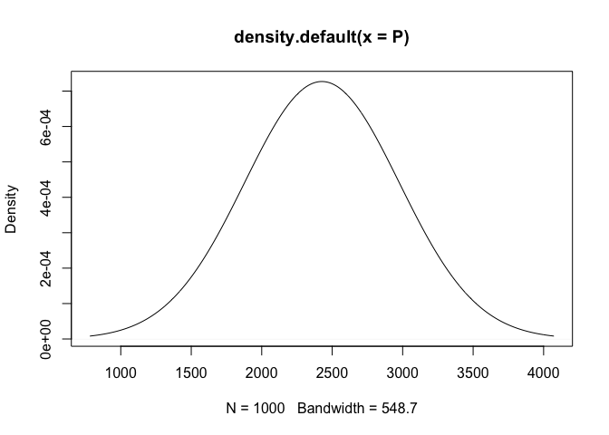

GLM (3)
================
Arthur Charpentier


``` r
n = 1000
x = runif(n)*2
eta = (-2+2*x)
y = exp(rnorm(n,eta,1))
base = data.frame(y=y, x=x)
reg = glm(y~x,data=base, family=Gamma(link="log"))
summary(reg)
```

    ## 
    ## Call:
    ## glm(formula = y ~ x, family = Gamma(link = "log"), data = base)
    ## 
    ## Deviance Residuals: 
    ##     Min       1Q   Median       3Q      Max  
    ## -2.0637  -0.9564  -0.4408   0.2033   4.9253  
    ## 
    ## Coefficients:
    ##             Estimate Std. Error t value Pr(>|t|)    
    ## (Intercept) -1.63084    0.07637  -21.35   <2e-16 ***
    ## x            2.04534    0.06542   31.26   <2e-16 ***
    ## ---
    ## Signif. codes:  0 '***' 0.001 '**' 0.01 '*' 0.05 '.' 0.1 ' ' 1
    ## 
    ## (Dispersion parameter for Gamma family taken to be 1.433038)
    ## 
    ##     Null deviance: 2178.92  on 999  degrees of freedom
    ## Residual deviance:  945.23  on 998  degrees of freedom
    ## AIC: 2881.9
    ## 
    ## Number of Fisher Scoring iterations: 5

``` r
sum(residuals(reg,"pearson")^2)/(n-2)
```

    ## [1] 1.433038

``` r
p = exp(eta)/(1+exp(eta))
e = 1+rpois(n,2)
y = rbinom(n,size=e,prob=p)
base = data.frame(y,e,x)
regb = glm(cbind(y,e-y)~x,data=base, family=binomial)
summary(regb)
```

    ## 
    ## Call:
    ## glm(formula = cbind(y, e - y) ~ x, family = binomial, data = base)
    ## 
    ## Deviance Residuals: 
    ##     Min       1Q   Median       3Q      Max  
    ## -2.5085  -0.8682  -0.0333   0.8632   2.6672  
    ## 
    ## Coefficients:
    ##             Estimate Std. Error z value Pr(>|z|)    
    ## (Intercept) -2.06714    0.09321  -22.18   <2e-16 ***
    ## x            2.03665    0.08085   25.19   <2e-16 ***
    ## ---
    ## Signif. codes:  0 '***' 0.001 '**' 0.01 '*' 0.05 '.' 0.1 ' ' 1
    ## 
    ## (Dispersion parameter for binomial family taken to be 1)
    ## 
    ##     Null deviance: 1924.3  on 999  degrees of freedom
    ## Residual deviance: 1093.7  on 998  degrees of freedom
    ## AIC: 1998.1
    ## 
    ## Number of Fisher Scoring iterations: 4

``` r
regqb = glm(cbind(y,e-y)~x,data=base, family=quasibinomial)
summary(regqb)
```

    ## 
    ## Call:
    ## glm(formula = cbind(y, e - y) ~ x, family = quasibinomial, data = base)
    ## 
    ## Deviance Residuals: 
    ##     Min       1Q   Median       3Q      Max  
    ## -2.5085  -0.8682  -0.0333   0.8632   2.6672  
    ## 
    ## Coefficients:
    ##             Estimate Std. Error t value Pr(>|t|)    
    ## (Intercept) -2.06714    0.08913  -23.19   <2e-16 ***
    ## x            2.03665    0.07731   26.34   <2e-16 ***
    ## ---
    ## Signif. codes:  0 '***' 0.001 '**' 0.01 '*' 0.05 '.' 0.1 ' ' 1
    ## 
    ## (Dispersion parameter for quasibinomial family taken to be 0.9142827)
    ## 
    ##     Null deviance: 1924.3  on 999  degrees of freedom
    ## Residual deviance: 1093.7  on 998  degrees of freedom
    ## AIC: NA
    ## 
    ## Number of Fisher Scoring iterations: 4

``` r
loc = 'http://freakonometrics.free.fr/baseaffairs.txt'
base = read.table(loc,header = TRUE)
regp = glm(Y ~ ., data=base, family = poisson)
summary(regp)
```

    ## 
    ## Call:
    ## glm(formula = Y ~ ., family = poisson, data = base)
    ## 
    ## Deviance Residuals: 
    ##     Min       1Q   Median       3Q      Max  
    ## -2.7377  -1.1197  -0.8582  -0.5802   5.6989  
    ## 
    ## Coefficients:
    ##               Estimate Std. Error z value Pr(>|z|)    
    ## (Intercept)  -0.092993   0.504006  -0.185  0.85361    
    ## SEX           0.033153   0.131322   0.252  0.80069    
    ## AGE          -0.040826   0.009919  -4.116 3.86e-05 ***
    ## YEARMARRIAGE  0.074275   0.017133   4.335 1.46e-05 ***
    ## CHILDREN      0.497587   0.171869   2.895  0.00379 ** 
    ## RELIGIOUS    -0.253704   0.048533  -5.228 1.72e-07 ***
    ## EDUCATION     0.118261   0.028875   4.096 4.21e-05 ***
    ## OCCUPATION    0.020923   0.038668   0.541  0.58845    
    ## SATISFACTION -0.362262   0.045908  -7.891 2.99e-15 ***
    ## ---
    ## Signif. codes:  0 '***' 0.001 '**' 0.01 '*' 0.05 '.' 0.1 ' ' 1
    ## 
    ## (Dispersion parameter for poisson family taken to be 1)
    ## 
    ##     Null deviance: 1295.2  on 562  degrees of freedom
    ## Residual deviance: 1132.7  on 554  degrees of freedom
    ## AIC: 1468.8
    ## 
    ## Number of Fisher Scoring iterations: 6

``` r
sum(residuals(regp,"pearson")^2)/554
```

    ## [1] 3.555002

``` r
regp = glm(Y ~ ., data=base, family = poisson)
regqp = glm(Y ~ ., data=base, family = quasipoisson)
cbind(summary(regp)$coefficients[,1:2],
      summary(regqp)$coefficients[,1:2])
```

    ##                 Estimate  Std. Error    Estimate Std. Error
    ## (Intercept)  -0.09299339 0.504005993 -0.09299339 0.95030594
    ## SEX           0.03315320 0.131321870  0.03315320 0.24760807
    ## AGE          -0.04082560 0.009919453 -0.04082560 0.01870318
    ## YEARMARRIAGE  0.07427472 0.017133174  0.07427472 0.03230469
    ## CHILDREN      0.49758727 0.171869209  0.49758727 0.32406029
    ## RELIGIOUS    -0.25370444 0.048532523 -0.25370444 0.09150833
    ## EDUCATION     0.11826082 0.028874518  0.11826082 0.05444305
    ## OCCUPATION    0.02092272 0.038667709  0.02092272 0.07290817
    ## SATISFACTION -0.36226240 0.045907614 -0.36226240 0.08655905

``` r
summary(regqp)
```

    ## 
    ## Call:
    ## glm(formula = Y ~ ., family = quasipoisson, data = base)
    ## 
    ## Deviance Residuals: 
    ##     Min       1Q   Median       3Q      Max  
    ## -2.7377  -1.1197  -0.8582  -0.5802   5.6989  
    ## 
    ## Coefficients:
    ##              Estimate Std. Error t value Pr(>|t|)    
    ## (Intercept)  -0.09299    0.95031  -0.098  0.92208    
    ## SEX           0.03315    0.24761   0.134  0.89354    
    ## AGE          -0.04083    0.01870  -2.183  0.02947 *  
    ## YEARMARRIAGE  0.07427    0.03230   2.299  0.02187 *  
    ## CHILDREN      0.49759    0.32406   1.535  0.12524    
    ## RELIGIOUS    -0.25370    0.09151  -2.772  0.00575 ** 
    ## EDUCATION     0.11826    0.05444   2.172  0.03026 *  
    ## OCCUPATION    0.02092    0.07291   0.287  0.77424    
    ## SATISFACTION -0.36226    0.08656  -4.185 3.31e-05 ***
    ## ---
    ## Signif. codes:  0 '***' 0.001 '**' 0.01 '*' 0.05 '.' 0.1 ' ' 1
    ## 
    ## (Dispersion parameter for quasipoisson family taken to be 3.55513)
    ## 
    ##     Null deviance: 1295.2  on 562  degrees of freedom
    ## Residual deviance: 1132.7  on 554  degrees of freedom
    ## AIC: NA
    ## 
    ## Number of Fisher Scoring iterations: 6

``` r
library(AER)
```

    ## Loading required package: car

    ## Loading required package: carData

    ## Loading required package: lmtest

    ## Loading required package: zoo

    ## 
    ## Attaching package: 'zoo'

    ## The following objects are masked from 'package:base':
    ## 
    ##     as.Date, as.Date.numeric

    ## Loading required package: sandwich

    ## Loading required package: survival

``` r
dispersiontest(regp, alternative = "greater")
```

    ## 
    ##  Overdispersion test
    ## 
    ## data:  regp
    ## z = 5.6724, p-value = 7.038e-09
    ## alternative hypothesis: true dispersion is greater than 1
    ## sample estimates:
    ## dispersion 
    ##   3.522986

``` r
library(MASS)
regnb = glm.nb(Y ~ ., data=base)
cbind(summary(regnb)$coefficients[,1:2],
      summary(regqp)$coefficients[,1:2])
```

    ##                 Estimate Std. Error    Estimate Std. Error
    ## (Intercept)   0.29699202 1.14382602 -0.09299339 0.95030594
    ## SEX           0.07875705 0.29330626  0.03315320 0.24760807
    ## AGE          -0.04953617 0.02247169 -0.04082560 0.01870318
    ## YEARMARRIAGE  0.09532155 0.04041235  0.07427472 0.03230469
    ## CHILDREN      0.38239059 0.35319109  0.49758727 0.32406029
    ## RELIGIOUS    -0.28040136 0.10973467 -0.25370444 0.09150833
    ## EDUCATION     0.14220450 0.06419563  0.11826082 0.05444305
    ## OCCUPATION   -0.03903303 0.08593921  0.02092272 0.07290817
    ## SATISFACTION -0.43630393 0.11710277 -0.36226240 0.08655905

``` r
source ("http://freakonometrics.free.fr/bases.R" )
INCURRED = PAID
for(j in 2:6) INCURRED[,j] = PAID[,j] - PAID[,j-1]
Y = as.vector(INCURRED)
base = data.frame(Y=Y , L=rep(1:6,6) , C=rep(1:6,each=6))
reg = glm(Y ~ as.factor(L)+as.factor(C), data=base, family = poisson)
passe = which(!is.na(base$Y))
futur = which(is.na(base$Y))
E = residuals(reg, type="pearson")
M = predict(reg, type="response",newdata=base)
n=nrow(base)
B = matrix(NA,1000,length(coefficients(reg)))
P = rep(NA,1000)
for(s in 1:1000){
  bases = base
  bases$Y = M+sample(E,size=n,replace=TRUE)*sqrt(M)
  bases$Y[bases$Y<0] = 0
  regs = glm(Y ~ as.factor(L)+as.factor(C), data=bases, family = poisson, subset = passe)
  B[s,]=coefficients(regs)
  P[s] =sum(predict(reg, type="response",newdata=base[futur,]))
}
cbind(apply(B,2,sd),summary(reg)$coefficients[,2])
```

    ##                     [,1]       [,2]
    ## (Intercept)   0.01880386 0.01551130
    ## as.factor(L)2 0.02622162 0.02090205
    ## as.factor(L)3 0.02518792 0.02025299
    ## as.factor(L)4 0.02529275 0.01980134
    ## as.factor(L)5 0.02366514 0.01933199
    ## as.factor(L)6 0.02524729 0.02079138
    ## as.factor(C)2 0.01662980 0.01359464
    ## as.factor(C)3 0.07975594 0.06613382
    ## as.factor(C)4 0.15336530 0.12631935
    ## as.factor(C)5 0.30135094 0.24279160
    ## as.factor(C)6 0.25256009 0.21876848

``` r
plot(density(P))
```

<!-- -->

