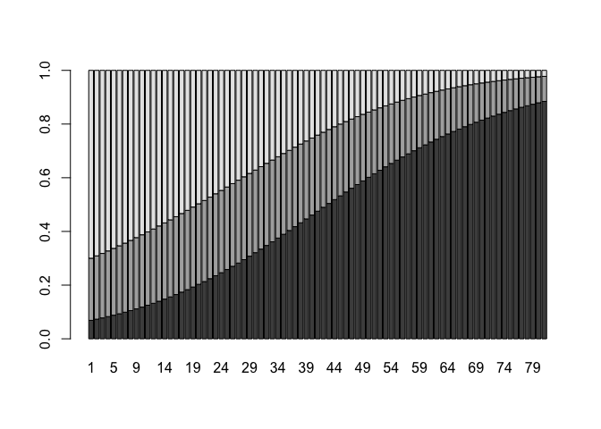
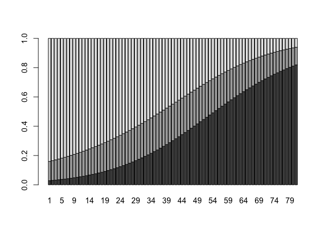

STT5100 - Devoir 2 - Automne 2022
================
Arthur Charpentier

``` r
loc_fichier = "http://freakonometrics.free.fr/titanic.RData"
download.file(loc_fichier, "titanic.RData")
load("titanic.RData")
str(base)
```

    ## 'data.frame':    891 obs. of  8 variables:
    ##  $ Survived: int  0 1 1 1 0 0 0 0 1 1 ...
    ##  $ Pclass  : Factor w/ 3 levels "1","2","3": 3 1 3 1 3 3 1 3 3 2 ...
    ##  $ Sex     : Factor w/ 2 levels "female","male": 2 1 1 1 2 2 2 2 1 1 ...
    ##  $ Age     : num  22 38 26 35 35 NA 54 2 27 14 ...
    ##  $ SibSp   : int  1 1 0 1 0 0 0 3 0 1 ...
    ##  $ Parch   : int  0 0 0 0 0 0 0 1 2 0 ...
    ##  $ Embarked: Factor w/ 4 levels "","C","Q","S": 4 2 4 4 4 3 4 4 4 2 ...
    ##  $ Name    : Factor w/ 893 levels "Abbing, Mr. Anthony",..: 109 191 358 277 16 559 520 629 417 581 ...

``` r
base = base[,1:7]
base = base[!is.na(base$Age),]
reg = glm(Survived~Sex+Pclass+Age+SibSp, family=binomial,data=base)
summary(reg)
```

    ## 
    ## Call:
    ## glm(formula = Survived ~ Sex + Pclass + Age + SibSp, family = binomial, 
    ##     data = base)
    ## 
    ## Deviance Residuals: 
    ##     Min       1Q   Median       3Q      Max  
    ## -2.7876  -0.6417  -0.3864   0.6261   2.4539  
    ## 
    ## Coefficients:
    ##              Estimate Std. Error z value Pr(>|z|)    
    ## (Intercept)  4.334201   0.450700   9.617  < 2e-16 ***
    ## Sexmale     -2.627679   0.214771 -12.235  < 2e-16 ***
    ## Pclass2     -1.414360   0.284727  -4.967 6.78e-07 ***
    ## Pclass3     -2.652618   0.285832  -9.280  < 2e-16 ***
    ## Age         -0.044760   0.008225  -5.442 5.27e-08 ***
    ## SibSp       -0.380190   0.121516  -3.129  0.00176 ** 
    ## ---
    ## Signif. codes:  0 '***' 0.001 '**' 0.01 '*' 0.05 '.' 0.1 ' ' 1
    ## 
    ## (Dispersion parameter for binomial family taken to be 1)
    ## 
    ##     Null deviance: 964.52  on 713  degrees of freedom
    ## Residual deviance: 636.56  on 708  degrees of freedom
    ## AIC: 648.56
    ## 
    ## Number of Fisher Scoring iterations: 5

``` r
reg = glm((Survived==0)~Sex+Pclass+Age+SibSp, family=binomial,data=base)
summary(reg)
```

    ## 
    ## Call:
    ## glm(formula = (Survived == 0) ~ Sex + Pclass + Age + SibSp, family = binomial, 
    ##     data = base)
    ## 
    ## Deviance Residuals: 
    ##     Min       1Q   Median       3Q      Max  
    ## -2.4539  -0.6261   0.3864   0.6417   2.7876  
    ## 
    ## Coefficients:
    ##              Estimate Std. Error z value Pr(>|z|)    
    ## (Intercept) -4.334201   0.450700  -9.617  < 2e-16 ***
    ## Sexmale      2.627679   0.214771  12.235  < 2e-16 ***
    ## Pclass2      1.414360   0.284727   4.967 6.78e-07 ***
    ## Pclass3      2.652618   0.285832   9.280  < 2e-16 ***
    ## Age          0.044760   0.008225   5.442 5.27e-08 ***
    ## SibSp        0.380190   0.121516   3.129  0.00176 ** 
    ## ---
    ## Signif. codes:  0 '***' 0.001 '**' 0.01 '*' 0.05 '.' 0.1 ' ' 1
    ## 
    ## (Dispersion parameter for binomial family taken to be 1)
    ## 
    ##     Null deviance: 964.52  on 713  degrees of freedom
    ## Residual deviance: 636.56  on 708  degrees of freedom
    ## AIC: 648.56
    ## 
    ## Number of Fisher Scoring iterations: 5

``` r
base$Survived2 = factor(base$Survived,labels = c('mort','vie'))
reg = glm(Survived~Sex+Pclass+Age+SibSp, family=binomial,data=base)
summary(reg)
```

    ## 
    ## Call:
    ## glm(formula = Survived ~ Sex + Pclass + Age + SibSp, family = binomial, 
    ##     data = base)
    ## 
    ## Deviance Residuals: 
    ##     Min       1Q   Median       3Q      Max  
    ## -2.7876  -0.6417  -0.3864   0.6261   2.4539  
    ## 
    ## Coefficients:
    ##              Estimate Std. Error z value Pr(>|z|)    
    ## (Intercept)  4.334201   0.450700   9.617  < 2e-16 ***
    ## Sexmale     -2.627679   0.214771 -12.235  < 2e-16 ***
    ## Pclass2     -1.414360   0.284727  -4.967 6.78e-07 ***
    ## Pclass3     -2.652618   0.285832  -9.280  < 2e-16 ***
    ## Age         -0.044760   0.008225  -5.442 5.27e-08 ***
    ## SibSp       -0.380190   0.121516  -3.129  0.00176 ** 
    ## ---
    ## Signif. codes:  0 '***' 0.001 '**' 0.01 '*' 0.05 '.' 0.1 ' ' 1
    ## 
    ## (Dispersion parameter for binomial family taken to be 1)
    ## 
    ##     Null deviance: 964.52  on 713  degrees of freedom
    ## Residual deviance: 636.56  on 708  degrees of freedom
    ## AIC: 648.56
    ## 
    ## Number of Fisher Scoring iterations: 5

``` r
library(nnet)
reg = multinom(Pclass~Sex+Age, data=base)
```

    ## # weights:  12 (6 variable)
    ## initial  value 784.409174 
    ## iter  10 value 676.047360
    ## final  value 676.047342 
    ## converged

``` r
Bf = data.frame(Sex = 'female', Age=0:80)
Bh = data.frame(Sex = 'male', Age=0:80)
Yf = predict(reg,newdata = Bf,type = 'probs')
barplot(t(Yf))
```

<!-- -->

``` r
Yh = predict(reg,newdata = Bh,type = 'probs')
barplot(t(Yh))
```

<!-- -->

``` r
loc = 'http://freakonometrics.free.fr/baseaffairs.txt'
base = read.table(loc,header = TRUE)
reg = glm(Y ~ ., data=base, family = poisson)
base[1:2,]
```

    ##   SEX AGE YEARMARRIAGE CHILDREN RELIGIOUS EDUCATION OCCUPATION SATISFACTION Y
    ## 1   1  37           10        0         3        18          7            4 0
    ## 2   0  27            4        0         4        14          6            4 0

``` r
predict(reg,type='response')[1:2]
```

    ##         1         2 
    ## 0.4664290 0.2057969

``` r
source ("http://freakonometrics.free.fr/bases.R" )
INCURRED = PAID
for(j in 2:6) INCURRED[,j] = PAID[,j] - PAID[,j-1]
Y = as.vector(INCURRED)
base = data.frame(Y=Y , L=rep(1:6,6) , C=rep(1:6,each=6))
reg = glm(Y ~ as.factor(L)+as.factor(C), data=base, family = poisson)
yp = predict(reg,newdata=base,type='response')
matrix(yp,6,6)
```

    ##          [,1]     [,2]     [,3]     [,4]      [,5]     [,6]
    ## [1,] 3155.699 1202.110 49.82071 19.14379  8.226405 21.00000
    ## [2,] 3365.605 1282.070 53.13460 20.41717  8.773595 22.39684
    ## [3,] 3863.737 1471.825 60.99889 23.43904 10.072147 25.71173
    ## [4,] 4310.096 1641.858 68.04580 26.14685 11.235734 28.68208
    ## [5,] 4919.862 1874.138 77.67250 29.84594 12.825297 32.73985
    ## [6,] 5217.000 1987.327 82.36357 31.64850 13.599887 34.71719

``` r
sum(yp[is.na(Y)])
```

    ## [1] 2426.985

``` r
library(ChainLadder)
```

    ## 
    ## Welcome to ChainLadder version 0.2.15
    ## 
    ## To cite package 'ChainLadder' in publications use:
    ## 
    ##   Markus Gesmann, Daniel Murphy, Yanwei (Wayne) Zhang, Alessandro
    ##   Carrato, Mario Wuthrich, Fabio Concina and Eric Dal Moro (2022).
    ##   ChainLadder: Statistical Methods and Models for Claims Reserving in
    ##   General Insurance. R package version 0.2.15.
    ##   https://CRAN.R-project.org/package=ChainLadder
    ## 
    ## To suppress this message use:
    ## suppressPackageStartupMessages(library(ChainLadder))

``` r
MackChainLadder(Triangle = PAID)
```

    ## MackChainLadder(Triangle = PAID)
    ## 
    ##   Latest Dev.To.Date Ultimate    IBNR Mack.S.E CV(IBNR)
    ## 1  4,456       1.000    4,456     0.0    0.000      NaN
    ## 2  4,730       0.995    4,752    22.4    0.639   0.0285
    ## 3  5,420       0.993    5,456    35.8    2.503   0.0699
    ## 4  6,020       0.989    6,086    66.1    5.046   0.0764
    ## 5  6,794       0.978    6,947   153.1   31.332   0.2047
    ## 6  5,217       0.708    7,367 2,149.7   68.449   0.0318
    ## 
    ##              Totals
    ## Latest:   32,637.00
    ## Dev:           0.93
    ## Ultimate: 35,063.99
    ## IBNR:      2,426.99
    ## Mack.S.E      79.30
    ## CV(IBNR):      0.03
