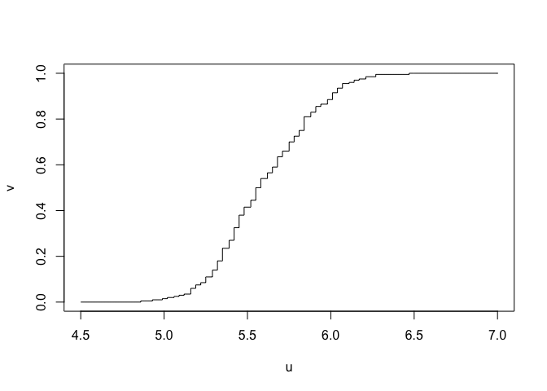
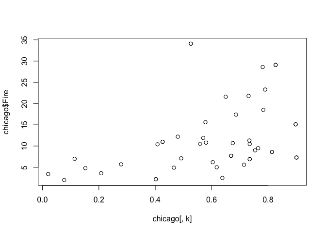
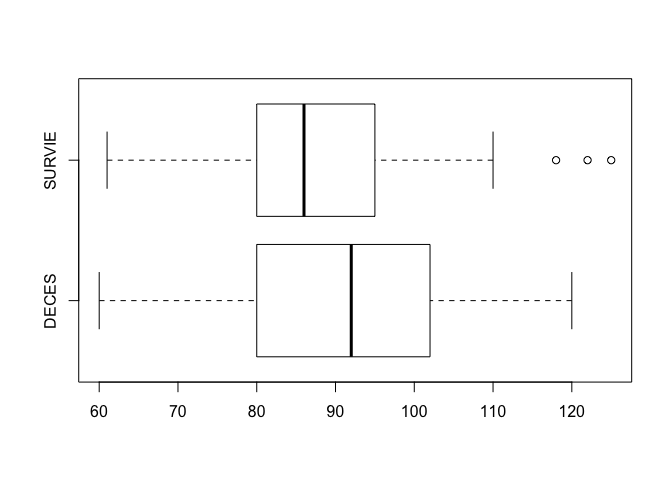
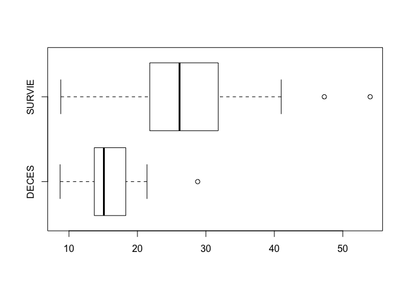
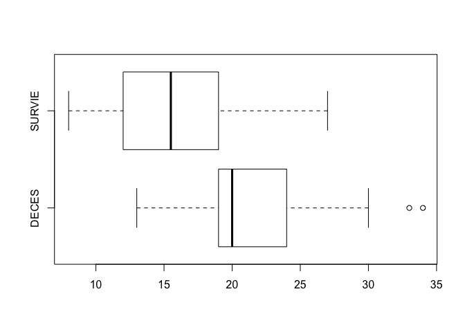

STT5100 - Probabilites et Statistiques - Hiver 2019
================
Arthur Charpentier

``` r
Davis=read.table(
"http://socserv.socsci.mcmaster.ca/jfox/Books/Applied-Regression-2E/datasets/Davis.txt")
Davis[12,c(2,3)]=Davis[12,c(3,2)]
Davis=data.frame(X=Davis$height / 30.48,
                 Y=Davis$weight * 2.204622)
str(Davis)
```

    ## 'data.frame':    200 obs. of  2 variables:
    ##  $ X: num  5.97 5.28 5.28 5.81 5.15 ...
    ##  $ Y: num  170 128 117 150 130 ...

``` r
X = Davis$X
plot(ecdf(X))
```

<!-- -->

``` r
ecdf(X)(mean(X))
```

    ## [1] 0.54

``` r
u=seq(4.5,7,length=251)
v=ecdf(X)(u)
plot(u,v,type="s")
```

<!-- -->

``` r
plot(v,u,type="s")
```

<!-- -->

``` r
hist(Davis$X)
```

<!-- -->

``` r
mean(Davis$X)
```

    ## [1] 5.595965

``` r
var(Davis$X)
```

    ## [1] 0.08587953

``` r
sd(Davis$X)
```

    ## [1] 0.2930521

``` r
u=seq(min(Davis$X),max(Davis$X),length=251)
hist(Davis$X,probability=TRUE)
lines(u,dnorm(u,mean(Davis$X),sd(Davis$X)),col="red")
```

<!-- -->

``` r
hist(Davis$Y)
```

<!-- -->

``` r
mean(Davis$Y)
```

    ## [1] 143.8626

``` r
var(Davis$Y)
```

    ## [1] 862.7012

``` r
sd(Davis$Y)
```

    ## [1] 29.37178

``` r
u=seq(min(Davis$Y),max(Davis$Y),length=251)
hist(Davis$Y,probability=TRUE)
lines(u,dnorm(u,mean(Davis$Y),sd(Davis$Y)),col="red")
```

<!-- -->

``` r
var(Davis[,c("X","Y")])
```

    ##            X          Y
    ## X 0.08587953   6.636992
    ## Y 6.63699165 862.701240

``` r
plot(Davis)
library(mnormt)
f=function(x,y) dmnorm(cbind(x,y),c(mean(Davis$X),mean(Davis$Y)),var(Davis))
x=seq(min(Davis$X),max(Davis$X),length=101)
y=seq(min(Davis$Y),max(Davis$Y),length=101)
z=outer(x,y,f)
contour(x,y,z,add=TRUE,col="red")
```

<!-- -->

``` r
data(cars)
str(cars)
```

    ## 'data.frame':    50 obs. of  2 variables:
    ##  $ speed: num  4 4 7 7 8 9 10 10 10 11 ...
    ##  $ dist : num  2 10 4 22 16 10 18 26 34 17 ...

``` r
plot(cars)
```

<!-- -->

``` r
chicago = read.table("http://freakonometrics.free.fr/chicago.txt",header=TRUE,sep=";")
tail(chicago)
```

    ##    Fire   X_1 X_2    X_3
    ## 42  4.8 0.152  19 13.323
    ## 43 10.4 0.408  25 12.960
    ## 44 15.6 0.578  28 11.260
    ## 45  7.0 0.114   3 10.080
    ## 46  7.1 0.492  23 11.428
    ## 47  4.9 0.466  27 13.731

``` r
str(chicago)
```

    ## 'data.frame':    47 obs. of  4 variables:
    ##  $ Fire: num  6.2 9.5 10.5 7.7 8.6 34.1 11 6.9 7.3 15.1 ...
    ##  $ X_1 : num  0.604 0.765 0.735 0.669 0.814 0.526 0.426 0.735 0.901 0.898 ...
    ##  $ X_2 : int  29 44 36 37 53 68 75 18 31 25 ...
    ##  $ X_3 : num  11.74 9.32 9.95 10.66 9.73 ...

``` r
for(k in 2:4) plot(chicago[,k],chicago$Fire)
```

<!-- --><!-- --><!-- -->

``` r
myocarde = read.table("http://freakonometrics.free.fr/myocarde.csv",head=TRUE, sep=";")
str(myocarde)
```

    ## 'data.frame':    71 obs. of  8 variables:
    ##  $ FRCAR: int  90 90 120 82 80 80 94 80 78 100 ...
    ##  $ INCAR: num  1.71 1.68 1.4 1.79 1.58 1.13 2.04 1.19 2.16 2.28 ...
    ##  $ INSYS: num  19 18.7 11.7 21.8 19.7 14.1 21.7 14.9 27.7 22.8 ...
    ##  $ PRDIA: int  16 24 23 14 21 18 23 16 15 16 ...
    ##  $ PAPUL: num  19.5 31 29 17.5 28 23.5 27 21 20.5 23 ...
    ##  $ PVENT: num  16 14 8 10 18.5 9 10 16.5 11.5 4 ...
    ##  $ REPUL: int  912 1476 1657 782 1418 1664 1059 1412 759 807 ...
    ##  $ PRONO: Factor w/ 2 levels "DECES","SURVIE": 2 1 1 2 1 1 2 2 2 2 ...

``` r
for(i in 1:7) boxplot(myocarde[,i]~myocarde$PRONO,horizontal=TRUE)
```

<!-- --><!-- --><!-- --><!-- --><!-- --><!-- --><!-- -->
