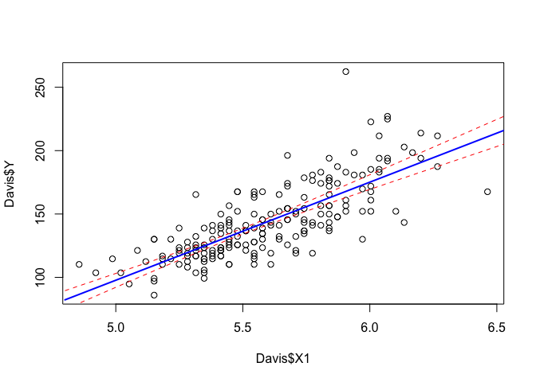

STT5100 \#2 - Modèle Linéaire Simple
================
Arthur Charpentier

Explaining the Weight of Students
=================================

``` r
Davis=read.table(
"http://socserv.socsci.mcmaster.ca/jfox/Books/Applied-Regression-2E/datasets/Davis.txt")
Davis[12,c(2,3)]=Davis[12,c(3,2)]
Davis=data.frame(X1=Davis$height / 30.48,
                 X2=Davis$sex,
                 Y=Davis$weight * 2.204622)
str(Davis)
```

    ## 'data.frame':    200 obs. of  3 variables:
    ##  $ X1: num  5.97 5.28 5.28 5.81 5.15 ...
    ##  $ X2: Factor w/ 2 levels "F","M": 2 1 1 2 1 2 2 2 2 2 ...
    ##  $ Y : num  170 128 117 150 130 ...

``` r
Y = Davis$Y
library(MASS)
fitdistr(Y,"normal")
```

    ##       mean          sd    
    ##   143.862609    29.298255 
    ##  (  2.071699) (  1.464913)

``` r
hist(Y,probability = TRUE, col=rgb(0,0,1,.4))
x=seq(min(Y),max(Y),length=251)
y=dnorm(x,fitdistr(Y,"normal")$estimate[1],fitdistr(Y,"normal")$estimate[2])
lines(x,y,col="red")
```


Regression - on a continous variable
------------------------------------

*y*<sub>*i*</sub> = *α* + *β**x*<sub>*i*</sub> + *ε*<sub>*i*</sub>

``` r
X1 = Davis$X1
plot(X1,Y)
mean(Y)
```

    ## [1] 143.8626

``` r
mean(X1)
```

    ## [1] 5.595965

``` r
abline(v=mean(X1),col="red",lty=2)
abline(h=mean(Y),col="red",lty=2)
```


$${\\displaystyle {\\begin{aligned}{\\hat {\\alpha }}&={\\bar {y}}-{\\hat {\\beta }}\\,{\\bar {x}},\\\\{\\hat {\\beta }}&={\\frac {\\sum \_{i=1}^{n}(x\_{i}-{\\bar {x}})(y\_{i}-{\\bar {y}})}{\\sum \_{i=1}^{n}(x\_{i}-{\\bar {x}})^{2}}}=\\text{corr}(x,y)\\cdot{\\frac {s\_{y}}{s\_{x}}}.\\\\\[6pt\]\\end{aligned}}} $$

``` r
cor(X1,Y)
```

    ## [1] 0.7710743

``` r
(Bhat = cor(X1,Y) * sd(Y)/sd(X1))
```

    ## [1] 77.28258

``` r
(Ahat = mean(Y) - Bhat*mean(X1))
```

    ## [1] -288.6079

``` r
plot(X1,Y)
abline(v=mean(X1),col="red",lty=2)
abline(h=mean(Y),col="red",lty=2)
abline(a = Ahat, b=Bhat, lwd=3, col="red")
```


``` r
Y_hat = Ahat + Bhat*X1
E_hat = Y-Y_hat
plot(X1,Y)
abline(a = Ahat, b=Bhat, lwd=3, col="red")
segments(X1,Y,X1,Y_hat,col="light blue")
```


``` r
SCR = function(B){sum((Y - (Ahat + B*X1))^2)}
x=seq(50,100)
y=Vectorize(SCR)(x)
plot(x,y,type="l",ylab="Somme des carres des erreurs")
abline(v=Bhat,col="red",lty=2)
```


``` r
reg = lm(Y~X1, data=Davis)
summary(reg)
```

    ## 
    ## Call:
    ## lm(formula = Y ~ X1, data = Davis)
    ## 
    ## Residuals:
    ##     Min      1Q  Median      3Q     Max 
    ## -43.338 -11.862  -1.223  10.597  94.565 
    ## 
    ## Coefficients:
    ##             Estimate Std. Error t value Pr(>|t|)    
    ## (Intercept) -288.608     25.415  -11.36   <2e-16 ***
    ## X1            77.283      4.535   17.04   <2e-16 ***
    ## ---
    ## Signif. codes:  0 '***' 0.001 '**' 0.01 '*' 0.05 '.' 0.1 ' ' 1
    ## 
    ## Residual standard error: 18.75 on 198 degrees of freedom
    ## Multiple R-squared:  0.5946, Adjusted R-squared:  0.5925 
    ## F-statistic: 290.4 on 1 and 198 DF,  p-value: < 2.2e-16

$${\\displaystyle s\_{\\hat {\\beta }}={\\sqrt {\\frac {{\\frac {1}{n-2}}\\sum \_{i=1}^{n}{\\hat {\\varepsilon }}\_{i}^{\\,2}}{\\sum \_{i=1}^{n}(x\_{i}-{\\bar {x}})^{2}}}}}$$

``` r
n=nrow(Davis)
(sigma2 = 1/(n-2)*sum(E_hat^2))
```

    ## [1] 351.544

``` r
sqrt(sigma2)
```

    ## [1] 18.74951

``` r
sqrt( sigma2 / sum( (X1-mean(X1))^2 ) )
```

    ## [1] 4.53543

$$
{\\displaystyle s\_{\\hat {\\alpha }}=s\_{\\hat {\\beta }}{\\sqrt {{\\frac {1}{n}}\\sum \_{i=1}^{n}x\_{i}^{2}}}={\\sqrt {{\\frac {1}{n(n-2)}}\\left(\\sum \_{i=1}^{n}{\\hat {\\varepsilon }}\_{j}^{\\,2}\\right){\\frac {\\sum \_{i=1}^{n}x\_{i}^{2}}{\\sum \_{i=1}^{n}(x\_{i}-{\\bar {x}})^{2}}}}}} 
$$

``` r
sqrt( sigma2 / sum( (X1-mean(X1))^2 ) )*sqrt(mean(X1^2))
```

    ## [1] 25.41471

$${\\displaystyle y=(\\alpha +\\beta x )\\in \\left\[{\\hat {\\alpha }}+{\\hat {\\beta }}x \\pm t\_{n-2}^{\*}{\\sqrt {\\left({\\frac {1}{n-2}}\\sum {\\hat {\\varepsilon }}\_{i}^{\\,2}\\right)\\cdot \\left({\\frac {1}{n}}+{\\frac {(x -{\\bar {x}})^{2}}{\\sum (x\_{i}-{\\bar {x}})^{2}}}\\right)}}\\right\]}$$

``` r
(t_star = qt(1-.05/2,n-2))
```

    ## [1] 1.972017

``` r
qnorm(1-.05/2)
```

    ## [1] 1.959964

Simulations
===========

``` r
library(scales)
BETA = matrix(NA,100,2)
for(s in 1:100){
  set.seed(s)
  idx = sample(1:nrow(Davis),nrow(Davis),replace=TRUE)
  reg_sim = lm(Y~X1, data=Davis[idx,])
  BETA[s,] = reg_sim$coefficients
}
pic_ani = function(k){
  plot(Davis$X1,Davis$Y,ylab="weight (lbs)",xlab="height (feet)",col="white")
  for(s in 1:100) abline(BETA[s,1],BETA[s,2],col=alpha("light blue",.3))
  set.seed(k)
  idx = sample(1:nrow(Davis),nrow(Davis),replace=TRUE)
  points(Davis$X1,Davis$Y,col="grey")
  points(Davis$X1[idx],Davis$Y[idx],pch=19)
  abline(BETA[k,1],BETA[k,2],col="blue",lwd=2)
}
for (k in 1:50) {pic_ani(k)}
```


Let us run 10,000 simulations of *pseudo*-samples

``` r
BETA = matrix(NA,1e5,2)
for(s in 1:nrow(BETA)){
  idx = sample(1:nrow(Davis),nrow(Davis),replace=TRUE)
  reg_sim = lm(Y~X1, data=Davis[idx,])
  BETA[s,] = reg_sim$coefficients
}
summary(lm(Y~X1, data=Davis))
```

    ## 
    ## Call:
    ## lm(formula = Y ~ X1, data = Davis)
    ## 
    ## Residuals:
    ##     Min      1Q  Median      3Q     Max 
    ## -43.338 -11.862  -1.223  10.597  94.565 
    ## 
    ## Coefficients:
    ##             Estimate Std. Error t value Pr(>|t|)    
    ## (Intercept) -288.608     25.415  -11.36   <2e-16 ***
    ## X1            77.283      4.535   17.04   <2e-16 ***
    ## ---
    ## Signif. codes:  0 '***' 0.001 '**' 0.01 '*' 0.05 '.' 0.1 ' ' 1
    ## 
    ## Residual standard error: 18.75 on 198 degrees of freedom
    ## Multiple R-squared:  0.5946, Adjusted R-squared:  0.5925 
    ## F-statistic: 290.4 on 1 and 198 DF,  p-value: < 2.2e-16

``` r
par(mfrow=c(1,2))
hist(BETA[,1],probability=TRUE,col="grey",border="white",ylim=c(0,.016))
m_std = summary(lm(Y~X1, data=Davis))$coefficients[1,1:2]
m_std
```

    ##   Estimate Std. Error 
    ## -288.60795   25.41471

``` r
u=seq(m_std[1]-3*m_std[2],m_std[1]+3*m_std[2],length=251)
v=dnorm(u,m_std[1],m_std[2])
lines(u,v,col="red")
hist(BETA[,2],probability=TRUE,col="grey",border="white",ylim=c(0,.09))
m_std = summary(lm(Y~X1, data=Davis))$coefficients[2,1:2]
u=seq(m_std[1]-3*m_std[2],m_std[1]+3*m_std[2],length=251)
v=dnorm(u,m_std[1],m_std[2])
lines(u,v,col="red")
```


``` r
par(mfrow=c(1,1))
plot(BETA[1:1000,1],BETA[1:1000,2])
```


``` r
cov(BETA)
```

    ##           [,1]       [,2]
    ## [1,]  824.4541 -150.06436
    ## [2,] -150.0644   27.36092

``` r
(V=vcov(lm(Y~X1, data=Davis)))
```

    ##             (Intercept)         X1
    ## (Intercept)    645.9074 -115.10968
    ## X1            -115.1097   20.57012

``` r
cor(BETA)
```

    ##           [,1]      [,2]
    ## [1,]  1.000000 -0.999146
    ## [2,] -0.999146  1.000000

``` r
V[1,2]/(sqrt(V[1,1]*V[2,2]))
```

    ## [1] -0.9986384

Classical confidence intervals for prediction are here

``` r
reg = lm(Y~X1, data=Davis)
par(mfrow=c(1,1))
plot(Davis$X1,Davis$Y)
u=seq(4.8,6.6,by=.05)
v=predict(reg,newdata = data.frame(X1=u),interval = "confidence")
lines(u,v[,1],col="blue",lwd=2)
lines(u,v[,2],col="red",lty=2)
lines(u,v[,3],col="red",lty=2)
```


One can use simulations to get those prediction

``` r
PRED = matrix(NA,nrow(BETA),length(u))
for(s in 1:nrow(BETA)) PRED[s,]=BETA[s,1]+BETA[s,2]*u
plot(Davis$X1,Davis$Y)
lines(u,apply(PRED,2,mean),col="blue",lwd=2)
lines(u,apply(PRED,2,function(x) quantile(x,.975)),col="red",lty=2)
lines(u,apply(PRED,2,function(x) quantile(x,.025)),col="red",lty=2)
```


