Code tapé en cours
================

# Cours régression logistique


``` r
# LOGISTIQUE
loc = "http://freakonometrics.free.fr/titanic.RData"
download.file(loc, "titanic.RData")
load("titanic.RData")
base = base[,1:7]
with(base,aggregate(Survived,by=list(Pclass),mean))$x
```

    ## [1] 0.6296296 0.4728261 0.2423625

``` r
(T = table(base$Survived,base$Pclass))
```

    ##    
    ##       1   2   3
    ##   0  80  97 372
    ##   1 136  87 119

``` r
chisq.test(T)
```

    ## 
    ##  Pearson's Chi-squared test
    ## 
    ## data:  T
    ## X-squared = 102.89, df = 2, p-value < 2.2e-16

``` r
Q =chisq.test(T)
Q$expected
```

    ##    
    ##             1         2        3
    ##   0 133.09091 113.37374 302.5354
    ##   1  82.90909  70.62626 188.4646

``` r
Q$observed
```

    ##    
    ##       1   2   3
    ##   0  80  97 372
    ##   1 136  87 119

``` r
library("graphics")
mosaicplot(T)
```

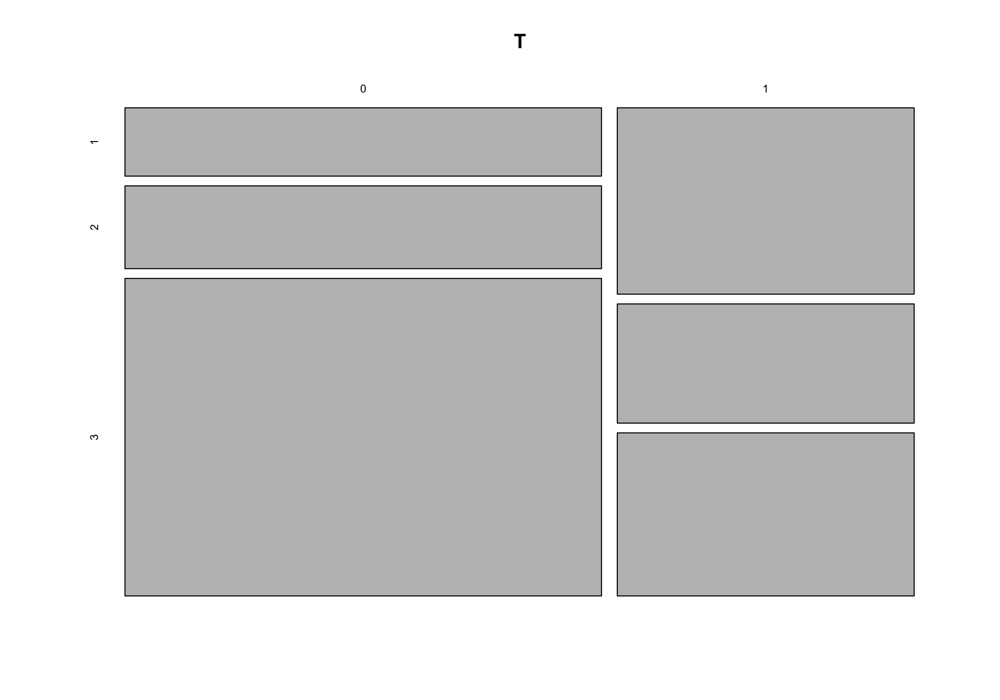

``` r
mosaicplot(t(T))
```

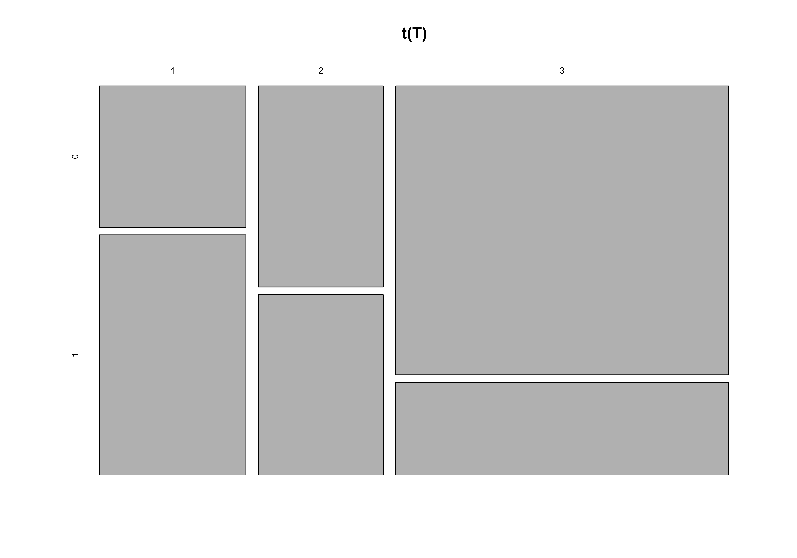

``` r
mosaicplot(Q$expected)
```


``` r
library("vcd")
assoc(T,shade=TRUE)
```

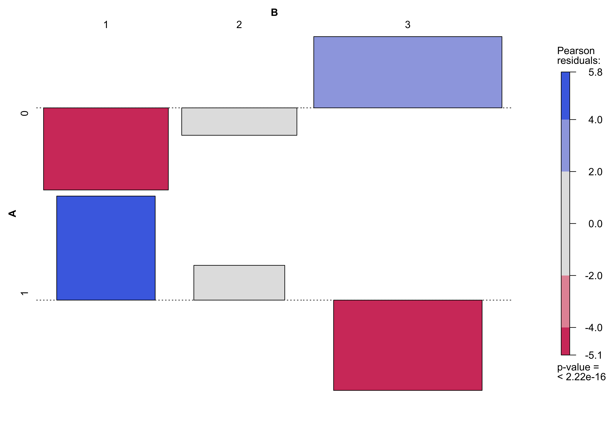

``` r
boxplot(base$Age ~ base$Survived)
```

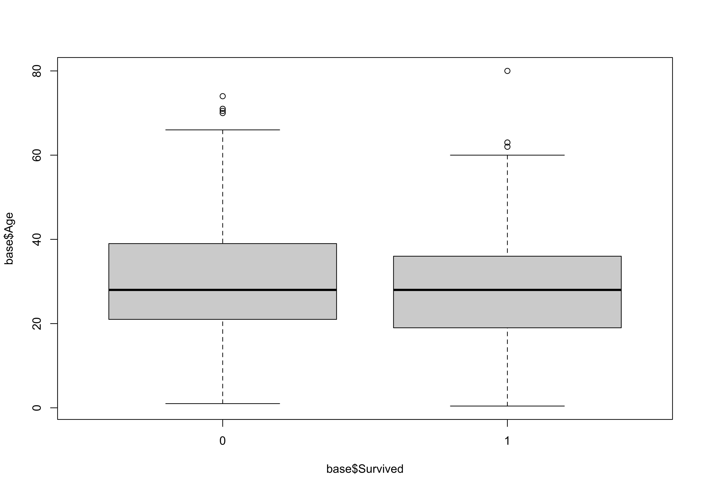

``` r
reg = glm(Survived ~ Age + Pclass, data = base,
          family = binomial)
head(predict(reg,type="response"))
```

    ##         1         2         3         4         5         7 
    ## 0.2512141 0.6702556 0.2211176 0.6973277 0.1631526 0.5103158

``` r
hist(predict(reg,type="response"))
```

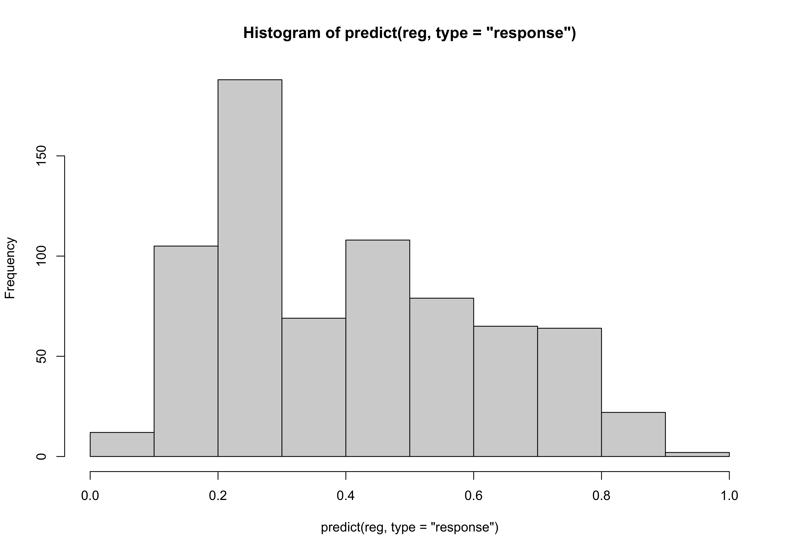

``` r
reg = glm(Survived ~ Pclass, data = base,
          family = binomial)

loc = "http://freakonometrics.free.fr/titanic.RData"
download.file(loc, "titanic.RData")
load("titanic.RData")
base = base[,1:7]
str(base)
```

    ## 'data.frame':    891 obs. of  7 variables:
    ##  $ Survived: int  0 1 1 1 0 0 0 0 1 1 ...
    ##  $ Pclass  : Factor w/ 3 levels "1","2","3": 3 1 3 1 3 3 1 3 3 2 ...
    ##  $ Sex     : Factor w/ 2 levels "female","male": 2 1 1 1 2 2 2 2 1 1 ...
    ##  $ Age     : num  22 38 26 35 35 NA 54 2 27 14 ...
    ##  $ SibSp   : int  1 1 0 1 0 0 0 3 0 1 ...
    ##  $ Parch   : int  0 0 0 0 0 0 0 1 2 0 ...
    ##  $ Embarked: Factor w/ 4 levels "","C","Q","S": 4 2 4 4 4 3 4 4 4 2 ...

``` r
base = base[!is.na(base$Age),]
reg = glm(Survived ~ Age + Pclass + Sex, data = base,
          family = binomial)
summary(reg)
```

    ## 
    ## Call:
    ## glm(formula = Survived ~ Age + Pclass + Sex, family = binomial, 
    ##     data = base)
    ## 
    ## Deviance Residuals: 
    ##     Min       1Q   Median       3Q      Max  
    ## -2.7303  -0.6780  -0.3953   0.6485   2.4657  
    ## 
    ## Coefficients:
    ##              Estimate Std. Error z value Pr(>|z|)    
    ## (Intercept)  3.777013   0.401123   9.416  < 2e-16 ***
    ## Age         -0.036985   0.007656  -4.831 1.36e-06 ***
    ## Pclass2     -1.309799   0.278066  -4.710 2.47e-06 ***
    ## Pclass3     -2.580625   0.281442  -9.169  < 2e-16 ***
    ## Sexmale     -2.522781   0.207391 -12.164  < 2e-16 ***
    ## ---
    ## Signif. codes:  0 '***' 0.001 '**' 0.01 '*' 0.05 '.' 0.1 ' ' 1
    ## 
    ## (Dispersion parameter for binomial family taken to be 1)
    ## 
    ##     Null deviance: 964.52  on 713  degrees of freedom
    ## Residual deviance: 647.28  on 709  degrees of freedom
    ## AIC: 657.28
    ## 
    ## Number of Fisher Scoring iterations: 5

``` r
newbase = data.frame(Age=c(20,17),
                     Pclass=c('3','1'),
                    Sex=c('male','female'))
predict(reg,newdata = newbase, type='response')
```

    ##         1         2 
    ## 0.1124358 0.9588402

``` r
score = predict(reg,newdata = base, type='response')

seuil = .5
plot(score, base$Survived)
abline(v=seuil,col='red')
```

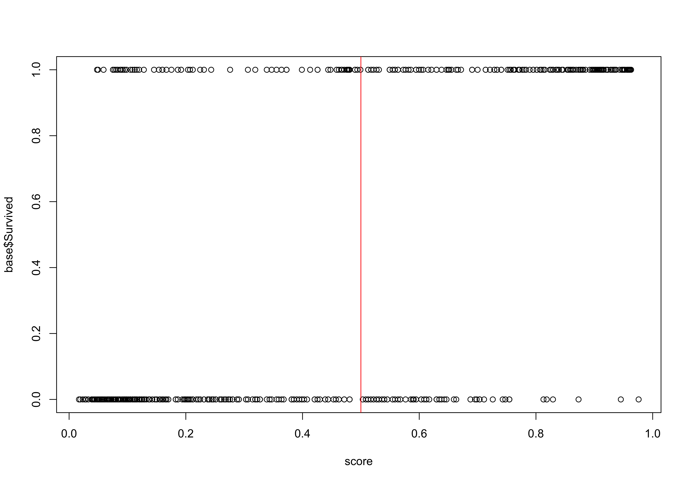

``` r
table(predict(reg,type="response")>seuil,base$Survived)
```

    ##        
    ##           0   1
    ##   FALSE 356  83
    ##   TRUE   68 207

``` r
Ps = predict(reg,type="response")>seuil
(FP=sum((Ps==1)*(base$Survived==0))/sum(base$Survived==0))    
```

    ## [1] 0.1603774

``` r
(TP=sum((Ps==1)*(base$Survived==1))/sum(base$Survived==1))
```

    ## [1] 0.7137931

``` r
plot(0:1,0:1,xlab='FPR',ylab='TPR',col='white')
for(seuil in (0:200)/200){ 
table(predict(reg,type="response")>seuil,base$Survived)
Ps = predict(reg,type="response")>seuil
(FP=sum((Ps==1)*(base$Survived==0))/sum(base$Survived==0))    
(TP=sum((Ps==1)*(base$Survived==1))/sum(base$Survived==1))
points(FP,TP,pch=19,col='blue')
}
```

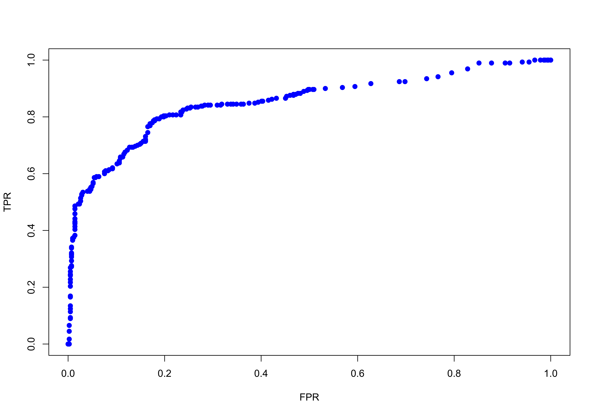

``` r
library(ROCR)
pred = prediction(predict(reg,type="response"), 
                  base$Survived)
perf = performance(pred,"tpr","fpr")
plot(perf)
```

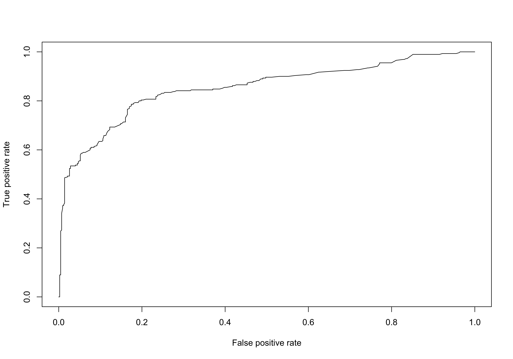

``` r
performance(pred, measure = "auc")@y.values[[1]]
```

    ## [1] 0.8523219

``` r
reg = glm(Survived ~ Pclass, data = base,
          family = binomial)
table(predict(reg,type="response"))
```

    ## 
    ##  0.23943661971878 0.479768786127168 0.655913978494603 
    ##               355               173               186

``` r
plot(predict(reg,type="response"),base$Survived,xlim=0:1)
```

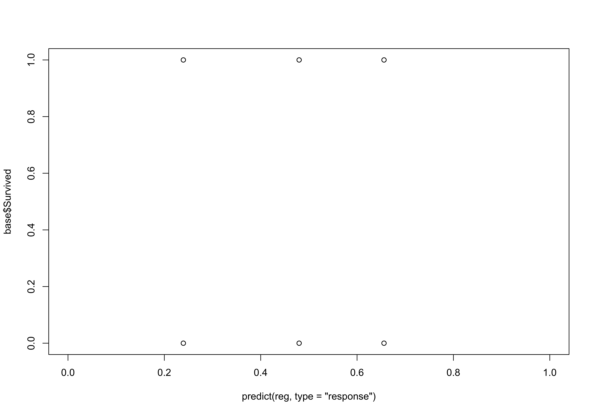

``` r
library(ROCR)
pred = prediction(predict(reg,type="response"), 
                  base$Survived)
perf = performance(pred,"tpr","fpr")
plot(perf)
```

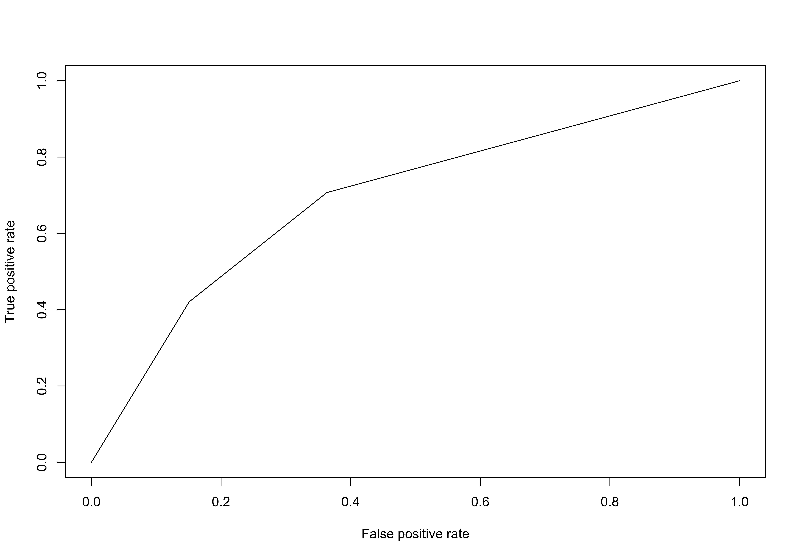

``` r
performance(pred, measure = "auc")@y.values[[1]]
```

    ## [1] 0.6948926

``` r
reg = glm(Survived ~ Sex, data = base,
          family = binomial)
table(predict(reg,type="response"))
```

    ## 
    ##  0.20529801324509 0.754789272030129 
    ##               453               261

``` r
plot(predict(reg,type="response"),base$Survived,xlim=0:1)
```

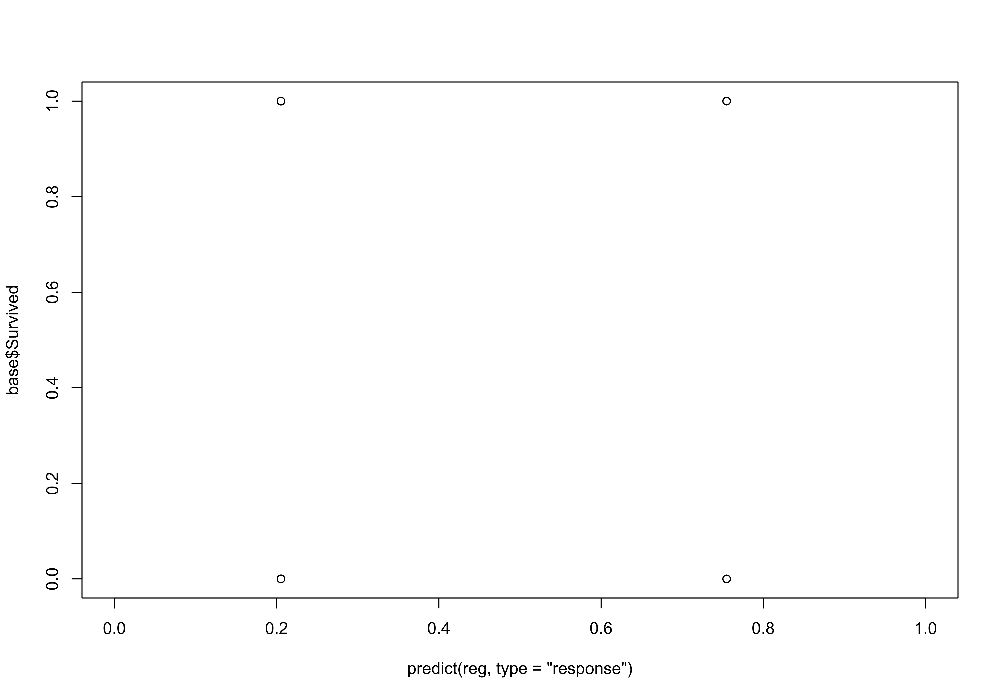

``` r
library(ROCR)
pred = prediction(predict(reg,type="response"), 
                  base$Survived)
perf = performance(pred,"tpr","fpr")
plot(perf)
performance(pred, measure = "auc")@y.values[[1]]
```

    ## [1] 0.7641835

``` r
s=.5
table(predict(reg,type="response")>s,base$Survived)
```

    ##        
    ##           0   1
    ##   FALSE 360  93
    ##   TRUE   64 197

``` r
Ps = predict(reg,type="response")>s
FP=sum((Ps==1)*(base$Survived==0))/sum(base$Survived==0)    
TP=sum((Ps==1)*(base$Survived==1))/sum(base$Survived==1)
points(FP,TP,pch=19,col="red")
```

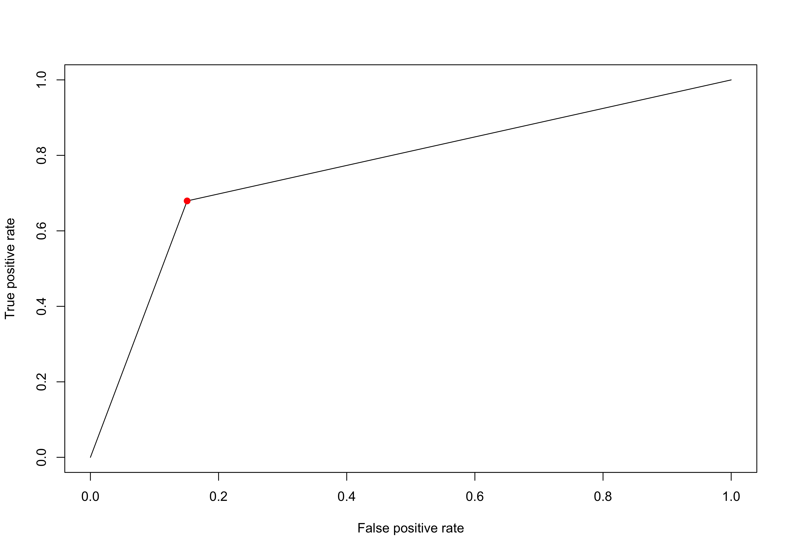

``` r
reg = glm(Survived ~ ., data = base,
          family = binomial)
plot(density(predict(reg,type="response")[base$Survived==0]),col="red",xlim=c(0,1),type="l")
lines(density(predict(reg,type="response")[base$Survived==1]),col="blue",xlim=c(0,1),type="l")
```

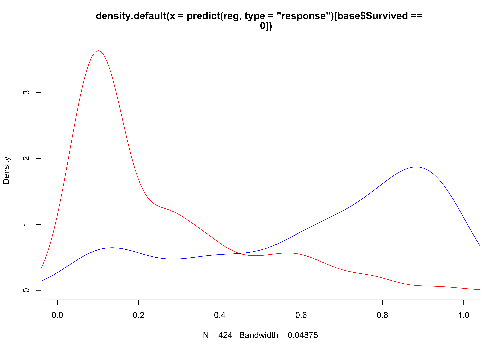

``` r
plot(ecdf(predict(reg,type="response")[base$Survived==0]),col='red')
lines(ecdf(predict(reg,type="response")[base$Survived==1]),col='blue')
```

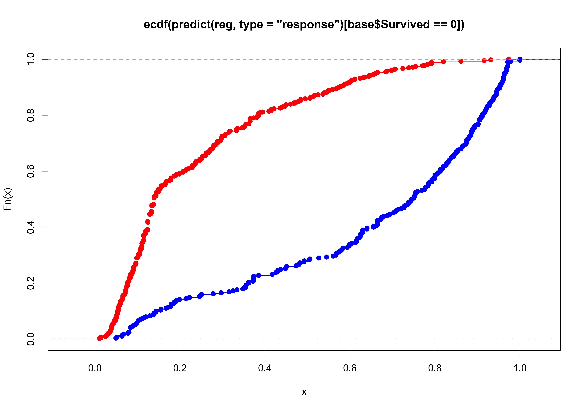

``` r
library(nnet)
```

    ## 
    ## Attaching package: 'nnet'

    ## The following object is masked from 'package:mgcv':
    ## 
    ##     multinom

``` r
reg = multinom(Pclass ~ Age + Survived + Sex,
               data=base)
```

    ## # weights:  15 (8 variable)
    ## initial  value 784.409174 
    ## iter  10 value 626.218834
    ## final  value 625.917569 
    ## converged

``` r
regm = multinom(Survived ~ Age + Pclass + Sex,
               data=base)
```

    ## # weights:  6 (5 variable)
    ## initial  value 494.907087 
    ## iter  10 value 323.641683
    ## final  value 323.641563 
    ## converged

``` r
reg = glm(Survived ~ Age + Pclass + Sex, data = base,
          family = binomial)
summary(reg)
```

    ## 
    ## Call:
    ## glm(formula = Survived ~ Age + Pclass + Sex, family = binomial, 
    ##     data = base)
    ## 
    ## Deviance Residuals: 
    ##     Min       1Q   Median       3Q      Max  
    ## -2.7303  -0.6780  -0.3953   0.6485   2.4657  
    ## 
    ## Coefficients:
    ##              Estimate Std. Error z value Pr(>|z|)    
    ## (Intercept)  3.777013   0.401123   9.416  < 2e-16 ***
    ## Age         -0.036985   0.007656  -4.831 1.36e-06 ***
    ## Pclass2     -1.309799   0.278066  -4.710 2.47e-06 ***
    ## Pclass3     -2.580625   0.281442  -9.169  < 2e-16 ***
    ## Sexmale     -2.522781   0.207391 -12.164  < 2e-16 ***
    ## ---
    ## Signif. codes:  0 '***' 0.001 '**' 0.01 '*' 0.05 '.' 0.1 ' ' 1
    ## 
    ## (Dispersion parameter for binomial family taken to be 1)
    ## 
    ##     Null deviance: 964.52  on 713  degrees of freedom
    ## Residual deviance: 647.28  on 709  degrees of freedom
    ## AIC: 657.28
    ## 
    ## Number of Fisher Scoring iterations: 5

``` r
summary(regm)
```

    ## Call:
    ## multinom(formula = Survived ~ Age + Pclass + Sex, data = base)
    ## 
    ## Coefficients:
    ##                  Values   Std. Err.
    ## (Intercept)  3.77693496 0.401118784
    ## Age         -0.03698333 0.007655864
    ## Pclass2     -1.30978030 0.278063856
    ## Pclass3     -2.58057722 0.281439027
    ## Sexmale     -2.52275085 0.207389480
    ## 
    ## Residual Deviance: 647.2831 
    ## AIC: 657.2831

``` r
reg = glm((Survived == 1) ~ Age + Pclass + Sex, data = base,
          family = binomial)
summary(reg)
```

    ## 
    ## Call:
    ## glm(formula = (Survived == 1) ~ Age + Pclass + Sex, family = binomial, 
    ##     data = base)
    ## 
    ## Deviance Residuals: 
    ##     Min       1Q   Median       3Q      Max  
    ## -2.7303  -0.6780  -0.3953   0.6485   2.4657  
    ## 
    ## Coefficients:
    ##              Estimate Std. Error z value Pr(>|z|)    
    ## (Intercept)  3.777013   0.401123   9.416  < 2e-16 ***
    ## Age         -0.036985   0.007656  -4.831 1.36e-06 ***
    ## Pclass2     -1.309799   0.278066  -4.710 2.47e-06 ***
    ## Pclass3     -2.580625   0.281442  -9.169  < 2e-16 ***
    ## Sexmale     -2.522781   0.207391 -12.164  < 2e-16 ***
    ## ---
    ## Signif. codes:  0 '***' 0.001 '**' 0.01 '*' 0.05 '.' 0.1 ' ' 1
    ## 
    ## (Dispersion parameter for binomial family taken to be 1)
    ## 
    ##     Null deviance: 964.52  on 713  degrees of freedom
    ## Residual deviance: 647.28  on 709  degrees of freedom
    ## AIC: 657.28
    ## 
    ## Number of Fisher Scoring iterations: 5

``` r
reg = glm((Survived == 0) ~ Age + Pclass + Sex, data = base,
          family = binomial)
summary(reg)
```

    ## 
    ## Call:
    ## glm(formula = (Survived == 0) ~ Age + Pclass + Sex, family = binomial, 
    ##     data = base)
    ## 
    ## Deviance Residuals: 
    ##     Min       1Q   Median       3Q      Max  
    ## -2.4657  -0.6485   0.3953   0.6780   2.7303  
    ## 
    ## Coefficients:
    ##              Estimate Std. Error z value Pr(>|z|)    
    ## (Intercept) -3.777013   0.401123  -9.416  < 2e-16 ***
    ## Age          0.036985   0.007656   4.831 1.36e-06 ***
    ## Pclass2      1.309799   0.278066   4.710 2.47e-06 ***
    ## Pclass3      2.580625   0.281442   9.169  < 2e-16 ***
    ## Sexmale      2.522781   0.207391  12.164  < 2e-16 ***
    ## ---
    ## Signif. codes:  0 '***' 0.001 '**' 0.01 '*' 0.05 '.' 0.1 ' ' 1
    ## 
    ## (Dispersion parameter for binomial family taken to be 1)
    ## 
    ##     Null deviance: 964.52  on 713  degrees of freedom
    ## Residual deviance: 647.28  on 709  degrees of freedom
    ## AIC: 657.28
    ## 
    ## Number of Fisher Scoring iterations: 5
