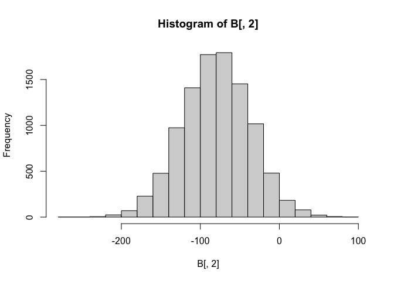
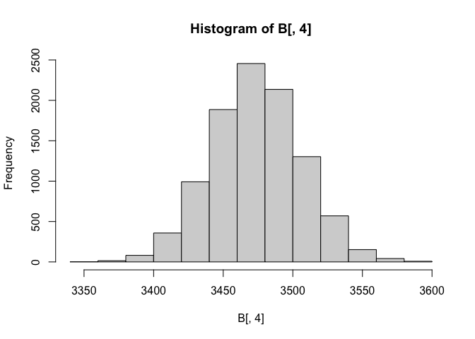
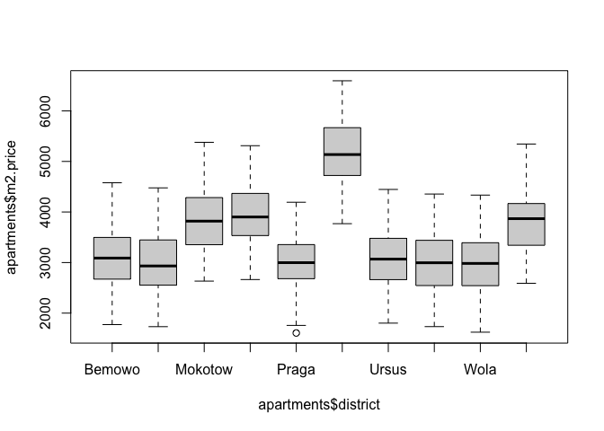
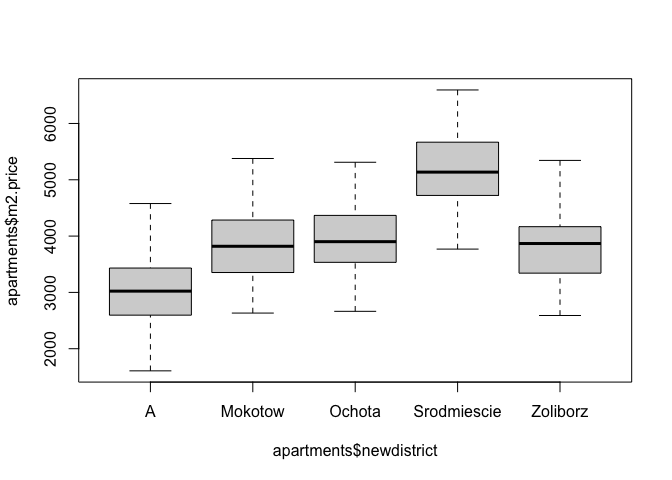
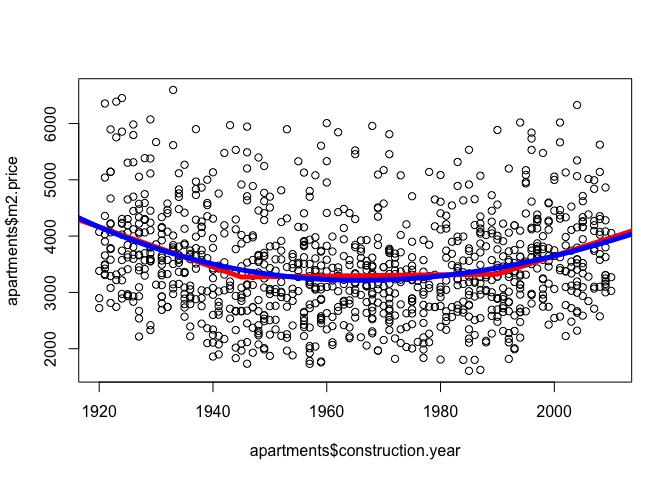

Code tapé en cours
================

- <a href="#cours-4" id="toc-cours-4">Cours 4</a>
- <a href="#cours-5" id="toc-cours-5">Cours 5</a>
- <a href="#cours-6" id="toc-cours-6">Cours 6</a>

# Cours 4

``` r
library(DALEX)
```

    ## Welcome to DALEX (version: 2.4.3).
    ## Find examples and detailed introduction at: http://ema.drwhy.ai/
    ## Additional features will be available after installation of: ggpubr.
    ## Use 'install_dependencies()' to get all suggested dependencies

``` r
data("apartments")
str(apartments)
```

    ## 'data.frame':    1000 obs. of  6 variables:
    ##  $ m2.price         : num  5897 1818 3643 3517 3013 ...
    ##  $ construction.year: num  1953 1992 1937 1995 1992 ...
    ##  $ surface          : num  25 143 56 93 144 61 127 105 145 112 ...
    ##  $ floor            : int  3 9 1 7 6 6 8 8 6 9 ...
    ##  $ no.rooms         : num  1 5 2 3 5 2 5 4 6 4 ...
    ##  $ district         : Factor w/ 10 levels "Bemowo","Bielany",..: 6 2 5 4 3 6 3 7 6 6 ...

``` r
model = lm(m2.price~as.factor(no.rooms)+district, data=apartments)
summary(model)
```

    ## 
    ## Call:
    ## lm(formula = m2.price ~ as.factor(no.rooms) + district, data = apartments)
    ## 
    ## Residuals:
    ##     Min      1Q  Median      3Q     Max 
    ## -934.94 -322.51   -3.88  263.91 1187.84 
    ## 
    ## Coefficients:
    ##                       Estimate Std. Error t value Pr(>|t|)    
    ## (Intercept)           3638.373     59.311  61.344  < 2e-16 ***
    ## as.factor(no.rooms)2  -145.947     52.505  -2.780  0.00555 ** 
    ## as.factor(no.rooms)3  -476.845     51.395  -9.278  < 2e-16 ***
    ## as.factor(no.rooms)4  -801.353     51.672 -15.509  < 2e-16 ***
    ## as.factor(no.rooms)5 -1113.546     52.759 -21.106  < 2e-16 ***
    ## as.factor(no.rooms)6 -1445.160     75.761 -19.075  < 2e-16 ***
    ## districtBielany         -3.079     61.406  -0.050  0.96002    
    ## districtMokotow        861.695     59.801  14.409  < 2e-16 ***
    ## districtOchota         846.114     61.424  13.775  < 2e-16 ***
    ## districtPraga          -49.188     62.141  -0.792  0.42881    
    ## districtSrodmiescie   2092.143     60.797  34.412  < 2e-16 ***
    ## districtUrsus           56.185     60.057   0.936  0.34975    
    ## districtUrsynow        -40.739     60.346  -0.675  0.49978    
    ## districtWola           -62.366     59.952  -1.040  0.29847    
    ## districtZoliborz       850.215     61.323  13.865  < 2e-16 ***
    ## ---
    ## Signif. codes:  0 '***' 0.001 '**' 0.01 '*' 0.05 '.' 0.1 ' ' 1
    ## 
    ## Residual standard error: 427.2 on 985 degrees of freedom
    ## Multiple R-squared:  0.7811, Adjusted R-squared:  0.778 
    ## F-statistic: 251.1 on 14 and 985 DF,  p-value: < 2.2e-16

``` r
table(apartments$district)
```

    ## 
    ##      Bemowo     Bielany     Mokotow      Ochota       Praga Srodmiescie 
    ##          98          96         107          96          92         100 
    ##       Ursus     Ursynow        Wola    Zoliborz 
    ##         105         103         106          97

``` r
n=nrow(apartments)
y = as.matrix(apartments$m2.price,n,1)
X = as.matrix(cbind(rep(1,n),
                    apartments$surface,
                    apartments$construction.year,
                    apartments$no.rooms))
b = solve(t(X)%*%X) %*% (t(X)%*%y)
model = lm(m2.price~surface+construction.year+no.rooms, 
           data=apartments)
summary(model)
```

    ## 
    ## Call:
    ## lm(formula = m2.price ~ surface + construction.year + no.rooms, 
    ##     data = apartments)
    ## 
    ## Residuals:
    ##     Min      1Q  Median      3Q     Max 
    ## -1174.7  -546.4  -178.4   398.3  2531.4 
    ## 
    ## Coefficients:
    ##                    Estimate Std. Error t value Pr(>|t|)    
    ## (Intercept)       6295.7095  1884.1995   3.341 0.000865 ***
    ## surface             -9.3827     1.6007  -5.862 6.22e-09 ***
    ## construction.year   -0.8829     0.9599  -0.920 0.357920    
    ## no.rooms           -80.6139    43.8440  -1.839 0.066264 .  
    ## ---
    ## Signif. codes:  0 '***' 0.001 '**' 0.01 '*' 0.05 '.' 0.1 ' ' 1
    ## 
    ## Residual standard error: 781.8 on 996 degrees of freedom
    ## Multiple R-squared:  0.2588, Adjusted R-squared:  0.2566 
    ## F-statistic: 115.9 on 3 and 996 DF,  p-value: < 2.2e-16

``` r
sqrt(diag(solve(t(X)%*%X)))
```

    ## [1] 2.410148767 0.002047488 0.001227888 0.056082519

``` r
haty = X %*% b
e = y - haty
1/(n-4)*sum(e^2)
```

    ## [1] 611175.7

``` r
sqrt(1/(n-4)*sum(e^2))
```

    ## [1] 781.7772

``` r
s = 781.8
s*sqrt(diag(solve(t(X)%*%X)))
```

    ## [1] 1884.2543061    1.6007263    0.9599625   43.8453137

# Cours 5

``` r
library(DALEX)
data("apartments")
str(apartments)
```

    ## 'data.frame':    1000 obs. of  6 variables:
    ##  $ m2.price         : num  5897 1818 3643 3517 3013 ...
    ##  $ construction.year: num  1953 1992 1937 1995 1992 ...
    ##  $ surface          : num  25 143 56 93 144 61 127 105 145 112 ...
    ##  $ floor            : int  3 9 1 7 6 6 8 8 6 9 ...
    ##  $ no.rooms         : num  1 5 2 3 5 2 5 4 6 4 ...
    ##  $ district         : Factor w/ 10 levels "Bemowo","Bielany",..: 6 2 5 4 3 6 3 7 6 6 ...

``` r
model = lm(m2.price~no.rooms+surface, data=apartments)
summary(model)
```

    ## 
    ## Call:
    ## lm(formula = m2.price ~ no.rooms + surface, data = apartments)
    ## 
    ## Residuals:
    ##     Min      1Q  Median      3Q     Max 
    ## -1155.1  -536.9  -181.5   391.7  2509.0 
    ## 
    ## Coefficients:
    ##             Estimate Std. Error t value Pr(>|t|)    
    ## (Intercept) 4563.730     65.082  70.123  < 2e-16 ***
    ## no.rooms     -79.492     43.824  -1.814     0.07 .  
    ## surface       -9.459      1.598  -5.918 4.48e-09 ***
    ## ---
    ## Signif. codes:  0 '***' 0.001 '**' 0.01 '*' 0.05 '.' 0.1 ' ' 1
    ## 
    ## Residual standard error: 781.7 on 997 degrees of freedom
    ## Multiple R-squared:  0.2582, Adjusted R-squared:  0.2567 
    ## F-statistic: 173.5 on 2 and 997 DF,  p-value: < 2.2e-16

``` r
ns=10000
B = matrix(NA,ns,4)

set.seed(123)
for(i in 1:nrow(B)){ 
  idx = sample(1:nrow(apartments),size=nrow(apartments),
               replace = TRUE)
  modeli = lm(m2.price~no.rooms+surface, data=apartments[idx,])
  B[i,1:3] = coef(modeli)
  B[i,4] = predict(modeli, newdata = data.frame(no.rooms=3,
                                       surface=90))
}
hist(B[,2])
```

<!-- -->

``` r
head(B)
```

    ##          [,1]      [,2]       [,3]     [,4]
    ## [1,] 4568.171 -64.17323  -9.748120 3498.321
    ## [2,] 4678.724 -96.81668  -9.764658 3509.455
    ## [3,] 4486.019 -75.19883  -9.063865 3444.675
    ## [4,] 4467.659 -90.21025  -7.965910 3480.096
    ## [5,] 4626.147 -92.24577  -8.874292 3550.724
    ## [6,] 4559.250 -53.13062 -10.125492 3488.564

``` r
hist(B[,4])
```

<!-- -->

# Cours 6

``` r
library(DALEX)
library(car)
```

    ## Loading required package: carData

``` r
library(leaps)
data("apartments")
Davis=read.table(
  "http://socserv.socsci.mcmaster.ca/jfox/Books/Applied-Regression-2E/datasets/Davis.txt")
Davis[12,c(2,3)]=Davis[12,c(3,2)]
t.test(Davis$height[Davis$sex=='F'],
       Davis$height[Davis$sex=='M'])
```

    ## 
    ##  Welch Two Sample t-test
    ## 
    ## data:  Davis$height[Davis$sex == "F"] and Davis$height[Davis$sex == "M"]
    ## t = -15.28, df = 174.29, p-value < 2.2e-16
    ## alternative hypothesis: true difference in means is not equal to 0
    ## 95 percent confidence interval:
    ##  -15.01467 -11.57949
    ## sample estimates:
    ## mean of x mean of y 
    ##  164.7143  178.0114

``` r
boxplot(apartments$m2.price~apartments$district)
```

<!-- -->

``` r
pairwise.t.test(apartments$m2.price,apartments$district)
```

    ## 
    ##  Pairwise comparisons using t tests with pooled SD 
    ## 
    ## data:  apartments$m2.price and apartments$district 
    ## 
    ##             Bemowo  Bielany Mokotow Ochota  Praga   Srodmiescie Ursus   Ursynow
    ## Bielany     1       -       -       -       -       -           -       -      
    ## Mokotow     < 2e-16 < 2e-16 -       -       -       -           -       -      
    ## Ochota      < 2e-16 < 2e-16 1       -       -       -           -       -      
    ## Praga       1       1       < 2e-16 < 2e-16 -       -           -       -      
    ## Srodmiescie < 2e-16 < 2e-16 < 2e-16 < 2e-16 < 2e-16 -           -       -      
    ## Ursus       1       1       < 2e-16 < 2e-16 1       < 2e-16     -       -      
    ## Ursynow     1       1       < 2e-16 < 2e-16 1       < 2e-16     1       -      
    ## Wola        1       1       < 2e-16 < 2e-16 1       < 2e-16     1       1      
    ## Zoliborz    < 2e-16 < 2e-16 1       1       < 2e-16 < 2e-16     3.9e-16 < 2e-16
    ##             Wola   
    ## Bielany     -      
    ## Mokotow     -      
    ## Ochota      -      
    ## Praga       -      
    ## Srodmiescie -      
    ## Ursus       -      
    ## Ursynow     -      
    ## Wola        -      
    ## Zoliborz    < 2e-16
    ## 
    ## P value adjustment method: holm

``` r
reg = lm(m2.price ~ district, data = apartments)
summary(reg)
```

    ## 
    ## Call:
    ## lm(formula = m2.price ~ district, data = apartments)
    ## 
    ## Residuals:
    ##     Min      1Q  Median      3Q     Max 
    ## -1413.8  -426.8   -11.1   422.1  1546.0 
    ## 
    ## Coefficients:
    ##                     Estimate Std. Error t value Pr(>|t|)    
    ## (Intercept)          3048.46      60.34  50.519   <2e-16 ***
    ## districtBielany       -62.72      85.78  -0.731    0.465    
    ## districtMokotow       807.00      83.52   9.662   <2e-16 ***
    ## districtOchota        907.83      85.78  10.583   <2e-16 ***
    ## districtPraga         -53.65      86.72  -0.619    0.536    
    ## districtSrodmiescie  2134.29      84.91  25.136   <2e-16 ***
    ## districtUrsus          21.91      83.90   0.261    0.794    
    ## districtUrsynow       -38.09      84.29  -0.452    0.651    
    ## districtWola          -80.10      83.71  -0.957    0.339    
    ## districtZoliborz      749.49      85.56   8.760   <2e-16 ***
    ## ---
    ## Signif. codes:  0 '***' 0.001 '**' 0.01 '*' 0.05 '.' 0.1 ' ' 1
    ## 
    ## Residual standard error: 597.4 on 990 degrees of freedom
    ## Multiple R-squared:  0.5698, Adjusted R-squared:  0.5659 
    ## F-statistic: 145.7 on 9 and 990 DF,  p-value: < 2.2e-16

``` r
library(car)
linearHypothesis(reg,
                 c('districtBielany = 0',
                   'districtPraga = 0',
                   'districtUrsus = 0',
                   'districtWola = 0',
                   'districtUrsynow = 0'))
```

    ## Linear hypothesis test
    ## 
    ## Hypothesis:
    ## districtBielany = 0
    ## districtPraga = 0
    ## districtUrsus = 0
    ## districtWola = 0
    ## districtUrsynow = 0
    ## 
    ## Model 1: restricted model
    ## Model 2: m2.price ~ district
    ## 
    ##   Res.Df       RSS Df Sum of Sq      F Pr(>F)
    ## 1    995 354051715                           
    ## 2    990 353269202  5    782513 0.4386 0.8217

``` r
apartments$newdistrict = apartments$district
levels(apartments$newdistrict) = c('A','A',
                                   "Mokotow",    
                                   "Ochota", "A","Srodmiescie",
                                   "A","A","A",       
                                   "Zoliborz")
boxplot(apartments$m2.price~apartments$newdistrict)
```

<!-- -->

``` r
reg = lm(m2.price ~ newdistrict, data = apartments)
summary(reg)
```

    ## 
    ## Call:
    ## lm(formula = m2.price ~ newdistrict, data = apartments)
    ## 
    ## Residuals:
    ##      Min       1Q   Median       3Q      Max 
    ## -1413.75  -437.44   -10.55   420.06  1564.66 
    ## 
    ## Coefficients:
    ##                        Estimate Std. Error t value Pr(>|t|)    
    ## (Intercept)             3013.34      24.35  123.74   <2e-16 ***
    ## newdistrictMokotow       842.12      62.60   13.45   <2e-16 ***
    ## newdistrictOchota        942.95      65.57   14.38   <2e-16 ***
    ## newdistrictSrodmiescie  2169.41      64.43   33.67   <2e-16 ***
    ## newdistrictZoliborz      784.61      65.28   12.02   <2e-16 ***
    ## ---
    ## Signif. codes:  0 '***' 0.001 '**' 0.01 '*' 0.05 '.' 0.1 ' ' 1
    ## 
    ## Residual standard error: 596.5 on 995 degrees of freedom
    ## Multiple R-squared:  0.5689, Adjusted R-squared:  0.5672 
    ## F-statistic: 328.3 on 4 and 995 DF,  p-value: < 2.2e-16

``` r
apartments$newdistrict = relevel(apartments$newdistrict,
                                 ref = 'Mokotow')
reg = lm(m2.price ~ newdistrict, data = apartments)
summary(reg)
```

    ## 
    ## Call:
    ## lm(formula = m2.price ~ newdistrict, data = apartments)
    ## 
    ## Residuals:
    ##      Min       1Q   Median       3Q      Max 
    ## -1413.75  -437.44   -10.55   420.06  1564.66 
    ## 
    ## Coefficients:
    ##                        Estimate Std. Error t value Pr(>|t|)    
    ## (Intercept)             3855.46      57.67  66.857   <2e-16 ***
    ## newdistrictA            -842.12      62.60 -13.453   <2e-16 ***
    ## newdistrictOchota        100.83      83.86   1.202    0.229    
    ## newdistrictSrodmiescie  1327.29      82.97  15.997   <2e-16 ***
    ## newdistrictZoliborz      -57.51      83.63  -0.688    0.492    
    ## ---
    ## Signif. codes:  0 '***' 0.001 '**' 0.01 '*' 0.05 '.' 0.1 ' ' 1
    ## 
    ## Residual standard error: 596.5 on 995 degrees of freedom
    ## Multiple R-squared:  0.5689, Adjusted R-squared:  0.5672 
    ## F-statistic: 328.3 on 4 and 995 DF,  p-value: < 2.2e-16

``` r
rm(apartments)
data(apartments)
summary(lm(m2.price ~ .-construction.year, data=apartments))
```

    ## 
    ## Call:
    ## lm(formula = m2.price ~ . - construction.year, data = apartments)
    ## 
    ## Residuals:
    ##    Min     1Q Median     3Q    Max 
    ## -241.4 -203.6 -173.7  382.0  459.1 
    ## 
    ## Coefficients:
    ##                      Estimate Std. Error t value Pr(>|t|)    
    ## (Intercept)         4571.9266    39.1368 116.819   <2e-16 ***
    ## surface              -10.2567     0.5769 -17.780   <2e-16 ***
    ## floor                -99.4333     3.0856 -32.225   <2e-16 ***
    ## no.rooms             -37.4568    15.8340  -2.366   0.0182 *  
    ## districtBielany       16.1484    40.4061   0.400   0.6895    
    ## districtMokotow      916.9777    39.3695  23.292   <2e-16 ***
    ## districtOchota       924.7258    40.4495  22.861   <2e-16 ***
    ## districtPraga        -37.9931    40.8589  -0.930   0.3527    
    ## districtSrodmiescie 2080.0722    39.9950  52.008   <2e-16 ***
    ## districtUrsus         27.3469    39.5170   0.692   0.4891    
    ## districtUrsynow      -20.0845    39.7018  -0.506   0.6131    
    ## districtWola         -19.2841    39.4494  -0.489   0.6251    
    ## districtZoliborz     888.8663    40.3631  22.022   <2e-16 ***
    ## ---
    ## Signif. codes:  0 '***' 0.001 '**' 0.01 '*' 0.05 '.' 0.1 ' ' 1
    ## 
    ## Residual standard error: 281.2 on 987 degrees of freedom
    ## Multiple R-squared:  0.905,  Adjusted R-squared:  0.9038 
    ## F-statistic: 783.1 on 12 and 987 DF,  p-value: < 2.2e-16

``` r
p=950
base = cbind(apartments,as.data.frame(matrix(rnorm(1000*p),1000,p)))
summary(lm(m2.price ~ ., data=base))
```

    ## 
    ## Call:
    ## lm(formula = m2.price ~ ., data = base)
    ## 
    ## Residuals:
    ##      Min       1Q   Median       3Q      Max 
    ## -164.582  -37.779   -1.492   39.693  191.696 
    ## 
    ## Coefficients:
    ##                       Estimate Std. Error t value Pr(>|t|)    
    ## (Intercept)         9785.15699 3157.75692   3.099  0.00376 ** 
    ## construction.year     -2.72351    1.62558  -1.675  0.10252    
    ## surface              -11.23128    3.50559  -3.204  0.00284 ** 
    ## floor               -103.48151   15.21058  -6.803 5.96e-08 ***
    ## no.rooms              29.80602   92.56641   0.322  0.74932    
    ## districtBielany      223.62104  255.34004   0.876  0.38696    
    ## districtMokotow      918.38910  209.89690   4.375 9.94e-05 ***
    ## districtOchota      1089.19720  206.93382   5.264 6.70e-06 ***
    ## districtPraga        -44.31860  189.71700  -0.234  0.81662    
    ## districtSrodmiescie 1975.20800  208.18441   9.488 2.48e-11 ***
    ## districtUrsus        -17.21122  191.23540  -0.090  0.92879    
    ## districtUrsynow      -63.67388  199.00652  -0.320  0.75085    
    ## districtWola         236.90235  210.51785   1.125  0.26790    
    ## districtZoliborz     947.46351  310.09976   3.055  0.00422 ** 
    ## V1                     1.23327   56.89126   0.022  0.98282    
    ## V2                    64.22048   47.59913   1.349  0.18570    
    ## V3                    57.70707   47.64372   1.211  0.23370    
    ## V4                   -12.06078   49.24811  -0.245  0.80793    
    ## V5                    18.00125   47.93257   0.376  0.70945    
    ## V6                    -2.24578   52.04567  -0.043  0.96582    
    ## V7                    54.04725   43.71655   1.236  0.22435    
    ## V8                    71.56218   45.64631   1.568  0.12569    
    ## V9                   -14.42521   44.55979  -0.324  0.74802    
    ## V10                   30.36991   52.47946   0.579  0.56639    
    ## V11                  -11.08653   52.50397  -0.211  0.83396    
    ## V12                   71.20443   47.53129   1.498  0.14284    
    ## V13                  -73.72239   52.42758  -1.406  0.16825    
    ## V14                  -16.78838   54.17312  -0.310  0.75842    
    ## V15                  -19.16638   49.46192  -0.387  0.70067    
    ## V16                  -16.04988   51.00874  -0.315  0.75484    
    ## V17                  -37.57732   42.64799  -0.881  0.38411    
    ## V18                  131.50196   59.32483   2.217  0.03305 *  
    ## V19                  -41.50172   52.68873  -0.788  0.43604    
    ## V20                   28.31904   37.52135   0.755  0.45531    
    ## V21                  -49.92117   57.19296  -0.873  0.38853    
    ## V22                   66.71723   48.24323   1.383  0.17520    
    ## V23                   89.64114   64.10433   1.398  0.17056    
    ## V24                  -77.93685   49.75666  -1.566  0.12601    
    ## V25                  128.97465   57.74836   2.233  0.03183 *  
    ## V26                   80.95320   60.98635   1.327  0.19273    
    ## V27                   -7.10486   51.06560  -0.139  0.89012    
    ## V28                   31.86398   54.27030   0.587  0.56078    
    ## V29                   43.60774   46.37626   0.940  0.35333    
    ## V30                  -24.45866   55.19439  -0.443  0.66032    
    ## V31                   62.81665   42.09414   1.492  0.14434    
    ## V32                    0.31492   59.17160   0.005  0.99578    
    ## V33                   -5.54376   47.16597  -0.118  0.90709    
    ## V34                  -84.95173   55.36442  -1.534  0.13367    
    ## V35                   60.07937   49.29723   1.219  0.23088    
    ## V36                   30.80588   48.04218   0.641  0.52544    
    ## V37                  -64.17406   50.06648  -1.282  0.20811    
    ## V38                 -105.16950   59.13267  -1.779  0.08376 .  
    ## V39                 -169.75088   62.63010  -2.710  0.01023 *  
    ## V40                  103.71869   51.08758   2.030  0.04977 *  
    ## V41                   -8.69835   41.54564  -0.209  0.83534    
    ## V42                  103.01303   59.43736   1.733  0.09163 .  
    ## V43                   68.02646   58.01110   1.173  0.24864    
    ## V44                   76.87453   47.17207   1.630  0.11189    
    ## V45                   61.77143   58.43203   1.057  0.29749    
    ## V46                   56.22843   45.00556   1.249  0.21959    
    ## V47                   27.95380   60.30199   0.464  0.64575    
    ## V48                   22.00316   61.00864   0.361  0.72046    
    ## V49                  -22.37556   49.36200  -0.453  0.65306    
    ## V50                  -50.83712   51.95605  -0.978  0.33437    
    ## V51                  -38.91798   48.10328  -0.809  0.42380    
    ## V52                  -50.18207   52.51411  -0.956  0.34565    
    ## V53                  -73.48161   48.43130  -1.517  0.13794    
    ## V54                   52.14411   49.76583   1.048  0.30172    
    ## V55                    5.12609   46.19965   0.111  0.91227    
    ## V56                   28.25116   56.13121   0.503  0.61782    
    ## V57                  -18.03759   56.21302  -0.321  0.75016    
    ## V58                   24.47861   45.78030   0.535  0.59615    
    ## V59                  114.96090   54.61558   2.105  0.04234 *  
    ## V60                   22.73654   53.80151   0.423  0.67510    
    ## V61                    5.24316   44.34622   0.118  0.90654    
    ## V62                  -78.84718   67.07732  -1.175  0.24752    
    ## V63                   -6.19198   49.18261  -0.126  0.90051    
    ## V64                  -13.38557   51.16339  -0.262  0.79510    
    ## V65                   21.44280   51.25261   0.418  0.67816    
    ## V66                   19.31063   46.67374   0.414  0.68152    
    ## V67                  112.71867   61.88250   1.821  0.07685 .  
    ## V68                   62.01652   47.08291   1.317  0.19610    
    ## V69                   80.60430   58.13889   1.386  0.17415    
    ## V70                   -5.62397   45.74891  -0.123  0.90285    
    ## V71                    3.14987   39.53337   0.080  0.93694    
    ## V72                  -53.35287   50.92365  -1.048  0.30176    
    ## V73                   -3.63153   70.16346  -0.052  0.95901    
    ## V74                  -38.27334   53.53865  -0.715  0.47930    
    ## V75                   -6.36089   48.79466  -0.130  0.89701    
    ## V76                  -17.68033   59.21221  -0.299  0.76697    
    ## V77                  -63.15966   46.29889  -1.364  0.18098    
    ## V78                  -43.83179   52.23101  -0.839  0.40690    
    ## V79                   13.04373   48.37746   0.270  0.78899    
    ## V80                  -62.41505   68.03197  -0.917  0.36502    
    ## V81                   30.63536   51.60753   0.594  0.55648    
    ## V82                   53.99237   40.23490   1.342  0.18802    
    ## V83                   27.51125   47.57038   0.578  0.56664    
    ## V84                   72.88895   46.70154   1.561  0.12733    
    ## V85                   36.93897   59.36209   0.622  0.53769    
    ## V86                  115.51867   57.30123   2.016  0.05131 .  
    ## V87                   71.16551   59.82282   1.190  0.24199    
    ## V88                    9.09100   51.01269   0.178  0.85956    
    ## V89                   42.02007   52.24931   0.804  0.42655    
    ## V90                  -21.72403   50.94333  -0.426  0.67233    
    ## V91                   -8.97381   46.97462  -0.191  0.84957    
    ## V92                   -0.41931   51.94943  -0.008  0.99360    
    ## V93                  -19.33926   50.43751  -0.383  0.70366    
    ## V94                   12.38186   59.15057   0.209  0.83537    
    ## V95                   18.16098   49.57603   0.366  0.71627    
    ## V96                  -90.62978   42.02827  -2.156  0.03781 *  
    ## V97                  -70.01534   51.63888  -1.356  0.18359    
    ## V98                   38.39510   51.61200   0.744  0.46175    
    ## V99                   11.73748   48.10141   0.244  0.80860    
    ## V100                 -31.68372   37.75594  -0.839  0.40691    
    ## V101                 -56.59988   48.92989  -1.157  0.25499    
    ## V102                 -26.38962   55.77727  -0.473  0.63898    
    ## V103                   2.84361   42.44207   0.067  0.94695    
    ## V104                 -54.09284   53.70811  -1.007  0.32058    
    ## V105                 -17.79264   52.82268  -0.337  0.73820    
    ## V106                 -40.89204   40.39379  -1.012  0.31813    
    ## V107                 -11.32213   42.69886  -0.265  0.79240    
    ## V108                  15.52340   53.36824   0.291  0.77282    
    ## V109                  79.94560   52.22918   1.531  0.13459    
    ## V110                 -26.89678   44.59525  -0.603  0.55020    
    ## V111                  73.03844   51.11645   1.429  0.16166    
    ## V112                 -22.10734   51.04487  -0.433  0.66753    
    ## V113                 -64.48553   45.80023  -1.408  0.16772    
    ## V114                  39.44221   53.65774   0.735  0.46706    
    ## V115                 -88.74086   60.09802  -1.477  0.14848    
    ## V116                  -9.08269   49.90360  -0.182  0.85660    
    ## V117                 -57.75526   43.59668  -1.325  0.19360    
    ## V118                  55.69450   53.91587   1.033  0.30850    
    ## V119                  72.93491   61.21981   1.191  0.24131    
    ## V120                 -46.19829   42.91056  -1.077  0.28881    
    ## V121                 -11.52556   50.64244  -0.228  0.82125    
    ## V122                 -54.53066   54.58802  -0.999  0.32449    
    ## V123                   0.15626   51.43584   0.003  0.99759    
    ## V124                  12.65892   47.17423   0.268  0.78997    
    ## V125                  61.10935   55.75397   1.096  0.28033    
    ## V126                 -18.22250   46.95676  -0.388  0.70025    
    ## V127                  -0.11807   46.20762  -0.003  0.99798    
    ## V128                  67.97608   47.90839   1.419  0.16454    
    ## V129                 -26.39941   48.86864  -0.540  0.59238    
    ## V130                  14.50494   49.64492   0.292  0.77183    
    ## V131                  99.75727   52.75487   1.891  0.06670 .  
    ## V132                -109.60677   60.51026  -1.811  0.07843 .  
    ## V133                 137.33745   55.23769   2.486  0.01768 *  
    ## V134                  19.70009   50.84099   0.387  0.70068    
    ## V135                 -14.13523   46.88417  -0.301  0.76477    
    ## V136                 -15.32210   48.67575  -0.315  0.75475    
    ## V137                 140.07008   52.81584   2.652  0.01182 *  
    ## V138                 -54.43676   43.21198  -1.260  0.21586    
    ## V139                   3.82855   65.04362   0.059  0.95339    
    ## V140                  68.56465   44.12416   1.554  0.12896    
    ## V141                  -6.01682   44.02187  -0.137  0.89205    
    ## V142                 -96.21436   43.80962  -2.196  0.03460 *  
    ## V143                  26.10483   52.70284   0.495  0.62338    
    ## V144                  58.67236   48.72569   1.204  0.23639    
    ## V145                  42.64492   57.70798   0.739  0.46471    
    ## V146                   4.65550   51.03086   0.091  0.92782    
    ## V147                  12.49640   50.91005   0.245  0.80749    
    ## V148                  66.32781   64.52851   1.028  0.31086    
    ## V149                 101.26434   53.42461   1.895  0.06608 .  
    ## V150                 -10.79899   56.57035  -0.191  0.84968    
    ## V151                -134.69933   56.10819  -2.401  0.02166 *  
    ## V152                  44.86748   46.34405   0.968  0.33943    
    ## V153                 -46.55708   64.59945  -0.721  0.47575    
    ## V154                 -20.61190   49.56229  -0.416  0.67997    
    ## V155                  84.71582   65.37720   1.296  0.20329    
    ## V156                 -45.72960   45.91049  -0.996  0.32587    
    ## V157                  59.17349   41.73755   1.418  0.16486    
    ## V158                  45.84826   50.74862   0.903  0.37230    
    ## V159                 -36.07703   41.26644  -0.874  0.38778    
    ## V160                 -83.13278   38.32994  -2.169  0.03678 *  
    ## V161                 -94.26853   61.48652  -1.533  0.13398    
    ## V162                 -46.46853   43.24307  -1.075  0.28971    
    ## V163                 -56.93970   52.57477  -1.083  0.28600    
    ## V164                  35.58024   55.05133   0.646  0.52218    
    ## V165                  14.31564   41.02135   0.349  0.72914    
    ## V166                  36.82752   40.73776   0.904  0.37200    
    ## V167                  72.54026   46.87985   1.547  0.13052    
    ## V168                 -90.51039   58.34659  -1.551  0.12959    
    ## V169                  76.79161   46.24105   1.661  0.10546    
    ## V170                  23.58537   47.89927   0.492  0.62543    
    ## V171                  -2.37471   51.63832  -0.046  0.96357    
    ## V172                  34.24322   47.05023   0.728  0.47144    
    ## V173                 -12.11386   63.27552  -0.191  0.84925    
    ## V174                 -78.14009   45.38992  -1.722  0.09374 .  
    ## V175                 -25.30880   42.52542  -0.595  0.55547    
    ## V176                 -58.26915   46.23835  -1.260  0.21571    
    ## V177                 -61.25123   48.44065  -1.264  0.21419    
    ## V178                 -30.17859   58.54042  -0.516  0.60934    
    ## V179                  71.39352   48.85092   1.461  0.15256    
    ## V180                  88.20940   42.19134   2.091  0.04368 *  
    ## V181                  37.38707   49.31958   0.758  0.45335    
    ## V182                  70.13057   57.04823   1.229  0.22693    
    ## V183                  12.78879   56.17183   0.228  0.82119    
    ## V184                  24.52825   50.99812   0.481  0.63345    
    ## V185                  64.13151   45.96288   1.395  0.17148    
    ## V186                  69.42546   46.21893   1.502  0.14179    
    ## V187                 -12.64394   56.17024  -0.225  0.82317    
    ## V188                 -45.00794   42.39419  -1.062  0.29546    
    ## V189                  -2.31763   61.86411  -0.037  0.97032    
    ## V190                  99.96836   52.76713   1.895  0.06621 .  
    ## V191                  -3.43902   54.06023  -0.064  0.94963    
    ## V192                  20.25149   52.37275   0.387  0.70127    
    ## V193                  68.93562   50.62409   1.362  0.18175    
    ## V194                 -93.43065   53.25663  -1.754  0.08788 .  
    ## V195                  18.75601   49.28158   0.381  0.70575    
    ## V196                 -24.73131   53.41107  -0.463  0.64612    
    ## V197                  18.71989   54.26472   0.345  0.73212    
    ## V198                -125.21382   56.78577  -2.205  0.03393 *  
    ## V199                  82.14305   46.92278   1.751  0.08853 .  
    ## V200                  23.69406   44.35230   0.534  0.59647    
    ## V201                  33.69913   53.18256   0.634  0.53031    
    ## V202                  91.88120   69.51463   1.322  0.19459    
    ## V203                  67.59240   49.03142   1.379  0.17654    
    ## V204                  42.47074   52.55368   0.808  0.42432    
    ## V205                  91.57865   50.53606   1.812  0.07831 .  
    ## V206                  66.56668   52.63596   1.265  0.21412    
    ## V207                  57.23493   46.71052   1.225  0.22841    
    ## V208                  15.42807   56.60026   0.273  0.78673    
    ## V209                  68.14622   51.90434   1.313  0.19752    
    ## V210                 -39.43968   54.59215  -0.722  0.47469    
    ## V211                 -50.89816   49.13582  -1.036  0.30717    
    ## V212                  90.89084   48.82035   1.862  0.07082 .  
    ## V213                 -17.34149   41.23583  -0.421  0.67659    
    ## V214                  19.14277   47.87972   0.400  0.69166    
    ## V215                 -12.11904   53.67684  -0.226  0.82265    
    ## V216                 -18.98175   45.02288  -0.422  0.67582    
    ## V217                   4.46704   45.87482   0.097  0.92297    
    ## V218                  21.04571   46.50559   0.453  0.65359    
    ## V219                 138.42360   49.07662   2.821  0.00775 ** 
    ## V220                 -87.03489   57.09035  -1.525  0.13612    
    ## V221                  45.83857   46.15517   0.993  0.32727    
    ## V222                 -49.69353   57.68234  -0.862  0.39466    
    ## V223                  75.28785   55.64061   1.353  0.18446    
    ## V224                  -8.70071   67.10600  -0.130  0.89756    
    ## V225                  75.32192   36.37192   2.071  0.04560 *  
    ## V226                 -58.40834   52.64232  -1.110  0.27456    
    ## V227                   6.44860   49.71166   0.130  0.89751    
    ## V228                 -22.79556   54.46200  -0.419  0.67803    
    ## V229                  -0.35132   46.87267  -0.007  0.99406    
    ## V230                 -10.70990   53.68642  -0.199  0.84300    
    ## V231                  79.42228   50.28054   1.580  0.12295    
    ## V232                  72.25625   52.19468   1.384  0.17477    
    ## V233                 -22.10459   45.40485  -0.487  0.62933    
    ## V234                  55.51025   55.65751   0.997  0.32525    
    ## V235                  30.01791   51.22957   0.586  0.56157    
    ## V236                 108.57977   55.73153   1.948  0.05921 .  
    ## V237                  26.17221   39.93359   0.655  0.51638    
    ## V238                  56.06438   54.77350   1.024  0.31287    
    ## V239                  69.46255   60.64221   1.145  0.25958    
    ## V240                  20.04721   55.60855   0.361  0.72058    
    ## V241                  10.16361   56.92925   0.179  0.85931    
    ## V242                 -23.32528   50.42520  -0.463  0.64646    
    ## V243                 -40.53002   50.80353  -0.798  0.43023    
    ## V244                 -43.03762   56.55350  -0.761  0.45161    
    ## V245                  88.46783   66.20545   1.336  0.18985    
    ## V246                 -54.63171   48.58480  -1.124  0.26826    
    ## V247                  46.41558   52.73894   0.880  0.38464    
    ## V248                  21.31093   49.73234   0.429  0.67083    
    ## V249                  -3.14213   46.77585  -0.067  0.94681    
    ## V250                  88.55759   46.98685   1.885  0.06756 .  
    ## V251                 -99.15855   54.98400  -1.803  0.07970 .  
    ## V252                  26.05119   47.87691   0.544  0.58971    
    ## V253                  41.01439   46.83242   0.876  0.38696    
    ## V254                 -22.51164   43.34941  -0.519  0.60673    
    ## V255                 -78.84368   43.78447  -1.801  0.08013 .  
    ## V256                 -56.26580   45.11259  -1.247  0.22037    
    ## V257                 130.93252   58.76446   2.228  0.03221 *  
    ## V258                  60.56418   53.16501   1.139  0.26215    
    ## V259                 -43.60810   55.03656  -0.792  0.43335    
    ## V260                  18.71353   56.18520   0.333  0.74101    
    ## V261                 -23.13019   47.49196  -0.487  0.62919    
    ## V262                  70.82732   46.14057   1.535  0.13352    
    ## V263                 -34.85450   45.86127  -0.760  0.45220    
    ## V264                 -50.59609   53.18978  -0.951  0.34783    
    ## V265                 -22.17450   53.21114  -0.417  0.67935    
    ## V266                  61.70373   57.64223   1.070  0.29154    
    ## V267                 -17.81410   44.86175  -0.397  0.69365    
    ## V268                 -54.99210   50.32389  -1.093  0.28176    
    ## V269                 -73.47089   50.49658  -1.455  0.15434    
    ## V270                 -55.12570   62.78434  -0.878  0.38576    
    ## V271                  66.61425   45.95694   1.449  0.15586    
    ## V272                 -31.50133   58.37871  -0.540  0.59279    
    ## V273                  -4.18947   48.98788  -0.086  0.93232    
    ## V274                  26.35567   49.68279   0.530  0.59904    
    ## V275                  12.92429   48.27928   0.268  0.79046    
    ## V276                 -34.03101   53.70434  -0.634  0.53030    
    ## V277                 -48.46564   54.61989  -0.887  0.38079    
    ## V278                  -4.66471   48.00377  -0.097  0.92313    
    ## V279                 -29.22263   55.14960  -0.530  0.59945    
    ## V280                  12.56281   59.44915   0.211  0.83383    
    ## V281                  20.55094   56.20220   0.366  0.71676    
    ## V282                  78.14254   55.67649   1.404  0.16903    
    ## V283                  -6.49478   43.71292  -0.149  0.88272    
    ## V284                  -0.17307   44.86352  -0.004  0.99694    
    ## V285                  57.86665   64.10385   0.903  0.37268    
    ## V286                 -52.19397   49.41647  -1.056  0.29791    
    ## V287                   8.30080   43.45688   0.191  0.84959    
    ## V288                  22.75091   43.21445   0.526  0.60179    
    ## V289                  28.73715   42.65715   0.674  0.50482    
    ## V290                 -51.28882   47.85859  -1.072  0.29100    
    ## V291                  34.70432   54.43511   0.638  0.52781    
    ## V292                 134.93686   48.31814   2.793  0.00832 ** 
    ## V293                  47.20603   45.29504   1.042  0.30427    
    ## V294                -115.58591   45.83205  -2.522  0.01624 *  
    ## V295                  -8.85810   42.88289  -0.207  0.83751    
    ## V296                  97.02440   55.94395   1.734  0.09142 .  
    ## V297                  93.09669   60.25865   1.545  0.13110    
    ## V298                  65.34434   55.20686   1.184  0.24432    
    ## V299                  14.18312   66.14775   0.214  0.83143    
    ## V300                  -0.96631   46.39294  -0.021  0.98350    
    ## V301                  15.10430   48.46505   0.312  0.75710    
    ## V302                   3.88083   60.65034   0.064  0.94933    
    ## V303                  14.97221   45.01450   0.333  0.74136    
    ## V304                 -83.25581   56.75889  -1.467  0.15110    
    ## V305                 -18.60425   56.68568  -0.328  0.74466    
    ## V306                 100.36334   60.90897   1.648  0.10810    
    ## V307                  -6.02281   52.72886  -0.114  0.90970    
    ## V308                 -93.17715   53.48073  -1.742  0.09000 .  
    ## V309                  61.61153   46.57025   1.323  0.19418    
    ## V310                 -10.95970   49.92901  -0.220  0.82750    
    ## V311                 -89.41677   77.46282  -1.154  0.25598    
    ## V312                -172.12494   64.68094  -2.661  0.01156 *  
    ## V313                 -49.84355   60.67213  -0.822  0.41676    
    ## V314                 -45.30815   52.52192  -0.863  0.39404    
    ## V315                 -26.53436   49.13647  -0.540  0.59251    
    ## V316                 -18.02478   51.91050  -0.347  0.73044    
    ## V317                  24.07267   48.32394   0.498  0.62141    
    ## V318                  -9.58667   39.43814  -0.243  0.80932    
    ## V319                 -47.64326   60.18183  -0.792  0.43375    
    ## V320                 -81.81611   50.92268  -1.607  0.11686    
    ## V321                 -26.42681   53.17635  -0.497  0.62223    
    ## V322                  82.57264   51.59115   1.601  0.11822    
    ## V323                 -24.80086   46.16794  -0.537  0.59444    
    ## V324                 -80.25667   53.28332  -1.506  0.14073    
    ## V325                 -86.39915   50.90596  -1.697  0.09828 .  
    ## V326                  32.42893   51.15022   0.634  0.53009    
    ## V327                  34.26827   57.42664   0.597  0.55442    
    ## V328                 -34.09607   45.27502  -0.753  0.45629    
    ## V329                 -79.16578   55.84144  -1.418  0.16488    
    ## V330                -121.93405   55.60500  -2.193  0.03486 *  
    ## V331                  79.04811   42.70466   1.851  0.07238 .  
    ## V332                 -39.25771   46.67107  -0.841  0.40581    
    ## V333                   6.00660   56.14597   0.107  0.91540    
    ## V334                -132.28226   62.68867  -2.110  0.04186 *  
    ## V335                   2.70022   61.96916   0.044  0.96549    
    ## V336                  79.94696   48.79752   1.638  0.11006    
    ## V337                  62.81850   58.19894   1.079  0.28760    
    ## V338                  55.57791   47.55688   1.169  0.25022    
    ## V339                  59.46372   43.36017   1.371  0.17874    
    ## V340                  43.04124   51.75721   0.832  0.41112    
    ## V341                -126.63714   58.93538  -2.149  0.03845 *  
    ## V342                   0.03685   51.86177   0.001  0.99944    
    ## V343                 -46.00001   45.28555  -1.016  0.31651    
    ## V344                 -61.24707   51.80230  -1.182  0.24483    
    ## V345                 -79.39561   62.32581  -1.274  0.21087    
    ## V346                   3.88152   59.58355   0.065  0.94842    
    ## V347                  58.39028   47.96360   1.217  0.23138    
    ## V348                 -58.04894   54.74011  -1.060  0.29600    
    ## V349                  12.37591   48.86311   0.253  0.80149    
    ## V350                 -84.08399   58.54281  -1.436  0.15956    
    ## V351                   9.72619   61.99544   0.157  0.87621    
    ## V352                -115.95929   61.82412  -1.876  0.06883 .  
    ## V353                  31.49214   54.54741   0.577  0.56731    
    ## V354                 -65.20718   50.17652  -1.300  0.20201    
    ## V355                 -21.24880   50.27224  -0.423  0.67505    
    ## V356                  34.12178   49.56213   0.688  0.49557    
    ## V357                 -21.68618   55.56779  -0.390  0.69864    
    ## V358                   3.38540   44.39393   0.076  0.93964    
    ## V359                  -8.97084   54.68078  -0.164  0.87060    
    ## V360                 -35.96539   56.51918  -0.636  0.52858    
    ## V361                  12.67302   53.98169   0.235  0.81572    
    ## V362                -100.66173   54.46719  -1.848  0.07281 .  
    ## V363                -140.92342   59.24758  -2.379  0.02281 *  
    ## V364                 -73.66188   45.54341  -1.617  0.11452    
    ## V365                  -5.82547   51.58049  -0.113  0.91071    
    ## V366                  84.11859   45.56524   1.846  0.07311 .  
    ## V367                  18.56314   44.81619   0.414  0.68118    
    ## V368                 -46.86613   53.59307  -0.874  0.38765    
    ## V369                  28.47884   53.45407   0.533  0.59746    
    ## V370                -186.56717   55.99941  -3.332  0.00201 ** 
    ## V371                 -13.02919   58.38844  -0.223  0.82468    
    ## V372                 -10.14967   47.37114  -0.214  0.83155    
    ## V373                 101.79503   72.42482   1.406  0.16844    
    ## V374                 -39.07628   45.82221  -0.853  0.39942    
    ## V375                  68.22345   61.76249   1.105  0.27666    
    ## V376                   5.60414   44.96873   0.125  0.90152    
    ## V377                 104.23243   53.82520   1.936  0.06069 .  
    ## V378                 112.89877   63.14269   1.788  0.08220 .  
    ## V379                 -23.82693   45.90775  -0.519  0.60692    
    ## V380                  -9.84692   47.59974  -0.207  0.83728    
    ## V381                 -36.58390   45.04390  -0.812  0.42202    
    ## V382                   7.48483   41.77280   0.179  0.85880    
    ## V383                 161.69261   61.32415   2.637  0.01228 *  
    ## V384                 -93.15352   57.26682  -1.627  0.11253    
    ## V385                -106.51850   52.58724  -2.026  0.05027 .  
    ## V386                  -3.93975   53.28450  -0.074  0.94147    
    ## V387                 -99.57285   55.01194  -1.810  0.07865 .  
    ## V388                 -43.25417   50.63402  -0.854  0.39861    
    ## V389                -131.93582   58.43588  -2.258  0.03012 *  
    ## V390                 -95.51964   45.92784  -2.080  0.04473 *  
    ## V391                 -53.48397   43.44833  -1.231  0.22631    
    ## V392                  20.03112   59.69877   0.336  0.73917    
    ## V393                 -46.76072   51.65790  -0.905  0.37138    
    ## V394                   9.19425   40.10049   0.229  0.81995    
    ## V395                 121.00456   57.26165   2.113  0.04158 *  
    ## V396                  15.91960   37.86294   0.420  0.67665    
    ## V397                  48.57098   48.83210   0.995  0.32654    
    ## V398                  46.04250   51.84635   0.888  0.38041    
    ## V399                   4.17201   51.77814   0.081  0.93623    
    ## V400                   6.03905   52.08279   0.116  0.90834    
    ## V401                   7.82786   65.42818   0.120  0.90543    
    ## V402                  88.82662   49.07623   1.810  0.07865 .  
    ## V403                 -29.52496   45.01255  -0.656  0.51604    
    ## V404                  40.95059   56.90103   0.720  0.47637    
    ## V405                  49.24741   51.55900   0.955  0.34586    
    ## V406                  28.92792   64.68513   0.447  0.65740    
    ## V407                  -9.96237   52.59844  -0.189  0.85084    
    ## V408                 -49.09193   40.03649  -1.226  0.22809    
    ## V409                  42.41469   51.30722   0.827  0.41386    
    ## V410                  30.83988   44.90991   0.687  0.49667    
    ## V411                -117.09887   49.60205  -2.361  0.02377 *  
    ## V412                 -24.01504   50.50142  -0.476  0.63728    
    ## V413                   7.29752   45.90475   0.159  0.87458    
    ## V414                  41.37682   48.73525   0.849  0.40149    
    ## V415                   2.54847   44.51147   0.057  0.95466    
    ## V416                  25.93560   54.14254   0.479  0.63482    
    ## V417                  77.59843   49.59781   1.565  0.12644    
    ## V418                 -79.26907   55.95954  -1.417  0.16521    
    ## V419                  15.90251   44.11541   0.360  0.72060    
    ## V420                 103.47973   54.55110   1.897  0.06588 .  
    ## V421                 -33.65585   47.62332  -0.707  0.48430    
    ## V422                 -54.39068   48.66197  -1.118  0.27109    
    ## V423                  37.99180   46.39402   0.819  0.41823    
    ## V424                  14.03055   48.48659   0.289  0.77396    
    ## V425                 -20.86673   54.61248  -0.382  0.70464    
    ## V426                  36.34902   51.76463   0.702  0.48707    
    ## V427                 -44.66888   67.46095  -0.662  0.51210    
    ## V428                 -27.18774   47.71368  -0.570  0.57235    
    ## V429                  81.26155   46.99125   1.729  0.09232 .  
    ## V430                  11.68155   46.85740   0.249  0.80455    
    ## V431                 -43.52804   48.03356  -0.906  0.37086    
    ## V432                 -72.31020   50.84927  -1.422  0.16362    
    ## V433                 -15.40699   53.49991  -0.288  0.77501    
    ## V434                 107.39142   45.87818   2.341  0.02490 *  
    ## V435                  14.99046   56.74112   0.264  0.79314    
    ## V436                  55.89996   47.69342   1.172  0.24887    
    ## V437                  19.51049   48.80452   0.400  0.69169    
    ## V438                 -55.89863   46.81187  -1.194  0.24024    
    ## V439                 -46.72976   57.87165  -0.807  0.42470    
    ## V440                -101.28651   59.75272  -1.695  0.09869 .  
    ## V441                  37.62691   52.86152   0.712  0.48118    
    ## V442                 -71.95444   40.81845  -1.763  0.08642 .  
    ## V443                  12.56302   51.08121   0.246  0.80712    
    ## V444                  19.08565   47.50310   0.402  0.69022    
    ## V445                 -32.72651   55.29099  -0.592  0.55762    
    ## V446                 -64.81244   39.75394  -1.630  0.11175    
    ## V447                  45.26099   53.47684   0.846  0.40294    
    ## V448                 -63.09240   48.15438  -1.310  0.19842    
    ## V449                 -32.33899   58.33005  -0.554  0.58272    
    ## V450                  15.13056   51.37362   0.295  0.77005    
    ## V451                  33.84588   53.94669   0.627  0.53436    
    ## V452                  89.77971   43.92192   2.044  0.04831 *  
    ## V453                  85.24740   42.45730   2.008  0.05221 .  
    ## V454                  57.05788   46.24092   1.234  0.22523    
    ## V455                 -22.76191   58.34064  -0.390  0.69872    
    ## V456                  51.51677   54.54255   0.945  0.35120    
    ## V457                -151.52225   58.68093  -2.582  0.01403 *  
    ## V458                  63.69746   46.93975   1.357  0.18323    
    ## V459                  54.05150   53.93270   1.002  0.32293    
    ## V460                  75.79484   39.59419   1.914  0.06356 .  
    ## V461                -108.54445   46.00146  -2.360  0.02384 *  
    ## V462                  48.56521   40.96172   1.186  0.24354    
    ## V463                 -16.61644   63.63210  -0.261  0.79548    
    ## V464                 -24.10440   43.22643  -0.558  0.58055    
    ## V465                  60.12150   44.69023   1.345  0.18694    
    ## V466                  76.49402   52.04207   1.470  0.15029    
    ## V467                  41.02554   41.79359   0.982  0.33284    
    ## V468                 -78.58474   54.66565  -1.438  0.15920    
    ## V469                  76.80227   48.57983   1.581  0.12264    
    ## V470                 -72.67807   48.44929  -1.500  0.14231    
    ## V471                 -14.90547   57.85193  -0.258  0.79815    
    ## V472                  45.59873   57.40194   0.794  0.43218    
    ## V473                -109.06536   64.35114  -1.695  0.09874 .  
    ## V474                 103.20792   51.34920   2.010  0.05198 .  
    ## V475                  -6.14358   46.41063  -0.132  0.89543    
    ## V476                  23.64641   66.82154   0.354  0.72550    
    ## V477                  34.89009   47.06949   0.741  0.46335    
    ## V478                  28.81803   48.53948   0.594  0.55642    
    ## V479                  -3.50181   41.21833  -0.085  0.93277    
    ## V480                 -40.04171   48.46051  -0.826  0.41409    
    ## V481                  54.50512   52.14249   1.045  0.30285    
    ## V482                  28.63793   50.39747   0.568  0.57340    
    ## V483                 -30.11953   51.00699  -0.590  0.55855    
    ## V484                 -56.65679   53.14075  -1.066  0.29345    
    ## V485                  20.14550   52.93880   0.381  0.70578    
    ## V486                  -8.58590   51.62373  -0.166  0.86884    
    ## V487                  34.15739   46.32657   0.737  0.46571    
    ## V488                 122.26462   65.76602   1.859  0.07120 .  
    ## V489                 -12.06534   48.85023  -0.247  0.80632    
    ## V490                 -16.02763   45.60146  -0.351  0.72728    
    ## V491                 -11.02323   54.02009  -0.204  0.83946    
    ## V492                 -56.46793   52.13051  -1.083  0.28592    
    ## V493                  -5.42202   53.13130  -0.102  0.91928    
    ## V494                 -17.37577   51.42078  -0.338  0.73739    
    ## V495                  88.54919   55.04646   1.609  0.11643    
    ## V496                 -33.57491   53.42935  -0.628  0.53371    
    ## V497                 -15.28232   50.05260  -0.305  0.76188    
    ## V498                 -26.39636   46.44746  -0.568  0.57336    
    ## V499                  53.39811   44.36213   1.204  0.23657    
    ## V500                  -4.27116   66.99200  -0.064  0.94952    
    ## V501                  -5.28804   51.33956  -0.103  0.91853    
    ## V502                  -3.01017   45.22636  -0.067  0.94730    
    ## V503                  -6.83116   43.26535  -0.158  0.87543    
    ## V504                  69.49650   59.40737   1.170  0.24976    
    ## V505                 -33.71799   46.95506  -0.718  0.47734    
    ## V506                  63.88236   50.67311   1.261  0.21554    
    ## V507                 -63.35144   44.21443  -1.433  0.16054    
    ## V508                  25.58734   41.54379   0.616  0.54183    
    ## V509                  12.99506   46.79673   0.278  0.78284    
    ## V510                  12.14687   51.39262   0.236  0.81450    
    ## V511                -140.09712   48.82839  -2.869  0.00685 ** 
    ## V512                  15.13714   48.01630   0.315  0.75439    
    ## V513                  66.33044   72.42119   0.916  0.36582    
    ## V514                  -4.54919   46.52811  -0.098  0.92265    
    ## V515                  -2.36938   50.00521  -0.047  0.96247    
    ## V516                 -88.00956   46.69094  -1.885  0.06753 .  
    ## V517                 109.03065   47.01193   2.319  0.02617 *  
    ## V518                  39.68819   59.87850   0.663  0.51167    
    ## V519                 -13.68455   49.99025  -0.274  0.78585    
    ## V520                  49.16063   46.41999   1.059  0.29664    
    ## V521                  44.90238   50.99318   0.881  0.38440    
    ## V522                   1.16325   58.78517   0.020  0.98432    
    ## V523                   9.74021   50.72779   0.192  0.84881    
    ## V524                  -7.55389   49.82486  -0.152  0.88034    
    ## V525                  18.73545   42.41766   0.442  0.66136    
    ## V526                 -63.01698   45.22588  -1.393  0.17205    
    ## V527                  55.39033   56.20608   0.985  0.33096    
    ## V528                 160.58528   57.61614   2.787  0.00844 ** 
    ## V529                  -6.77377   53.19136  -0.127  0.89937    
    ## V530                  44.41530   48.66517   0.913  0.36749    
    ## V531                  43.54268   49.35857   0.882  0.38354    
    ## V532                  53.45554   58.80919   0.909  0.36941    
    ## V533                -111.20839   49.33077  -2.254  0.03036 *  
    ## V534                 -57.32324   42.60392  -1.345  0.18688    
    ## V535                  -3.02210   47.63113  -0.063  0.94976    
    ## V536                 -70.74381   44.11799  -1.604  0.11756    
    ## V537                 -32.69687   58.76516  -0.556  0.58138    
    ## V538                  48.10504   55.30062   0.870  0.39013    
    ## V539                 -30.76902   49.53111  -0.621  0.53838    
    ## V540                 -35.48797   46.99337  -0.755  0.45506    
    ## V541                  45.61179   53.47263   0.853  0.39930    
    ## V542                  21.88588   45.19365   0.484  0.63113    
    ## V543                  -5.00991   49.84304  -0.101  0.92049    
    ## V544                  18.15567   45.04810   0.403  0.68931    
    ## V545                  43.13670   44.22213   0.975  0.33584    
    ## V546                  14.70618   56.69226   0.259  0.79680    
    ## V547                 -20.46476   51.91353  -0.394  0.69575    
    ## V548                 -11.10822   42.39020  -0.262  0.79478    
    ## V549                 -21.83144   46.54376  -0.469  0.64186    
    ## V550                  25.82284   62.15572   0.415  0.68028    
    ## V551                 -20.06683   53.13031  -0.378  0.70788    
    ## V552                 -49.65665   49.83275  -0.996  0.32567    
    ## V553                  55.37187   48.06615   1.152  0.25692    
    ## V554                 -11.96624   49.76296  -0.240  0.81133    
    ## V555                 -73.07846   59.54770  -1.227  0.22770    
    ## V556                 -18.33979   42.50105  -0.432  0.66867    
    ## V557                 -12.63028   50.68206  -0.249  0.80462    
    ## V558                 -55.13951   50.93038  -1.083  0.28616    
    ## V559                  40.97672   52.06760   0.787  0.43644    
    ## V560                  63.02794   60.00661   1.050  0.30056    
    ## V561                  43.66514   52.58076   0.830  0.41176    
    ## V562                  -4.08406   39.49807  -0.103  0.91822    
    ## V563                 -66.70640   55.64316  -1.199  0.23843    
    ## V564                -120.75784   52.32956  -2.308  0.02688 *  
    ## V565                  -7.52481   47.26583  -0.159  0.87440    
    ## V566                  67.02662   52.15853   1.285  0.20698    
    ## V567                 140.74257   66.68366   2.111  0.04182 *  
    ## V568                 111.13209   48.02496   2.314  0.02648 *  
    ## V569                  -8.25784   48.90884  -0.169  0.86687    
    ## V570                  19.35903   51.44354   0.376  0.70889    
    ## V571                  17.60095   55.27985   0.318  0.75202    
    ## V572                 -37.07815   42.93620  -0.864  0.39354    
    ## V573                  25.63760   45.26837   0.566  0.57467    
    ## V574                  63.13461   52.45950   1.203  0.23664    
    ## V575                -115.35846   50.51077  -2.284  0.02838 *  
    ## V576                 -91.74573   47.48661  -1.932  0.06126 .  
    ## V577                 -18.86507   51.45633  -0.367  0.71605    
    ## V578                 -40.01137   51.34386  -0.779  0.44091    
    ## V579                  44.37962   44.69421   0.993  0.32736    
    ## V580                  73.30113   47.56336   1.541  0.13203    
    ## V581                  14.31820   51.29515   0.279  0.78174    
    ## V582                  91.19783   50.41121   1.809  0.07880 .  
    ## V583                  41.63782   53.98055   0.771  0.44553    
    ## V584                 116.40665   40.09530   2.903  0.00627 ** 
    ## V585                  33.63863   44.16858   0.762  0.45126    
    ## V586                 -54.61815   45.73065  -1.194  0.24015    
    ## V587                   7.52035   43.63602   0.172  0.86413    
    ## V588                  97.61362   44.14133   2.211  0.03345 *  
    ## V589                  14.25349   58.02071   0.246  0.80734    
    ## V590                  77.22926   61.30203   1.260  0.21584    
    ## V591                  -8.08432   63.36174  -0.128  0.89918    
    ## V592                  34.88310   59.80743   0.583  0.56336    
    ## V593                  11.50170   42.99820   0.267  0.79062    
    ## V594                  -6.81305   42.12166  -0.162  0.87241    
    ## V595                  73.92978   43.97324   1.681  0.10137    
    ## V596                  57.64597   54.75335   1.053  0.29943    
    ## V597                  59.51854   58.16796   1.023  0.31303    
    ## V598                  93.51615   62.23066   1.503  0.14163    
    ## V599                  88.50998   56.46879   1.567  0.12577    
    ## V600                 -66.74770   55.30641  -1.207  0.23535    
    ## V601                 -78.54979   47.10797  -1.667  0.10410    
    ## V602                  14.76085   45.15634   0.327  0.74565    
    ## V603                  21.39177   46.38803   0.461  0.64747    
    ## V604                  23.47339   71.41496   0.329  0.74429    
    ## V605                 -49.70300   46.53050  -1.068  0.29255    
    ## V606                  29.37405   43.94105   0.668  0.50809    
    ## V607                 -68.60288   51.60487  -1.329  0.19208    
    ## V608                  64.53720   45.10642   1.431  0.16112    
    ## V609                 154.14512   71.42206   2.158  0.03766 *  
    ## V610                  -0.11071   58.89676  -0.002  0.99851    
    ## V611                 -97.22191   51.42387  -1.891  0.06675 .  
    ## V612                 -48.97784   48.47421  -1.010  0.31905    
    ## V613                 -25.56067   53.04318  -0.482  0.63280    
    ## V614                  29.09664   50.62008   0.575  0.56900    
    ## V615                 -42.98316   48.06273  -0.894  0.37709    
    ## V616                  57.22477   72.21722   0.792  0.43332    
    ## V617                   0.98562   43.10453   0.023  0.98188    
    ## V618                 -33.38423   58.58613  -0.570  0.57233    
    ## V619                 -24.79738   54.00108  -0.459  0.64885    
    ## V620                 -51.82383   50.60347  -1.024  0.31261    
    ## V621                 -73.38799   48.76939  -1.505  0.14110    
    ## V622                  11.45705   40.23972   0.285  0.77749    
    ## V623                 -33.02002   65.75896  -0.502  0.61863    
    ## V624                 -34.52430   52.29862  -0.660  0.51337    
    ## V625                 -73.91825   53.11118  -1.392  0.17253    
    ## V626                -128.93032   46.83234  -2.753  0.00919 ** 
    ## V627                 -41.10488   47.14589  -0.872  0.38906    
    ## V628                 -28.99466   46.41491  -0.625  0.53612    
    ## V629                 -16.95891   49.33424  -0.344  0.73303    
    ## V630                  28.61102   51.83895   0.552  0.58441    
    ## V631                  -6.77291   71.03166  -0.095  0.92457    
    ## V632                  74.38628   46.41589   1.603  0.11776    
    ## V633                  47.39398   46.96655   1.009  0.31966    
    ## V634                  10.02113   43.27907   0.232  0.81820    
    ## V635                  36.62257   48.80450   0.750  0.45789    
    ## V636                 -13.05115   40.86493  -0.319  0.75129    
    ## V637                  32.89205   55.31897   0.595  0.55584    
    ## V638                  39.43992   52.88011   0.746  0.46061    
    ## V639                 -14.05754   45.37945  -0.310  0.75852    
    ## V640                  26.77708   55.74278   0.480  0.63387    
    ## V641                  31.03457   43.80893   0.708  0.48325    
    ## V642                -140.38189   43.21877  -3.248  0.00252 ** 
    ## V643                 -32.25933   60.07202  -0.537  0.59456    
    ## V644                  10.14737   50.55898   0.201  0.84206    
    ## V645                 -12.55923   51.00250  -0.246  0.80689    
    ## V646                  64.10623   48.11851   1.332  0.19115    
    ## V647                 146.94711   60.65877   2.423  0.02057 *  
    ## V648                 -46.40590   48.98445  -0.947  0.34977    
    ## V649                 -22.70340   53.66004  -0.423  0.67474    
    ## V650                 184.15298   52.34771   3.518  0.00120 ** 
    ## V651                   1.42306   53.78214   0.026  0.97904    
    ## V652                 -29.62790   66.99127  -0.442  0.66094    
    ## V653                  10.39953   51.68981   0.201  0.84168    
    ## V654                  90.59998   57.59665   1.573  0.12447    
    ## V655                 -23.46141   47.56526  -0.493  0.62483    
    ## V656                   4.12368   46.84690   0.088  0.93034    
    ## V657                  58.23533   47.84762   1.217  0.23148    
    ## V658                  44.76224   44.37816   1.009  0.31987    
    ## V659                 -22.40980   43.84240  -0.511  0.61237    
    ## V660                 -30.08473   56.29414  -0.534  0.59634    
    ## V661                  -4.36377   51.51596  -0.085  0.93296    
    ## V662                  10.54683   49.13602   0.215  0.83125    
    ## V663                 -68.82676   59.93380  -1.148  0.25839    
    ## V664                  25.26227   63.85107   0.396  0.69470    
    ## V665                 -70.54956   57.11503  -1.235  0.22475    
    ## V666                  25.23654   45.29031   0.557  0.58083    
    ## V667                -110.54913   67.63355  -1.635  0.11086    
    ## V668                   9.93958   62.69826   0.159  0.87492    
    ## V669                  62.52586   51.45316   1.215  0.23220    
    ## V670                   9.84869   46.88345   0.210  0.83480    
    ## V671                  62.31093   61.88884   1.007  0.32074    
    ## V672                  34.87258   60.89440   0.573  0.57043    
    ## V673                  -6.27374   41.72430  -0.150  0.88132    
    ## V674                  63.38415   55.44956   1.143  0.26054    
    ## V675                  46.10492   51.57415   0.894  0.37728    
    ## V676                  54.51360   48.32050   1.128  0.26671    
    ## V677                 -58.91559   46.16999  -1.276  0.21011    
    ## V678                 -19.90958   50.67878  -0.393  0.69674    
    ## V679                  18.32033   57.34652   0.319  0.75122    
    ## V680                  13.02367   53.36385   0.244  0.80857    
    ## V681                  22.42289   45.52784   0.493  0.62535    
    ## V682                 -30.47915   51.95190  -0.587  0.56108    
    ## V683                 -69.92905   53.72082  -1.302  0.20128    
    ## V684                 -24.36499   46.94853  -0.519  0.60696    
    ## V685                 -69.20118   51.84108  -1.335  0.19030    
    ## V686                 -25.80873   46.04188  -0.561  0.57858    
    ## V687                -106.14349   63.61965  -1.668  0.10391    
    ## V688                  32.37687   55.86287   0.580  0.56581    
    ## V689                 -58.43083   44.42714  -1.315  0.19676    
    ## V690                -185.43656   70.22618  -2.641  0.01216 *  
    ## V691                 -42.09242   41.26445  -1.020  0.31450    
    ## V692                  68.31082   63.13745   1.082  0.28647    
    ## V693                   5.46870   49.28524   0.111  0.91226    
    ## V694                  40.71022   48.61964   0.837  0.40794    
    ## V695                  11.90262   53.83140   0.221  0.82626    
    ## V696                 -63.45384   60.33908  -1.052  0.29998    
    ## V697                 -12.21530   53.58762  -0.228  0.82097    
    ## V698                  -4.09745   44.81632  -0.091  0.92766    
    ## V699                 -44.35802   63.05092  -0.704  0.48625    
    ## V700                  38.12414   44.19661   0.863  0.39407    
    ## V701                  26.16628   51.49658   0.508  0.61447    
    ## V702                  28.47071   40.64760   0.700  0.48816    
    ## V703                  83.36365   42.87746   1.944  0.05971 .  
    ## V704                 -55.56022   55.31198  -1.004  0.32185    
    ## V705                 -66.59070   46.66467  -1.427  0.16219    
    ## V706                   1.69959   44.08713   0.039  0.96946    
    ## V707                  38.93593   53.38493   0.729  0.47051    
    ## V708                  19.47437   44.16992   0.441  0.66192    
    ## V709                  70.38779   52.59712   1.338  0.18921    
    ## V710                  71.83537   43.14530   1.665  0.10460    
    ## V711                   3.03680   38.16882   0.080  0.93703    
    ## V712                  36.26099   47.71700   0.760  0.45225    
    ## V713                   1.55267   53.02042   0.029  0.97680    
    ## V714                  23.62040   44.56724   0.530  0.59937    
    ## V715                 147.18436   55.96520   2.630  0.01249 *  
    ## V716                 -33.18063   57.85492  -0.574  0.56986    
    ## V717                 -47.93881   50.79725  -0.944  0.35160    
    ## V718                  66.48053   48.79038   1.363  0.18148    
    ## V719                 -40.99651   52.85203  -0.776  0.44300    
    ## V720                 -10.46929   51.08870  -0.205  0.83879    
    ## V721                  44.30446   51.28438   0.864  0.39336    
    ## V722                 -73.82897   53.91732  -1.369  0.17939    
    ## V723                  39.13452   55.21101   0.709  0.48300    
    ## V724                -154.04399   65.14212  -2.365  0.02355 *  
    ## V725                   5.51719   51.37279   0.107  0.91507    
    ## V726                   8.16391   38.13984   0.214  0.83171    
    ## V727                 -18.07191   54.22670  -0.333  0.74087    
    ## V728                  -6.69030   59.52330  -0.112  0.91113    
    ## V729                  19.39607   42.82432   0.453  0.65332    
    ## V730                  21.84514   46.59319   0.469  0.64200    
    ## V731                  13.91740   53.41410   0.261  0.79592    
    ## V732                 -18.99450   56.13300  -0.338  0.73704    
    ## V733                  51.55151   39.12285   1.318  0.19593    
    ## V734                 -92.03009   53.46143  -1.721  0.09376 .  
    ## V735                  69.32881   54.39214   1.275  0.21061    
    ## V736                  23.03880   53.60067   0.430  0.66989    
    ## V737                  61.41593   59.02237   1.041  0.30502    
    ## V738                -106.16779   62.69548  -1.693  0.09902 .  
    ## V739                 -47.42926   47.12275  -1.007  0.32089    
    ## V740                  43.16948   53.50040   0.807  0.42502    
    ## V741                 -32.14075   46.18413  -0.696  0.49094    
    ## V742                 -24.28884   53.26406  -0.456  0.65112    
    ## V743                 -49.59039   49.95971  -0.993  0.32753    
    ## V744                 -21.91740   41.76685  -0.525  0.60297    
    ## V745                 -28.42840   52.58904  -0.541  0.59213    
    ## V746                 -32.89007   48.99346  -0.671  0.50630    
    ## V747                 -71.10318   57.04231  -1.246  0.22063    
    ## V748                  21.42203   43.03274   0.498  0.62165    
    ## V749                   6.49233   48.79283   0.133  0.89489    
    ## V750                 -24.72560   50.64458  -0.488  0.62836    
    ## V751                  78.24941   50.74094   1.542  0.13179    
    ## V752                  58.58638   51.29015   1.142  0.26089    
    ## V753                  96.89158   48.03746   2.017  0.05120 .  
    ## V754                  19.88336   50.03977   0.397  0.69345    
    ## V755                  38.92094   47.69073   0.816  0.41980    
    ## V756                 -14.10377   51.27751  -0.275  0.78485    
    ## V757                 118.31229   63.04058   1.877  0.06867 .  
    ## V758                 -49.31073   54.62280  -0.903  0.37266    
    ## V759                  58.54395   51.44714   1.138  0.26266    
    ## V760                  60.89718   62.45892   0.975  0.33607    
    ## V761                  63.90735   60.45511   1.057  0.29751    
    ## V762                 -17.35393   41.82403  -0.415  0.68066    
    ## V763                  59.68821   50.17663   1.190  0.24201    
    ## V764                  29.28052   42.71068   0.686  0.49739    
    ## V765                  29.41321   48.82841   0.602  0.55070    
    ## V766                  39.33838   48.20879   0.816  0.41987    
    ## V767                  43.98585   43.96842   1.000  0.32380    
    ## V768                 -60.56346   43.19534  -1.402  0.16945    
    ## V769                 -27.44011   47.47405  -0.578  0.56686    
    ## V770                 -56.92649   52.64882  -1.081  0.28678    
    ## V771                  89.78380   53.69080   1.672  0.10315    
    ## V772                 -25.48372   45.77135  -0.557  0.58114    
    ## V773                  39.93694   62.17692   0.642  0.52474    
    ## V774                 135.44861   50.29600   2.693  0.01068 *  
    ## V775                 -52.59032   38.54485  -1.364  0.18091    
    ## V776                 -88.76004   69.06878  -1.285  0.20697    
    ## V777                 -85.85919   60.57780  -1.417  0.16498    
    ## V778                 -66.81202   44.68760  -1.495  0.14361    
    ## V779                 -18.59208   49.73704  -0.374  0.71074    
    ## V780                 -76.78651   50.89915  -1.509  0.14013    
    ## V781                   6.01932   63.30300   0.095  0.92477    
    ## V782                  34.34884   54.14986   0.634  0.52988    
    ## V783                   1.59720   42.85120   0.037  0.97047    
    ## V784                -103.39011   45.64287  -2.265  0.02962 *  
    ## V785                 -23.98521   60.56487  -0.396  0.69442    
    ## V786                   0.47875   78.15977   0.006  0.99515    
    ## V787                  30.44331   57.45679   0.530  0.59947    
    ## V788                 -64.28540   55.63482  -1.155  0.25550    
    ## V789                 -46.11865   47.16240  -0.978  0.33466    
    ## V790                  32.29590   63.48321   0.509  0.61404    
    ## V791                   7.79164   49.57879   0.157  0.87600    
    ## V792                  19.95856   49.65134   0.402  0.69008    
    ## V793                  43.23249   45.11721   0.958  0.34434    
    ## V794                  51.35205   50.87854   1.009  0.31956    
    ## V795                 -24.50095   53.48686  -0.458  0.64965    
    ## V796                 -15.70342   45.43854  -0.346  0.73166    
    ## V797                 -24.83460   55.26303  -0.449  0.65584    
    ## V798                 -18.00069   45.76858  -0.393  0.69642    
    ## V799                   6.34193   46.49393   0.136  0.89226    
    ## V800                  48.00043   54.69119   0.878  0.38595    
    ## V801                 -26.02407   46.88485  -0.555  0.58228    
    ## V802                  20.97092   48.04376   0.436  0.66508    
    ## V803                 -18.35219   47.05962  -0.390  0.69885    
    ## V804                  16.89213   51.46100   0.328  0.74462    
    ## V805                 -83.88322   54.87147  -1.529  0.13507    
    ## V806                 113.11476   52.88254   2.139  0.03929 *  
    ## V807                  92.12661   48.80885   1.887  0.06718 .  
    ## V808                 -63.03453   51.59644  -1.222  0.22977    
    ## V809                 -45.79620   58.46194  -0.783  0.43854    
    ## V810                -122.28847   52.72494  -2.319  0.02616 *  
    ## V811                  16.51597   40.91679   0.404  0.68886    
    ## V812                 -29.49362   52.93596  -0.557  0.58087    
    ## V813                 -37.31258   52.79950  -0.707  0.48431    
    ## V814                  44.16166   51.54655   0.857  0.39726    
    ## V815                  37.63676   49.31531   0.763  0.45032    
    ## V816                   4.30260   44.70972   0.096  0.92387    
    ## V817                  -9.07925   46.06168  -0.197  0.84485    
    ## V818                  45.18521   49.43033   0.914  0.36674    
    ## V819                  55.93662   56.09036   0.997  0.32530    
    ## V820                  14.85119   51.25895   0.290  0.77369    
    ## V821                  -8.83548   52.16886  -0.169  0.86646    
    ## V822                   5.03039   39.93830   0.126  0.90047    
    ## V823                 -33.08908   55.43382  -0.597  0.55430    
    ## V824                  67.24013   51.82251   1.298  0.20271    
    ## V825                  54.65988   66.30625   0.824  0.41517    
    ## V826                   3.52551   51.29335   0.069  0.94558    
    ## V827                  11.33374   54.65126   0.207  0.83688    
    ## V828                  11.93915   54.22723   0.220  0.82698    
    ## V829                 -42.49734   59.75312  -0.711  0.48153    
    ## V830                  78.45350   60.04147   1.307  0.19962    
    ## V831                  33.74758   40.83641   0.826  0.41402    
    ## V832                  13.14037   52.46405   0.250  0.80365    
    ## V833                 -57.22279   52.08467  -1.099  0.27921    
    ## V834                  30.40318   60.74882   0.500  0.61979    
    ## V835                  21.36890   49.62787   0.431  0.66934    
    ## V836                 -14.89063   47.30884  -0.315  0.75477    
    ## V837                 -50.59721   48.29490  -1.048  0.30177    
    ## V838                 -25.56309   35.86405  -0.713  0.48058    
    ## V839                 110.19586   57.38973   1.920  0.06279 .  
    ## V840                  17.91182   54.08224   0.331  0.74242    
    ## V841                   7.03288   59.20197   0.119  0.90610    
    ## V842                 122.93021   69.67815   1.764  0.08617 .  
    ## V843                  86.97437   52.23612   1.665  0.10459    
    ## V844                 -65.37233   46.47742  -1.407  0.16814    
    ## V845                 -16.11940   44.09679  -0.366  0.71684    
    ## V846                  42.95387   52.74889   0.814  0.42082    
    ## V847                  99.25117   58.41178   1.699  0.09792 .  
    ## V848                 133.12013   59.90513   2.222  0.03264 *  
    ## V849                  31.61670   55.01782   0.575  0.56909    
    ## V850                   0.42034   58.51477   0.007  0.99431    
    ## V851                  -3.42831   56.80522  -0.060  0.95221    
    ## V852                   3.88548   56.51853   0.069  0.94557    
    ## V853                  10.51693   50.43203   0.209  0.83599    
    ## V854                 -20.95330   44.12983  -0.475  0.63779    
    ## V855                 -75.11627   52.23394  -1.438  0.15905    
    ## V856                 112.82696   73.00084   1.546  0.13096    
    ## V857                  56.35238   42.29746   1.332  0.19114    
    ## V858                 -10.25116   56.12085  -0.183  0.85609    
    ## V859                  53.31110   46.01827   1.158  0.25430    
    ## V860                  17.39556   51.27781   0.339  0.73640    
    ## V861                 -79.55186   45.00331  -1.768  0.08559 .  
    ## V862                  68.23270   55.27403   1.234  0.22503    
    ## V863                -120.95615   55.44962  -2.181  0.03577 *  
    ## V864                  34.67870   43.57598   0.796  0.43135    
    ## V865                  -6.87342   51.25845  -0.134  0.89408    
    ## V866                 -37.18727   50.28675  -0.740  0.46440    
    ## V867                  43.68750   47.05486   0.928  0.35936    
    ## V868                  56.68978   53.40560   1.061  0.29553    
    ## V869                   7.29368   51.44501   0.142  0.88805    
    ## V870                  70.42863   48.71507   1.446  0.15690    
    ## V871                  18.98284   43.61452   0.435  0.66599    
    ## V872                  -9.14148   46.63072  -0.196  0.84568    
    ## V873                -100.64991   59.65015  -1.687  0.10019    
    ## V874                  44.69851   59.13126   0.756  0.45462    
    ## V875                 143.60275   50.71444   2.832  0.00754 ** 
    ## V876                -116.88197   49.83967  -2.345  0.02465 *  
    ## V877                -112.69363   63.27379  -1.781  0.08334 .  
    ## V878                  67.73270   44.78456   1.512  0.13916    
    ## V879                   8.80106   46.94522   0.187  0.85234    
    ## V880                 -22.62141   55.31610  -0.409  0.68500    
    ## V881                  70.50840   59.64565   1.182  0.24491    
    ## V882                  36.48348   59.94433   0.609  0.54660    
    ## V883                 -31.49158   40.95749  -0.769  0.44698    
    ## V884                 -11.93362   42.16697  -0.283  0.77879    
    ## V885                 103.19653   55.50044   1.859  0.07116 .  
    ## V886                  50.27208   46.34724   1.085  0.28527    
    ## V887                 -38.54625   47.61755  -0.809  0.42355    
    ## V888                 -33.99408   37.27940  -0.912  0.36790    
    ## V889                  61.59722   61.31176   1.005  0.32177    
    ## V890                  80.64988   52.80152   1.527  0.13540    
    ## V891                   5.16270   53.92845   0.096  0.92426    
    ## V892                 -28.58753   45.58949  -0.627  0.53457    
    ## V893                 -21.72041   55.26843  -0.393  0.69664    
    ## V894                  28.58597   51.55373   0.554  0.58267    
    ## V895                  -2.47336   48.80277  -0.051  0.95986    
    ## V896                  36.07564   64.13838   0.562  0.57728    
    ## V897                  10.38691   44.27802   0.235  0.81586    
    ## V898                 -79.18697   64.12958  -1.235  0.22491    
    ## V899                 -96.96233   49.02368  -1.978  0.05564 .  
    ## V900                  21.11131   47.80071   0.442  0.66138    
    ## V901                  -2.56503   47.40518  -0.054  0.95715    
    ## V902                  14.63910   49.21458   0.297  0.76783    
    ## V903                  91.73243   56.36098   1.628  0.11233    
    ## V904                  78.10317   45.67598   1.710  0.09588 .  
    ## V905                  17.88153   57.23237   0.312  0.75651    
    ## V906                 -73.49912   45.50905  -1.615  0.11503    
    ## V907                  56.78102   46.63278   1.218  0.23129    
    ## V908                  14.11070   42.13330   0.335  0.73964    
    ## V909                 -37.91325   43.03382  -0.881  0.38416    
    ## V910                 -13.25798   42.60570  -0.311  0.75746    
    ## V911                 -27.56460   52.04296  -0.530  0.59961    
    ## V912                  13.36210   47.93654   0.279  0.78204    
    ## V913                 -20.60862   53.65683  -0.384  0.70318    
    ## V914                   0.41792   47.55633   0.009  0.99304    
    ## V915                 -20.10924   45.04529  -0.446  0.65797    
    ## V916                  20.92185   49.66483   0.421  0.67607    
    ## V917                  -7.41561   45.34890  -0.164  0.87102    
    ## V918                 168.76522   54.88146   3.075  0.00400 ** 
    ## V919                 -13.18951   57.46031  -0.230  0.81975    
    ## V920                  17.15311   45.03652   0.381  0.70554    
    ## V921                 -99.64555   48.19330  -2.068  0.04592 *  
    ## V922                  55.46455   52.53149   1.056  0.29808    
    ## V923                  77.15974   48.85999   1.579  0.12304    
    ## V924                  50.39558   49.31064   1.022  0.31360    
    ## V925                  34.40882   49.57498   0.694  0.49209    
    ## V926                   4.88558   50.17799   0.097  0.92298    
    ## V927                 -11.20900   34.36373  -0.326  0.74617    
    ## V928                 -84.06895   46.34580  -1.814  0.07803 .  
    ## V929                   4.62960   46.93197   0.099  0.92197    
    ## V930                   7.21825   41.17467   0.175  0.86182    
    ## V931                 -11.59890   43.81745  -0.265  0.79274    
    ## V932                  28.73447   47.90494   0.600  0.55238    
    ## V933                  25.87294   51.36403   0.504  0.61753    
    ## V934                 -48.09912   43.54693  -1.105  0.27669    
    ## V935                  -9.20008   48.65904  -0.189  0.85110    
    ## V936                  10.63688   46.43490   0.229  0.82011    
    ## V937                  50.15506   56.54639   0.887  0.38098    
    ## V938                 -26.76745   61.19783  -0.437  0.66444    
    ## V939                 -59.99028   52.92693  -1.133  0.26452    
    ## V940                  79.87577   48.12484   1.660  0.10565    
    ## V941                -137.72939   51.71796  -2.663  0.01151 *  
    ## V942                -112.96919   53.50436  -2.111  0.04175 *  
    ## V943                 -51.58955   49.59421  -1.040  0.30517    
    ## V944                 -61.78279   40.80672  -1.514  0.13875    
    ## V945                 111.81770   67.33617   1.661  0.10548    
    ## V946                  50.30846   64.91149   0.775  0.44338    
    ## V947                  70.62648   57.11904   1.236  0.22429    
    ## V948                   6.88336   53.10593   0.130  0.89759    
    ## V949                 -32.09957   52.21865  -0.615  0.54261    
    ## V950                 -88.57618   46.27205  -1.914  0.06356 .  
    ## ---
    ## Signif. codes:  0 '***' 0.001 '**' 0.01 '*' 0.05 '.' 0.1 ' ' 1
    ## 
    ## Residual standard error: 298.2 on 36 degrees of freedom
    ## Multiple R-squared:  0.9961, Adjusted R-squared:  0.8918 
    ## F-statistic: 9.553 on 963 and 36 DF,  p-value: 3.031e-12

``` r
library(leaps)
?regsubsets
data(swiss)
str(swiss)
```

    ## 'data.frame':    47 obs. of  6 variables:
    ##  $ Fertility       : num  80.2 83.1 92.5 85.8 76.9 76.1 83.8 92.4 82.4 82.9 ...
    ##  $ Agriculture     : num  17 45.1 39.7 36.5 43.5 35.3 70.2 67.8 53.3 45.2 ...
    ##  $ Examination     : int  15 6 5 12 17 9 16 14 12 16 ...
    ##  $ Education       : int  12 9 5 7 15 7 7 8 7 13 ...
    ##  $ Catholic        : num  9.96 84.84 93.4 33.77 5.16 ...
    ##  $ Infant.Mortality: num  22.2 22.2 20.2 20.3 20.6 26.6 23.6 24.9 21 24.4 ...

``` r
regs = regsubsets(Fertility~ ., data=swiss)
summary(regs)
```

    ## Subset selection object
    ## Call: regsubsets.formula(Fertility ~ ., data = swiss)
    ## 5 Variables  (and intercept)
    ##                  Forced in Forced out
    ## Agriculture          FALSE      FALSE
    ## Examination          FALSE      FALSE
    ## Education            FALSE      FALSE
    ## Catholic             FALSE      FALSE
    ## Infant.Mortality     FALSE      FALSE
    ## 1 subsets of each size up to 5
    ## Selection Algorithm: exhaustive
    ##          Agriculture Examination Education Catholic Infant.Mortality
    ## 1  ( 1 ) " "         " "         "*"       " "      " "             
    ## 2  ( 1 ) " "         " "         "*"       "*"      " "             
    ## 3  ( 1 ) " "         " "         "*"       "*"      "*"             
    ## 4  ( 1 ) "*"         " "         "*"       "*"      "*"             
    ## 5  ( 1 ) "*"         "*"         "*"       "*"      "*"

``` r
plot(apartments$construction.year,apartments$m2.price)
pos1945 = function(x) (x-1945)*(x>1945)
pos1990 = function(x) (x-1990)*(x>1990)
reg = lm(m2.price~ construction.year+pos1945(construction.year)+
           pos1990(construction.year), data = apartments)
summary(reg)
```

    ## 
    ## Call:
    ## lm(formula = m2.price ~ construction.year + pos1945(construction.year) + 
    ##     pos1990(construction.year), data = apartments)
    ## 
    ## Residuals:
    ##      Min       1Q   Median       3Q      Max 
    ## -1711.54  -630.37   -89.36   451.09  2895.87 
    ## 
    ## Coefficients:
    ##                             Estimate Std. Error t value Pr(>|t|)    
    ## (Intercept)                72362.032   9959.171   7.266 7.47e-13 ***
    ## construction.year            -35.521      5.142  -6.908 8.75e-12 ***
    ## pos1945(construction.year)    36.663      6.674   5.493 5.01e-08 ***
    ## pos1990(construction.year)    31.246      8.587   3.639 0.000288 ***
    ## ---
    ## Signif. codes:  0 '***' 0.001 '**' 0.01 '*' 0.05 '.' 0.1 ' ' 1
    ## 
    ## Residual standard error: 872.8 on 996 degrees of freedom
    ## Multiple R-squared:  0.07615,    Adjusted R-squared:  0.07337 
    ## F-statistic: 27.37 on 3 and 996 DF,  p-value: < 2.2e-16

``` r
annees = 1900:2020
y = predict(reg, newdata = data.frame(construction.year = annees))
lines(annees,y,lwd=5, col='red')
library(splines)
reg = lm(m2.price~ bs(construction.year), data = apartments)
y = predict(reg, newdata = data.frame(construction.year = annees))
```

    ## Warning in bs(construction.year, degree = 3L, knots = numeric(0),
    ## Boundary.knots = c(1920, : some 'x' values beyond boundary knots may cause
    ## ill-conditioned bases

``` r
lines(annees,y,lwd=5, col='blue')
```

<!-- -->
