MANDASS
================
Arthur Charpentier
2022

- <a href="#cours-1" id="toc-cours-1">Cours 1</a>
- <a href="#cours-2" id="toc-cours-2">Cours 2</a>
- <a href="#cours-3" id="toc-cours-3">Cours 3</a>

# Cours 1

``` r
b20
```

    ##  [1] pile face pile face face pile pile face pile pile face pile face pile pile
    ## [16] face pile pile pile face
    ## Levels: face pile

``` r
str(b20)
```

    ##  Factor w/ 2 levels "face","pile": 2 1 2 1 1 2 2 1 2 2 ...

``` r
y=(b20 == "pile")*1
table(b20)
```

    ## b20
    ## face pile 
    ##    8   12

``` r
logL = function(theta) sum(log(dbinom(y, size = 1, prob = theta)))
vect_x = seq(0,1,by=.01)
vect_y = Vectorize(logL)(vect_x)
plot(vect_x,vect_y,type='l')
```

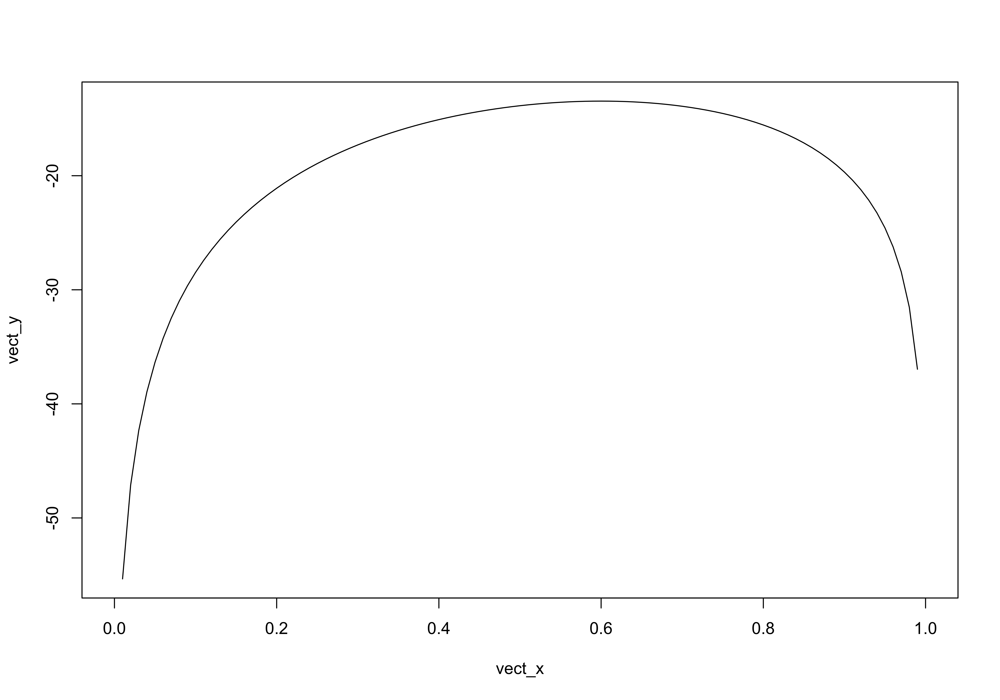

``` r
neglogL = function(theta) -logL(theta)
optim(.5,neglogL)
```

    ## Warning in optim(0.5, neglogL): one-dimensional optimization by Nelder-Mead is unreliable:
    ## use "Brent" or optimize() directly

    ## $par
    ## [1] 0.6
    ## 
    ## $value
    ## [1] 13.46023
    ## 
    ## $counts
    ## function gradient 
    ##       24       NA 
    ## 
    ## $convergence
    ## [1] 0
    ## 
    ## $message
    ## NULL

``` r
y = p20
logL = function(theta) sum(log(dpois(y, lambda = theta)))
vect_x = seq(15,30,by=.01)
vect_y = Vectorize(logL)(vect_x)
plot(vect_x,vect_y,type='l')
```

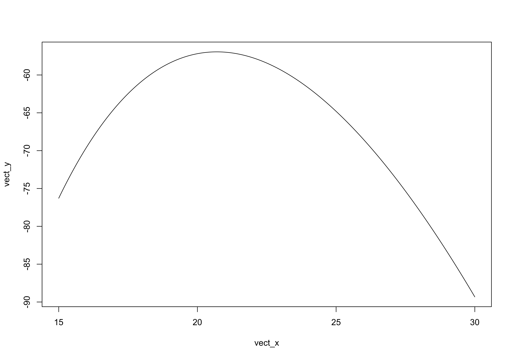

``` r
neglogL = function(theta) -logL(theta)
optim(.5,neglogL)
```

    ## Warning in optim(0.5, neglogL): one-dimensional optimization by Nelder-Mead is unreliable:
    ## use "Brent" or optimize() directly

    ## $par
    ## [1] 20.75
    ## 
    ## $value
    ## [1] 56.94551
    ## 
    ## $counts
    ## function gradient 
    ##       30       NA 
    ## 
    ## $convergence
    ## [1] 0
    ## 
    ## $message
    ## NULL

# Cours 2

``` r
u=runif(10)
hist(runif(1e6))
```

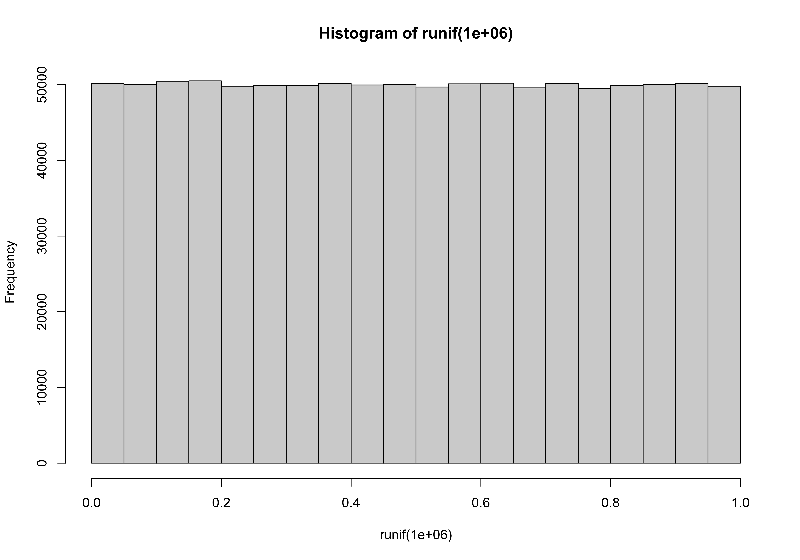

``` r
set.seed(123)
runif(10)
```

    ##  [1] 0.2875775 0.7883051 0.4089769 0.8830174 0.9404673 0.0455565 0.5281055
    ##  [8] 0.8924190 0.5514350 0.4566147

``` r
hist(qnorm(runif(1e5)))
```

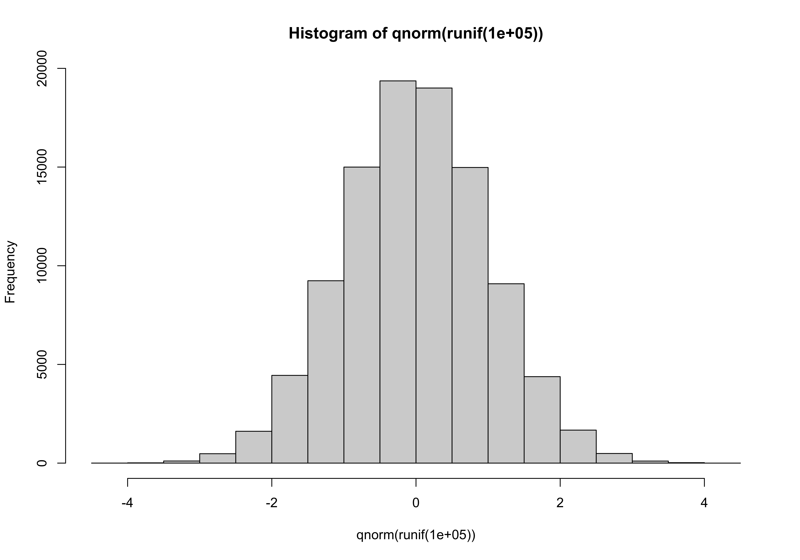

``` r
n = 200
p = 70/100
y = sample(c(0,1),size=n,replace=TRUE,prob = c(1-p,p))
ns = 1e4
vect_y = rep(NA,ns)
for(s in 1:ns) vect_y[s] = mean(sample(c(0,1),size=n,replace=TRUE,prob = c(1-p,p)))
hist(vect_y)
```

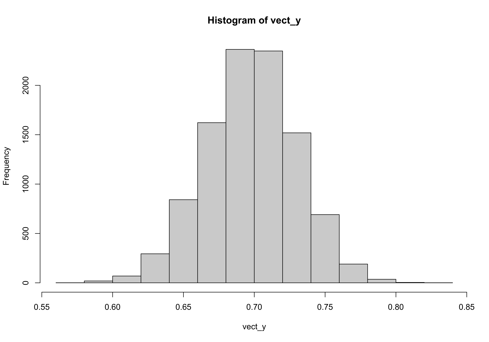

``` r
mean(vect_y)
```

    ## [1] 0.700232

``` r
sd(vect_y)
```

    ## [1] 0.0320724

``` r
sqrt(p*(1-p)/n)
```

    ## [1] 0.0324037

``` r
p + c(-1.96,1.96)*sqrt(p*(1-p)/n)
```

    ## [1] 0.6364887 0.7635113

``` r
n = 200
p = 60/100
y = sample(c(0,1),size=n,replace=TRUE,prob = c(1-p,p))
t.test(y,mu=50/100,alternative = "two.sided")
```

    ## 
    ##  One Sample t-test
    ## 
    ## data:  y
    ## t = 3.1814, df = 199, p-value = 0.0017
    ## alternative hypothesis: true mean is not equal to 0.5
    ## 95 percent confidence interval:
    ##  0.5418183 0.6781817
    ## sample estimates:
    ## mean of x 
    ##      0.61

``` r
(mean(y)-50/100)/sqrt(mean(y)*(1-mean(y))/n)
```

    ## [1] 3.189411

``` r
M=matrix(c(1,.5,.5,1),2,2)
M %*% solve(M)
```

    ##      [,1] [,2]
    ## [1,]    1    0
    ## [2,]    0    1

``` r
chol(M)
```

    ##      [,1]      [,2]
    ## [1,]    1 0.5000000
    ## [2,]    0 0.8660254

# Cours 3

``` r
r = .7
n  = 50000
z1 = rnorm(n)
z2 = rnorm(n)
Z = cbind(z1,z2)
cor(Z)
```

    ##              z1           z2
    ## z1  1.000000000 -0.001707962
    ## z2 -0.001707962  1.000000000

``` r
S = matrix(c(1,r,r,1),2,2)
A = chol(S)
X =  Z %*% (A) 
cor(X)
```

    ##           [,1]      [,2]
    ## [1,] 1.0000000 0.6981041
    ## [2,] 0.6981041 1.0000000

``` r
plot(X[1:1000,])
```

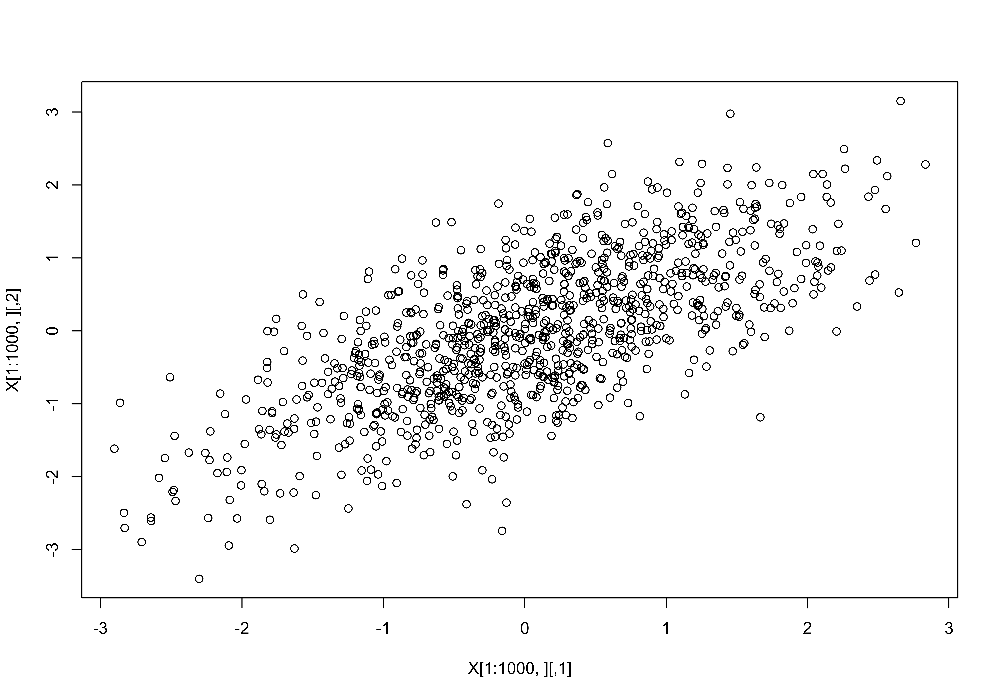

``` r
x1=X[,1]
x2=X[,2]
hist(x1,prob=TRUE)
curve(dnorm,from = -5,to=+5,add=TRUE,col="red")
```

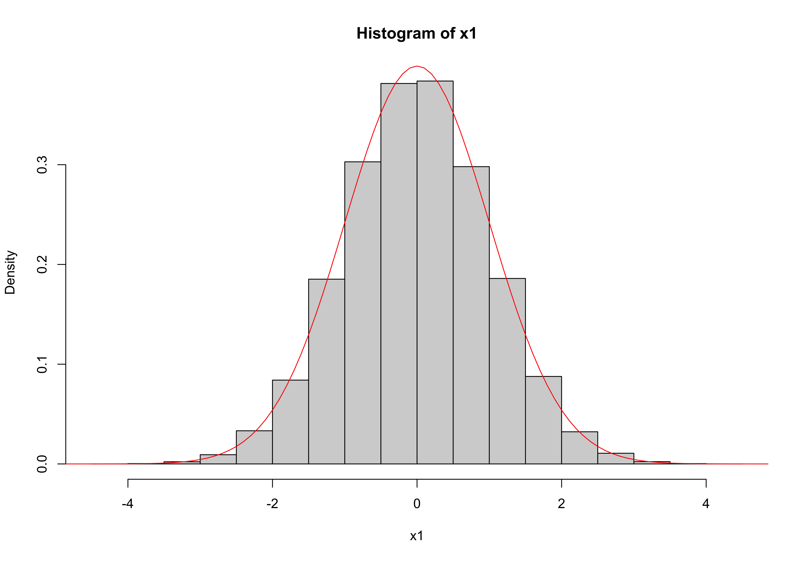

``` r
plot(X[1:1000,],col="light blue")
idx = (x1>(-.1)&x1<(.1))
points(X[idx,],col="blue")
boxplot(x2[idx],at=.5,add=TRUE,col="blue")
```

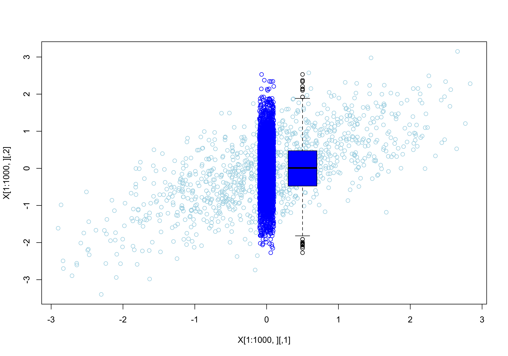

``` r
x20 = x2[idx]
hist(x20,prob=TRUE)
curve(dnorm,from = -5,to=+5,add=TRUE,col="red")
mean(x20)
```

    ## [1] 0.00293001

``` r
var(x20)
```

    ## [1] 0.5177875

``` r
curve(dnorm(x,0,sqrt(1-r^2)),from = -5,to=+5,add=TRUE,col="dark green")
```

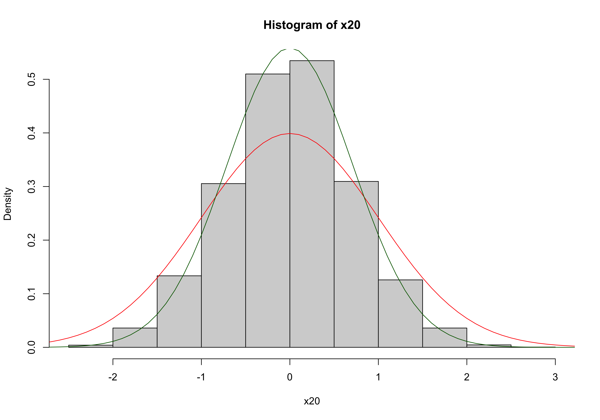

``` r
plot(X[1:1000,],col="light blue")
idx = (x1>(1.35)&x1<(1.65))
points(X[idx,],col="blue")
abline(a=0,b=r)
boxplot(x2[idx],at=.5,add=TRUE,col="blue")
```

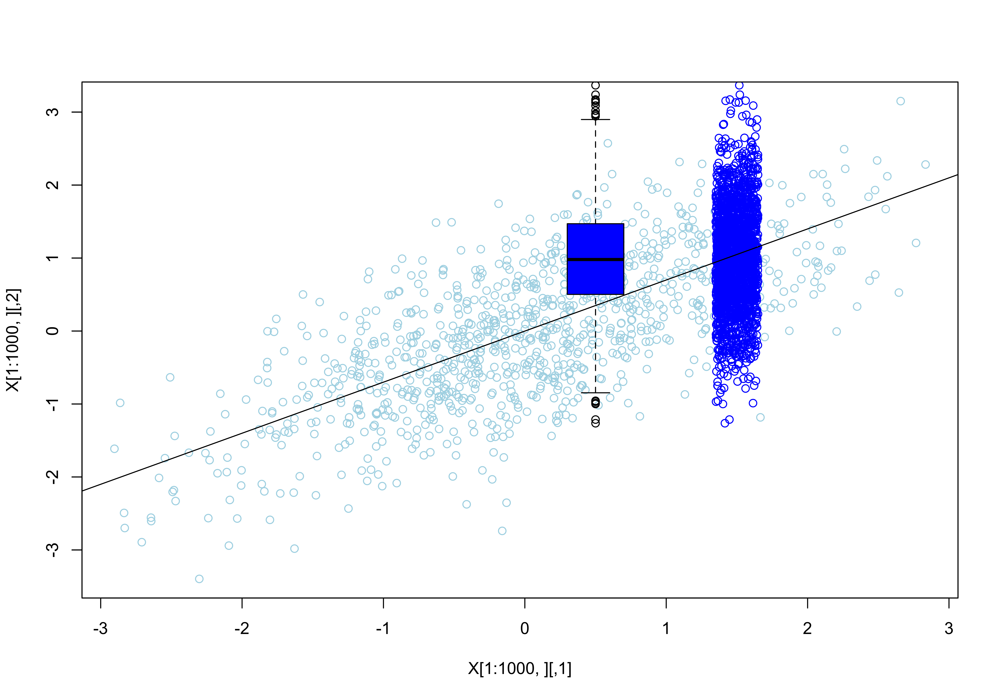

``` r
x215 = x2[idx]
hist(x215,prob=TRUE)
curve(dnorm,from = -5,to=+5,add=TRUE,col="red")
mean(x215)
```

    ## [1] 0.9907196

``` r
var(x215)
```

    ## [1] 0.5017547

``` r
curve(dnorm(x,mean(x215),sd(x215)),from = -5,to=+5,add=TRUE,col="dark green")
```

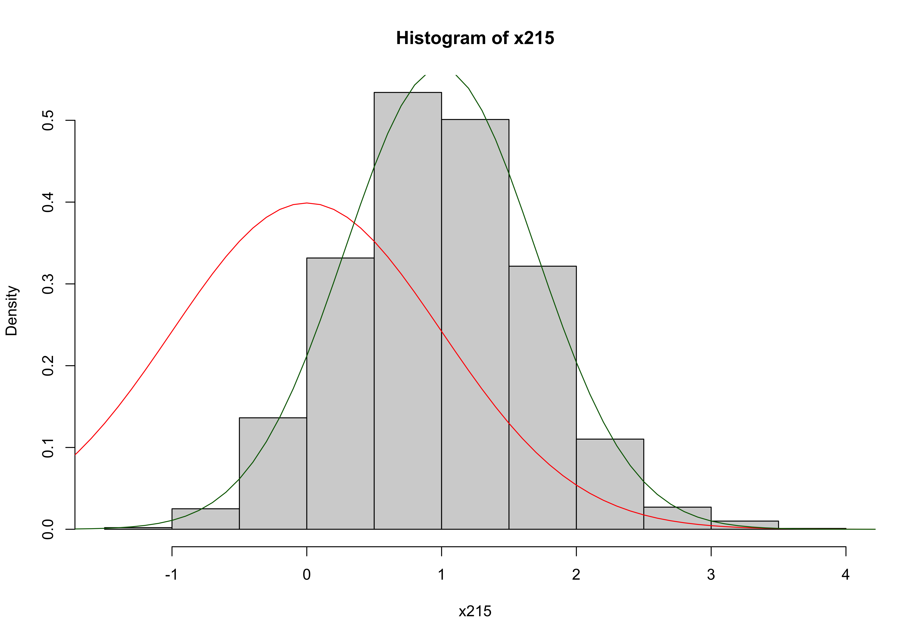
