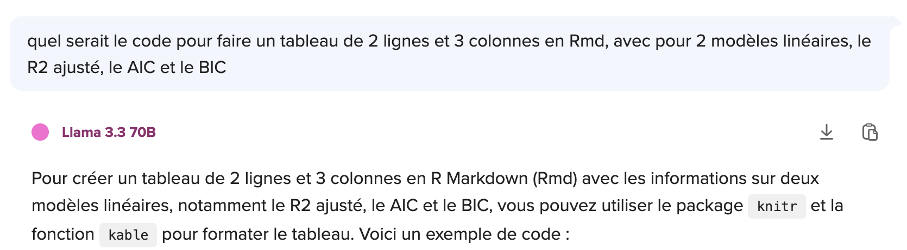
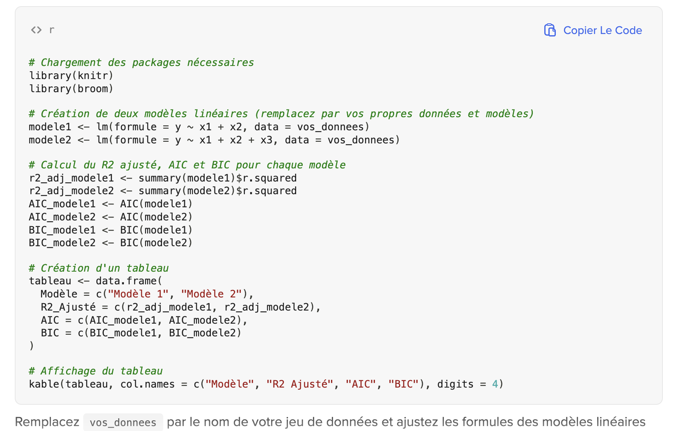

STT5100 Devoir 1 Hiver 2025
================

``` r
code_permanent = "ABCD12345678"
loc_fichier = paste("http://freakonometrics.free.fr/STT5100/base_STT5100_H2025_Devoir1_",code_permanent,".RData",sep="")
download.file(loc_fichier, "base_devoir_1.RData")
load("base_devoir_1.RData")
tail(base_STT5100_H2025_1)
```

    ##   surface nb_chambres nb_sdb annee_construction terrain garage voisinage
    ## 1    1360           2      1               1981      60      0         5
    ## 2    4272           3      3               2016     475      1         6
    ## 3    3592           1      2               2016     363      0         9
    ## 4     966           1      2               1977     273      1         8
    ## 5    4926           2      1               1993     470      0         8
    ## 6    3944           5      3               1990     248      2         8
    ##      prix code_postal etage renovation
    ## 1  262383         NW1     3       1993
    ## 2  985261         SE1     3       2016
    ## 3  777977         SW3     3       2016
    ## 4  229699        SW1P     1       1995
    ## 5 1041741         NW8     1       1993
    ## 6  879797          W9     2       1990

``` r
str(base_STT5100_H2025_1)
```

    ## 'data.frame':    6 obs. of  11 variables:
    ##  $ surface           : int  1360 4272 3592 966 4926 3944
    ##  $ nb_chambres       : int  2 3 1 1 2 5
    ##  $ nb_sdb            : int  1 3 2 2 1 3
    ##  $ annee_construction: int  1981 2016 2016 1977 1993 1990
    ##  $ terrain           : num  60 475 363 273 470 248
    ##  $ garage            : int  0 1 0 1 0 2
    ##  $ voisinage         : int  5 6 9 8 8 8
    ##  $ prix              : num  262383 985261 777977 229699 1041741 ...
    ##  $ code_postal       : chr  "NW1" "SE1" "SW3" "SW1P" ...
    ##  $ etage             : num  3 3 3 1 1 2
    ##  $ renovation        : num  1993 2016 2016 1995 1993 ...

Les données sont des prix de maisons, à Londres (UK)

- `prix` : **Variable a expliquer** : prix de la maison
- `surface` : surface
- `nb_chambres` : nombre de chambres
- `nb_sdb` : nombre de salle de bain
- `annee_construction` : année de construction
- `terrain` : surface du terrain
- `garage` : nombre de garages
- `voisinage` : note du voisinage (1-10)
- `code_postal` : code postal de la maison
- `etage` : nombre d’étages dans la maison
- `renovation` : année de la dernière rénovation

Le but du devoir est de mettre en oeuvre, sur des vraies données, les techniques présentées en cours.

*   Date limite pour déposer le devoir **mardi 11 mars 2025** à **midi (12:00)** sur Moodle (l'onglet fermera à midi),
*   Chaque etudiant(e) doit déposer sur l’espace dédié, sur [Moodle](https://ena01.uqam.ca/mod/assign/view.php?id=4557039),
    deux fichiers : `devoir1-ABCD12345678.hmtl`, sortie d’un fichier
    `devoir1-ABCD12345678.Rmd` (il faudra envoyer les deux fichiers), où
    `ABCD12345678` doit être remplacé par le code permanent de
    l’étudiant(e). Le fichier `devoir1-ABCD12345678.hmtl` doit etre
    lisible et le fichier `devoir1-ABCD12345678.Rmd` doit compiler sans
    erreur. 
*   Dans le preambule du markdown, `author:` doit mentionner le code
    permanent,
*  Le fichier doit contenir quatre parties

1.  Une partie exploratoire qui presente rapidement les variables qui pourraient etre intéressantes pour prédire ensuite le prix de la maison (pour rappel, `prix` est la variable d’interet)
2.  Une partie presentant la construction d'un modele "simple", par exemple 
    partir au choix (i) d’un modele simple, et de montrer comment
    l’ameliorer, (ii) d’un modele complexe, et de montrer comment le
    simplifier
3.  Une partie proposant une amélioration du modèle, par exemple en transformant une ou plusieurs variables explicatives, en regroupant des variables factorielles, etc
4.  Une partie qui presente rapidement les deux modeles, et qui conclue par un tableau récapitulatif donnant pour deux modèles (ou plus), (i) le R2
    ajusté (ii) l’indice d’Akaike AIC et (iii) l’indice BIC

Parmi les consignes,

* tout test ou toute technique utilisée qui n'a pas été présenté dans le cadre du cours devra être expliquée, motivée, et pointer vers une référence (la commande pour insérer un lien est, e.g. `[Anderson Darling](https://en.wikipedia.org/wiki/Anderson%E2%80%93Darling_test)`). Dans le cas contraire, des points seront enlevés.
* les seuls packages autorises (sauf autorisation explicite) sont `MASS`, `lmtest`, `nortest`, `car`, `splines`, `AER`, `splines`, `Hmisc`, `np`, les packages graphiques `ggplot2` (et éventuellement de couleurs, ou de mise en forme `knitr`, `stargazer`, `DT`, `papeR`, `formattable` etc), de manipulation de données `dplyr`, ainsi que les fonctions de base de `stats`. L'utilisation de tout autre package devra être demandée au préalable. Sinon, des points seront enlevés.
* la forme du document et sa lisibilité interviendront dans la notation. Afficher des sorties R de plusieurs centaines de lignes, par exemple, est à proscrire, ou l'affichage de messages automatiques (*warnings*) est à éviter.
* les rapports sont individuels ! s'il est autorisé de discuter avec d'autres élèves du groupe (en respectant le protocol sanitaire en vigueur), chacun doit rendre son propre rapport. Dans le cas où deux fichiers identiques seraient envoyés par deux élèves différents, les deux élèves seront sanctionnés.





* le fichier html doit être lisible dans un navigateur internet (Firefox) et le code Rmd doit compiler sans erreur. Le préambule du fichier Rmd doit contenir comme auteur le code permanent. Tout fichier qui ne compile pas et/ou qui n'est pas lisible donnera lieu à une forte pénalisation.

Au niveau pratique, pour avoir accès à _vos_ données, vous devez remplacer `"ABCD12345678"` ci-dessus par votre **vrai** code permanent (avec les lettres en majuscules).
