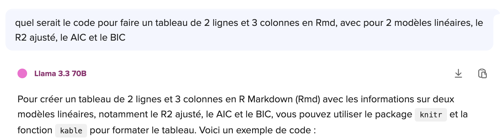
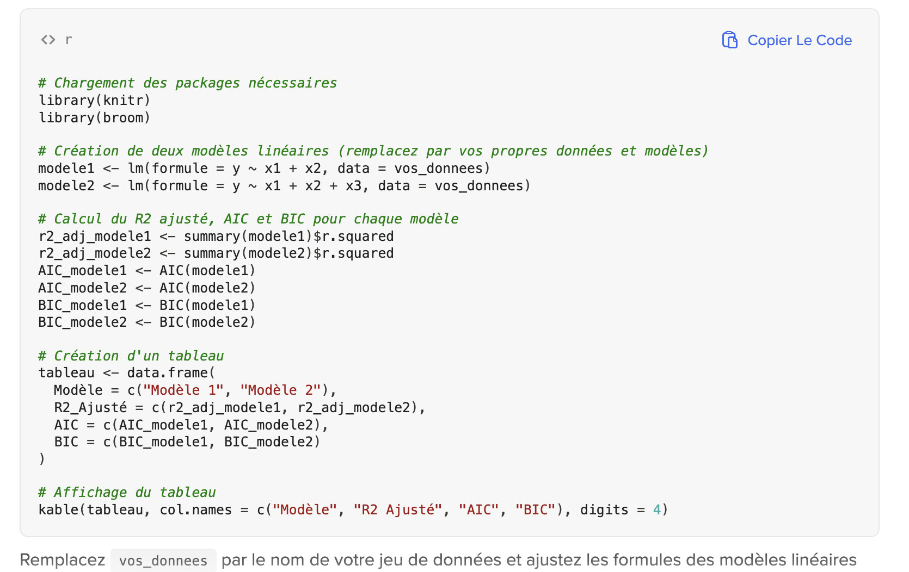

STT5100 Devoir 2 Hiver 2025
================

``` r
code_permanent = "ABCD12345678"
loc_fichier = paste("http://freakonometrics.free.fr/STT5100/base_STT5100_H2025_Devoir2_",code_permanent,".RData",sep="")
download.file(loc_fichier, "base_devoir_2.RData")
load("base_devoir_2.RData")
tail(base_STT5100_H2025_2)
```

    ##   fraude    revenu email_similarite nb_mois age temps_demande payment_type
    ## 1      1 0.8685308        0.6550653     199  70   0.002775998           AC
    ## 2      0 0.1982509        0.7044166      10  30   0.826400181           AC
    ## 3      0 0.8978133        0.7521825      73  20   0.020636228           AB
    ## 4      0 0.3300099        0.5396401     137  40   0.022440745           AA
    ## 5      1 0.7263235        0.7644467      56  50   0.023049073           AB
    ## 6      0 0.5887841        0.8661035      44  30   0.003589341           AC
    ##   zip_compte_4sem activite_6h activite_24h activite_4sem distinct_emails emploi
    ## 1            1403    5724.159     4775.064      4867.410               1     CC
    ## 2            2428   12842.400     6791.232      5496.401               7     CA
    ## 3            2802    9844.447     5028.261      5337.626              24     CA
    ## 4            3935   11531.850     8048.617      5602.788              14     CC
    ## 5            1144    7226.854     4667.367      5008.360               1     CA
    ## 6             665    4037.265     3440.621      5638.649              10     CA
    ##   credit_score logement tel_maison tel_cell banque_mois cartes_autres
    ## 1          276       BA          1        0          -1             0
    ## 2           67       BA          0        1          -1             0
    ## 3          160       BE          0        1          28             0
    ## 4           78       BB          1        1          15             0
    ## 5          234       BB          1        1          31             0
    ## 6          113       BB          0        1          -1             0
    ##   limit_credit etranger   source duree_min OS_ordinateur compte_fraude
    ## 1         2000        0 INTERNET  4.604693       windows             0
    ## 2         1500        0 INTERNET 10.106207         linux             0
    ## 3         1000        0 INTERNET  1.728756         linux             0
    ## 4          200        0 INTERNET  7.377212         linux             0
    ## 5         1500        0 INTERNET  6.791382       windows             0
    ## 6          500        0 INTERNET  6.016655       windows             0

``` r
str(base_STT5100_H2025_2)
```

    ## 'data.frame':    6 obs. of  25 variables:
    ##  $ fraude          : int  1 0 0 0 1 0
    ##  $ revenu          : num  0.869 0.198 0.898 0.33 0.726 ...
    ##  $ email_similarite: num  0.655 0.704 0.752 0.54 0.764 ...
    ##  $ nb_mois         : int  199 10 73 137 56 44
    ##  $ age             : int  70 30 20 40 50 30
    ##  $ temps_demande   : num  0.00278 0.8264 0.02064 0.02244 0.02305 ...
    ##  $ payment_type    : chr  "AC" "AC" "AB" "AA" ...
    ##  $ zip_compte_4sem : int  1403 2428 2802 3935 1144 665
    ##  $ activite_6h     : num  5724 12842 9844 11532 7227 ...
    ##  $ activite_24h    : num  4775 6791 5028 8049 4667 ...
    ##  $ activite_4sem   : num  4867 5496 5338 5603 5008 ...
    ##  $ distinct_emails : int  1 7 24 14 1 10
    ##  $ emploi          : chr  "CC" "CA" "CA" "CC" ...
    ##  $ credit_score    : int  276 67 160 78 234 113
    ##  $ logement        : chr  "BA" "BA" "BE" "BB" ...
    ##  $ tel_maison      : int  1 0 0 1 1 0
    ##  $ tel_cell        : int  0 1 1 1 1 1
    ##  $ banque_mois     : int  -1 -1 28 15 31 -1
    ##  $ cartes_autres   : int  0 0 0 0 0 0
    ##  $ limit_credit    : num  2000 1500 1000 200 1500 500
    ##  $ etranger        : int  0 0 0 0 0 0
    ##  $ source          : chr  "INTERNET" "INTERNET" "INTERNET" "INTERNET" ...
    ##  $ duree_min       : num  4.6 10.11 1.73 7.38 6.79 ...
    ##  $ OS_ordinateur   : chr  "windows" "linux" "linux" "linux" ...
    ##  $ compte_fraude   : int  0 0 0 0 0 0

Les données corresponde à de la détection de transaction frauduleuses

- `fraude` : **Variable a expliquer** : détection d’une fraude (0/1)
- `revenu` : score indiquant un niveau de revenu
- `email_similarite` : similarité email frauduleux
- `nb_mois` : nombre de mois
- `age` : âge
- `temps_demande` : temps d’une demande
- `payment_type` : type de payments
- `zip_compte_4sem` : nombres de ZIP codes sur 4 semaines
- `activite_6h` : activités sur 6 heures
- `activite_24h` : activités sur 24 heures
- `activite_4sem` : activités sur 4 semaines
- `distinct_emails` : courriels
- `emploi` : emploi
- `credit_score` : score de crédit
- `logement` : logement
- `tel_maison` : numéro de téléphone fixe
- `tel_cell` : numéro de cellulaire
- `banque_mois` : banques
- `cartes_autres` : autres cartes de crédit
- `limit_credit` : montant limite du crédit
- `etranger` : étranger
- `source` : source de la fraude
- `duree_min` : durée
- `OS_ordinateur` : type d’OS
- `compte_fraude` : comptage de fraudes passées

Le but du devoir est de mettre en oeuvre, sur des vraies données, les techniques présentées en cours.

*   Date limite pour déposer le devoir **mercredi 30 avril 2025** à **midi (12:00)** sur Moodle (l'onglet fermera à midi),
*   Chaque etudiant(e) doit déposer sur l’espace dédié, sur [Moodle](https://ena01.uqam.ca/mod/assign/view.php?id=4571971),
    deux fichiers : `devoir2-ABCD12345678.hmtl`, sortie d’un fichier
    `devoir3-ABCD12345678.Rmd` (il faudra envoyer les deux fichiers), où
    `ABCD12345678` doit être remplacé par le code permanent de
    l’étudiant(e). Le fichier `devoir3-ABCD12345678.hmtl` doit etre
    lisible et le fichier `devoir3-ABCD12345678.Rmd` doit compiler sans
    erreur. 
*   Dans le preambule du markdown, `author:` doit mentionner le code
    permanent,
*  Le fichier doit contenir quatre parties

1.  Une partie exploratoire qui presente rapidement les variables qui pourraient etre intéressantes pour prédire ensuite la fraude d'une personne (pour rappel, `compte_fraude` est la variable d’interêt à modéliser)
2.  Une partie presentant la construction d'un modèle "simple", par exemple 
    partir au choix (i) d’un modele simple, et de montrer comment
    l’ameliorer, (ii) d’un modele complexe, et de montrer comment le
    simplifier
3.  Une partie proposant une amélioration du modèle, par exemple en transformant une ou plusieurs variables explicatives, en regroupant des variables factorielles, etc
4.  Une partie qui presente rapidement les deux modèles, avec une première sous-partie plus visuelle, montrant les courbes ROC, et qui conclue par un tableau récapitulatif donnant pour deux modèles (ou plus), (i) le AUC (ii) l’indice d’Akaike AIC et (iii) l’indice BIC

Parmi les consignes,

* tout test ou toute technique utilisée qui n'a pas été présenté dans le cadre du cours devra être expliquée, motivée, et pointer vers une référence (la commande pour insérer un lien est, e.g. `[Anderson Darling](https://en.wikipedia.org/wiki/Anderson%E2%80%93Darling_test)`). Dans le cas contraire, des points seront enlevés.
* les seuls packages autorises (sauf autorisation explicite) sont `MASS`, `lmtest`, `nortest`, `car`, `splines`, `AER`, `splines`, `Hmisc`, `np`, `pROC`, `ROCR` ou `ROCit`, les packages graphiques `ggplot2` (et éventuellement de couleurs, ou de mise en forme `knitr`, `stargazer`, `DT`, `papeR`, `formattable` etc) ou `plotROC`, de manipulation de données `dplyr`, ainsi que les fonctions de base de `stats`. L'utilisation de tout autre package devra être demandée au préalable. Sinon, des points seront enlevés.
* la forme du document et sa lisibilité interviendront dans la notation. Afficher des sorties R de plusieurs centaines de lignes, par exemple, est à proscrire, ou l'affichage de messages automatiques (*warnings*) est à éviter.
* les rapports sont individuels ! s'il est autorisé de discuter avec d'autres élèves du groupe (en respectant le protocol sanitaire en vigueur), chacun doit rendre son propre rapport. Dans le cas où deux fichiers identiques seraient envoyés par deux élèves différents, les deux élèves seront sanctionnés.
* l'utilisation de GPT, Llama, etc est autorisée, voire recommandée, en particulier pour générer des graphiques ou des tableaux plus jolis à lire. Eg, [Llama via duckduckgo](https://duckduckgo.com/?q=quel%20serait%20le%20code%20pour%20faire%20un%20tableau%20de%202%20lignes%20et%203%20colonnes%20en%20Rmd%2C%20avec%20pour%202%20mod%C3%A8les%20lin%C3%A9aires%2C%20le%20R2%20ajust%C3%A9%2C%20le%20AIC%20et%20le%20BIC&t=newext&atb=v418-1&ia=chat)





* le fichier html doit être lisible dans un navigateur internet (Firefox) et le code Rmd doit compiler sans erreur. Le préambule du fichier Rmd doit contenir comme auteur le code permanent. Tout fichier qui ne compile pas et/ou qui n'est pas lisible donnera lieu à une forte pénalisation.

Au niveau pratique, pour avoir accès à _vos_ données, vous devez remplacer `"ABCD12345678"` ci-dessus par votre **vrai** code permanent (avec les lettres en majuscules).
