``` r
loc_fichier = "http://freakonometrics.free.fr/titanic.RData"
download.file(loc_fichier, "titanic.RData")
load("titanic.RData")
str(base)
```

    ## 'data.frame':    891 obs. of  8 variables:
    ##  $ Survived: int  0 1 1 1 0 0 0 0 1 1 ...
    ##  $ Pclass  : Factor w/ 3 levels "1","2","3": 3 1 3 1 3 3 1 3 3 2 ...
    ##  $ Sex     : Factor w/ 2 levels "female","male": 2 1 1 1 2 2 2 2 1 1 ...
    ##  $ Age     : num  22 38 26 35 35 NA 54 2 27 14 ...
    ##  $ SibSp   : int  1 1 0 1 0 0 0 3 0 1 ...
    ##  $ Parch   : int  0 0 0 0 0 0 0 1 2 0 ...
    ##  $ Embarked: Factor w/ 4 levels "","C","Q","S": 4 2 4 4 4 3 4 4 4 2 ...
    ##  $ Name    : Factor w/ 893 levels "Abbing, Mr. Anthony",..: 109 191 358 277 16 559 520 629 417 581 ...

``` r
base = base[,1:7]

mean(base$Survived)
```

    ## [1] 0.3838384

``` r
table(base$Survived)/nrow(base)
```

    ## 
    ##         0         1 
    ## 0.6161616 0.3838384

``` r
glm(Survived~1, family=binomial,data=base)
```

    ## 
    ## Call:  glm(formula = Survived ~ 1, family = binomial, data = base)
    ## 
    ## Coefficients:
    ## (Intercept)  
    ##     -0.4733  
    ## 
    ## Degrees of Freedom: 890 Total (i.e. Null);  890 Residual
    ## Null Deviance:       1187 
    ## Residual Deviance: 1187  AIC: 1189

``` r
predict(glm(Survived~1, family=binomial,
            data=base), type="response")[1]
```

    ##         1 
    ## 0.3838384

``` r
## - binaire

mean(base$Survived[base$Sex=="female"])
```

    ## [1] 0.7420382

``` r
mean(base$Survived[base$Sex=="male"])
```

    ## [1] 0.1889081

``` r
summary(glm(Survived~Sex, family=binomial,data=base))
```

    ## 
    ## Call:
    ## glm(formula = Survived ~ Sex, family = binomial, data = base)
    ## 
    ## Deviance Residuals: 
    ##     Min       1Q   Median       3Q      Max  
    ## -1.6462  -0.6471  -0.6471   0.7725   1.8256  
    ## 
    ## Coefficients:
    ##             Estimate Std. Error z value Pr(>|z|)    
    ## (Intercept)   1.0566     0.1290   8.191 2.58e-16 ***
    ## Sexmale      -2.5137     0.1672 -15.036  < 2e-16 ***
    ## ---
    ## Signif. codes:  0 '***' 0.001 '**' 0.01 '*' 0.05 '.' 0.1 ' ' 1
    ## 
    ## (Dispersion parameter for binomial family taken to be 1)
    ## 
    ##     Null deviance: 1186.7  on 890  degrees of freedom
    ## Residual deviance:  917.8  on 889  degrees of freedom
    ## AIC: 921.8
    ## 
    ## Number of Fisher Scoring iterations: 4

``` r
predict(glm(Survived~Sex, family=binomial,
            data=base), type="response")[1:2]
```

    ##         1         2 
    ## 0.1889081 0.7420382

``` r
chisq.test(table(base$Survived,base$Sex))
```

    ## 
    ##  Pearson's Chi-squared test with Yates' continuity correction
    ## 
    ## data:  table(base$Survived, base$Sex)
    ## X-squared = 260.72, df = 1, p-value < 2.2e-16

``` r
chisq.test(table(base$Survived,base$Sex))
```

    ## 
    ##  Pearson's Chi-squared test with Yates' continuity correction
    ## 
    ## data:  table(base$Survived, base$Sex)
    ## X-squared = 260.72, df = 1, p-value < 2.2e-16

``` r
chisq.test(table(base$Survived,base$Sex))$residuals
```

    ##    
    ##        female      male
    ##   0 -8.086170  5.965128
    ##   1 10.245095 -7.557757

``` r
library("graphics")
mosaicplot(table(base$Sex,base$Survived), shade = TRUE, las=2)
library("vcd")
```

    ## Loading required package: grid

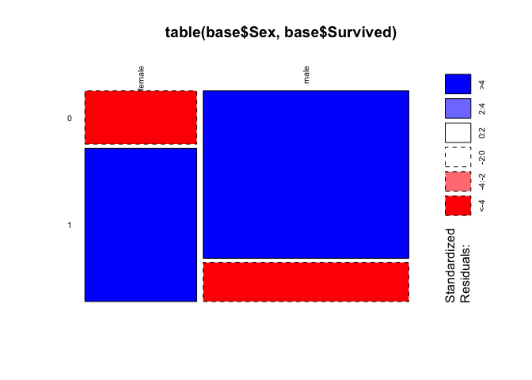<!-- -->

``` r
assoc(table(base$Survived,base$Sex), shade = TRUE, las=3)
```

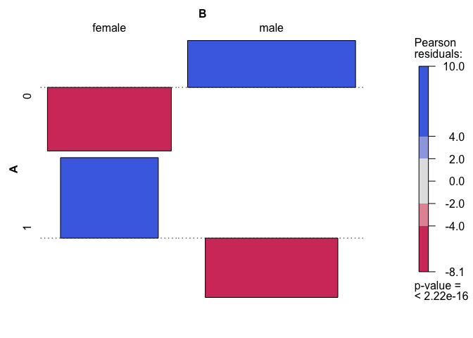<!-- -->

``` r
#

base$EmbarkedA = as.factor(as.character(base$Embarked))
levels(base$EmbarkedA) = c("other","other","other","S")

mean(base$Survived[base$EmbarkedA=="S"])
```

    ## [1] 0.3369565

``` r
mean(base$Survived[base$EmbarkedA=="other"])
```

    ## [1] 0.5060729

``` r
summary(glm(Survived~EmbarkedA, family=binomial,data=base))
```

    ## 
    ## Call:
    ## glm(formula = Survived ~ EmbarkedA, family = binomial, data = base)
    ## 
    ## Deviance Residuals: 
    ##     Min       1Q   Median       3Q      Max  
    ## -1.1877  -0.9065  -0.9065   1.1671   1.4750  
    ## 
    ## Coefficients:
    ##             Estimate Std. Error z value Pr(>|z|)    
    ## (Intercept)  0.02429    0.12727   0.191    0.849    
    ## EmbarkedAS  -0.70118    0.15214  -4.609 4.05e-06 ***
    ## ---
    ## Signif. codes:  0 '***' 0.001 '**' 0.01 '*' 0.05 '.' 0.1 ' ' 1
    ## 
    ## (Dispersion parameter for binomial family taken to be 1)
    ## 
    ##     Null deviance: 1186.7  on 890  degrees of freedom
    ## Residual deviance: 1165.4  on 889  degrees of freedom
    ## AIC: 1169.4
    ## 
    ## Number of Fisher Scoring iterations: 4

``` r
predict(glm(Survived~Sex, family=binomial,
            data=base), type="response")[1:2]
```

    ##         1         2 
    ## 0.1889081 0.7420382

``` r
chisq.test(table(base$Survived,base$EmbarkedA))
```

    ## 
    ##  Pearson's Chi-squared test with Yates' continuity correction
    ## 
    ## data:  table(base$Survived, base$EmbarkedA)
    ## X-squared = 20.88, df = 1, p-value = 4.89e-06

``` r
library("graphics")
mosaicplot(table(base$EmbarkedA,base$Survived), shade = TRUE, las=2)
```

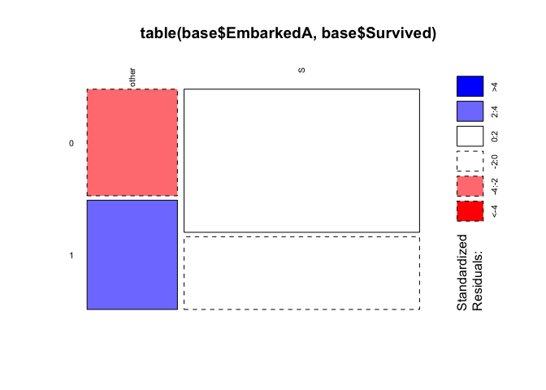<!-- -->

``` r
library("vcd")
assoc(table(base$Survived,base$EmbarkedA), shade = TRUE, las=3)
```

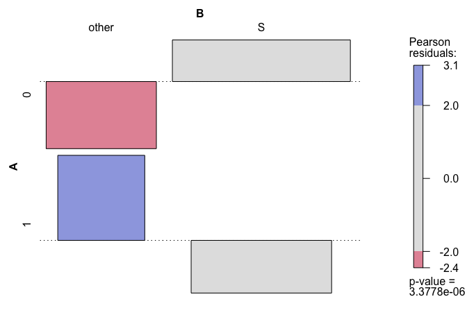<!-- -->

``` r
prop.test(x = as.numeric(table(base$EmbarkedA[base$Survived==1])),
          n = as.numeric(table(base$EmbarkedA)))
```

    ## 
    ##  2-sample test for equality of proportions with continuity correction
    ## 
    ## data:  as.numeric(table(base$EmbarkedA[base$Survived == 1])) out of as.numeric(table(base$EmbarkedA))
    ## X-squared = 20.88, df = 1, p-value = 4.89e-06
    ## alternative hypothesis: two.sided
    ## 95 percent confidence interval:
    ##  0.09406455 0.24416816
    ## sample estimates:
    ##    prop 1    prop 2 
    ## 0.5060729 0.3369565

``` r
res <- aov(Survived ~ EmbarkedA, data = base)
summary(res)
```

    ##              Df Sum Sq Mean Sq F value   Pr(>F)    
    ## EmbarkedA     1   5.11   5.106   22.07 3.04e-06 ***
    ## Residuals   889 205.62   0.231                     
    ## ---
    ## Signif. codes:  0 '***' 0.001 '**' 0.01 '*' 0.05 '.' 0.1 ' ' 1

``` r
## - multiple

mean(base$Survived[base$Pclass=="1"])
```

    ## [1] 0.6296296

``` r
glm(Survived~Pclass, family=binomial,data=base)
```

    ## 
    ## Call:  glm(formula = Survived ~ Pclass, family = binomial, data = base)
    ## 
    ## Coefficients:
    ## (Intercept)      Pclass2      Pclass3  
    ##      0.5306      -0.6394      -1.6704  
    ## 
    ## Degrees of Freedom: 890 Total (i.e. Null);  888 Residual
    ## Null Deviance:       1187 
    ## Residual Deviance: 1083  AIC: 1089

``` r
reg=glm(Survived~Pclass, family=binomial,data=base)
predict(reg,newdata=data.frame(Pclass="1"),type="response")
```

    ##         1 
    ## 0.6296296

``` r
chisq.test(table(base$Survived,base$Pclass))
```

    ## 
    ##  Pearson's Chi-squared test
    ## 
    ## data:  table(base$Survived, base$Pclass)
    ## X-squared = 102.89, df = 2, p-value < 2.2e-16

``` r
chisq.test(table(base$Survived,base$Pclass))$residuals
```

    ##    
    ##             1         2         3
    ##   0 -4.601993 -1.537771  3.993703
    ##   1  5.830678  1.948340 -5.059981

``` r
library("graphics")
mosaicplot(table(base$Pclass,base$Survived), shade = TRUE, las=2)
```

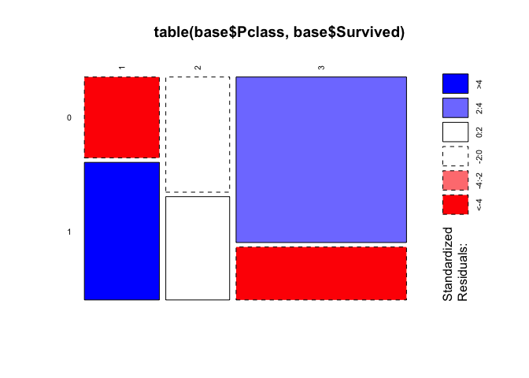<!-- -->

``` r
library("vcd")
assoc(table(base$Survived,base$Pclass), shade = TRUE, las=3)
```

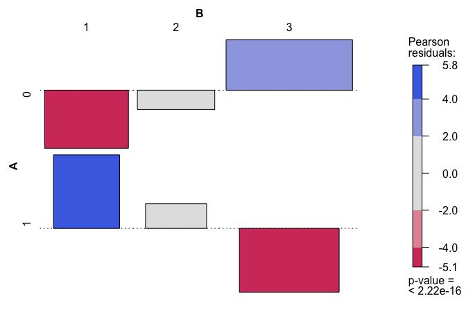<!-- -->

``` r
res <- aov(Survived ~ Pclass, data = base)
summary(res)
```

    ##              Df Sum Sq Mean Sq F value Pr(>F)    
    ## Pclass        2  24.33   12.17   57.97 <2e-16 ***
    ## Residuals   888 186.39    0.21                   
    ## ---
    ## Signif. codes:  0 '***' 0.001 '**' 0.01 '*' 0.05 '.' 0.1 ' ' 1

``` r
## continu

base = base[!is.na(base$Age),]

mean(base$Age[base$Survived==1])
```

    ## [1] 28.34369

``` r
mean(base$Age[base$Survived==0])
```

    ## [1] 30.62618

``` r
boxplot(base$Age~ base$Survived)
```

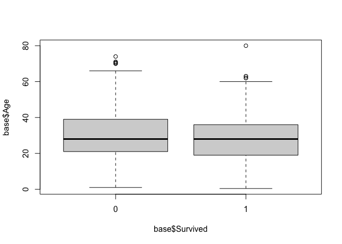<!-- -->

``` r
summary(glm(Survived~Age, family=binomial,data=base))
```

    ## 
    ## Call:
    ## glm(formula = Survived ~ Age, family = binomial, data = base)
    ## 
    ## Deviance Residuals: 
    ##     Min       1Q   Median       3Q      Max  
    ## -1.1488  -1.0361  -0.9544   1.3159   1.5908  
    ## 
    ## Coefficients:
    ##             Estimate Std. Error z value Pr(>|z|)  
    ## (Intercept) -0.05672    0.17358  -0.327   0.7438  
    ## Age         -0.01096    0.00533  -2.057   0.0397 *
    ## ---
    ## Signif. codes:  0 '***' 0.001 '**' 0.01 '*' 0.05 '.' 0.1 ' ' 1
    ## 
    ## (Dispersion parameter for binomial family taken to be 1)
    ## 
    ##     Null deviance: 964.52  on 713  degrees of freedom
    ## Residual deviance: 960.23  on 712  degrees of freedom
    ## AIC: 964.23
    ## 
    ## Number of Fisher Scoring iterations: 4

``` r
t.test(x=base$Age[base$Survived==0], 
       y=base$Age[base$Survived==1], alternative = "two.sided", var.equal = FALSE)
```

    ## 
    ##  Welch Two Sample t-test
    ## 
    ## data:  base$Age[base$Survived == 0] and base$Age[base$Survived == 1]
    ## t = 2.046, df = 598.84, p-value = 0.04119
    ## alternative hypothesis: true difference in means is not equal to 0
    ## 95 percent confidence interval:
    ##  0.09158472 4.47339446
    ## sample estimates:
    ## mean of x mean of y 
    ##  30.62618  28.34369

``` r
# ks.test(base$Age[base$Survived==0],base$Age[base$Survived==1])

res <- aov(Age ~ Survived, data = base)
summary(res)
```

    ##              Df Sum Sq Mean Sq F value Pr(>F)  
    ## Survived      1    897   897.2   4.271 0.0391 *
    ## Residuals   712 149559   210.1                 
    ## ---
    ## Signif. codes:  0 '***' 0.001 '**' 0.01 '*' 0.05 '.' 0.1 ' ' 1
    
    ``` r
plot(base$Age,base$Survived)
va = 0:100
reg = glm(Survived~Age+Pclass, family=binomial,data=base)
vy1 = predict(reg, newdata=data.frame(Age = va,
                                     Pclass = '1'),
             type='response')
lines(va,vy1,col='red')
vy2 = predict(reg, newdata=data.frame(Age = va,
                                     Pclass = '2'),
             type='response')
lines(va,vy2,col='dark blue')
vy3 = predict(reg, newdata=data.frame(Age = va,
                                     Pclass = '3'),
             type='response')
lines(va,vy3,col='dark green')
```

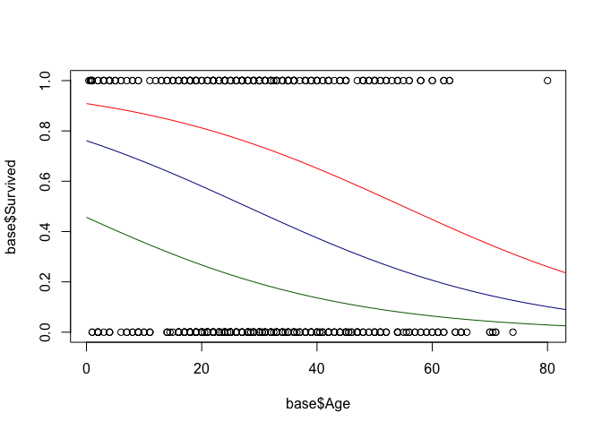<!-- -->

``` r
reg = glm(Survived~Age, family=binomial,data=base)
plot(base$Age,base$Survived)
vy = predict(reg, newdata=data.frame(Age = va),
             type='response')
lines(va,vy,col='red')
```

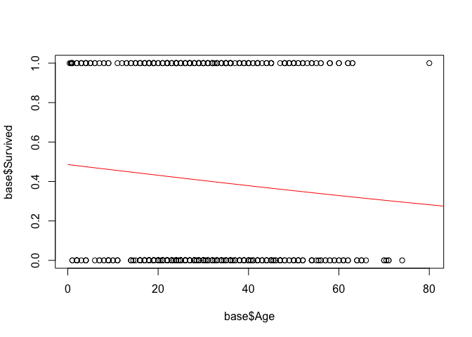<!-- -->

``` r
base = base[!is.na(base$Age),]
reg = glm(Survived~Sex+Pclass+Age+SibSp, family=binomial,data=base)
yhat = predict(reg,type='response')
ROC = function(seuil = .50){ 
survie = (yhat>seuil)*1
B = data.frame(Y = base$Survived,
               Yhat = survie,
               proba = yhat)
T = table(B$Yhat,B$Y)
fpr = T[2,1]/sum(T[,1])
tpr = T[2,2]/sum(T[,2])
return(c(fpr=fpr,tpr=tpr))
}
V=Vectorize(ROC)(seq(.1,.95,by=.01))

# install.packages("ROCR")
library(ROCR)
yhat = predict(reg,type='response')
  B = data.frame(Y = base$Survived,
                 proba = yhat)
p = prediction(B$proba,B$Y)
plot(performance(p,'tpr','fpr'))
```

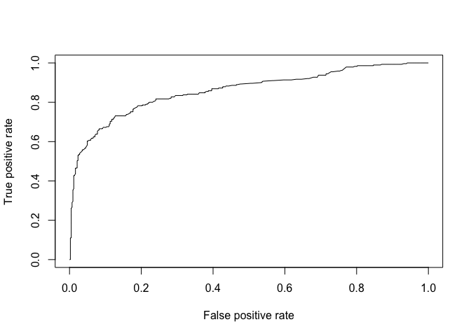<!-- -->

``` r
performance(p, measure = "auc")@y.values[[1]] # AUC
```

    ## [1] 0.8593526

``` r
reg0 = glm(Survived~Pclass, family=binomial,data=base)
yhat0 = predict(reg0,type='response')
  B = data.frame(Y = base$Survived,
                 proba = yhat0)
p = prediction(B$proba,B$Y)
plot(performance(p,'tpr','fpr'))
```

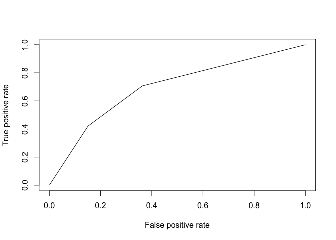<!-- -->

``` r
performance(p, measure = "auc")@y.values[[1]] # AUC
```

    ## [1] 0.6948926

``` r
reg0 = glm(Survived~1, family=binomial,data=base)
yhat0 = predict(reg0,type='response')
  B = data.frame(Y = base$Survived,
                 proba = yhat0)
p = prediction(B$proba,B$Y)
plot(performance(p,'tpr','fpr'))
```

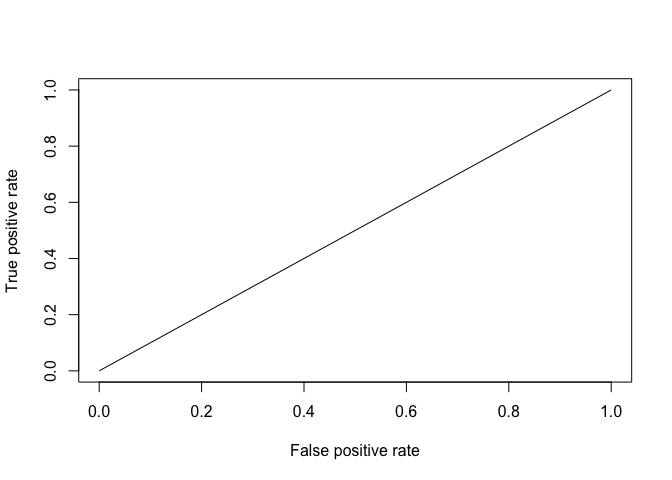<!-- -->

``` r
performance(p, measure = "auc")@y.values[[1]] # AUC
```

    ## [1] 0.5
