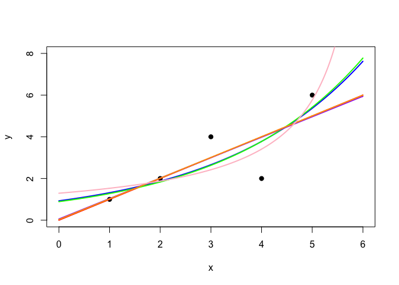

Code GLM (1)
================
Arthur Charpentier

``` r
x = c(1,2,3,4,5)
y = c(1,2,4,2,6)
 plot(x,y,pch=19,xlim=c(0,6),ylim=c(0,8))
 base = data.frame(x=x, y=y)
 reg = lm(y ~ x, data=base)
 summary(reg)
```

    ## 
    ## Call:
    ## lm(formula = y ~ x, data = base)
    ## 
    ## Residuals:
    ##          1          2          3          4          5 
    ## -5.551e-17  2.049e-16  1.000e+00 -2.000e+00  1.000e+00 
    ## 
    ## Coefficients:
    ##              Estimate Std. Error t value Pr(>|t|)
    ## (Intercept) 1.986e-15  1.483e+00   0.000    1.000
    ## x           1.000e+00  4.472e-01   2.236    0.111
    ## 
    ## Residual standard error: 1.414 on 3 degrees of freedom
    ## Multiple R-squared:  0.625,  Adjusted R-squared:    0.5 
    ## F-statistic:     5 on 1 and 3 DF,  p-value: 0.1114

``` r
 nbase = data.frame(x=seq(0,6,by=.01))
 y1 = predict(reg,newdata = nbase)
 lines(nbase$x,y1,col='red')
 reg2 = glm(y ~ x, data=base, family = gaussian(link = 'identity'))
 y2 = predict(reg2,newdata = nbase)
 lines(nbase$x,y2,col='red',lwd=2)
 reg3 = glm(y ~ x, data=base, family = poisson(link = 'log'))
 y3 = predict(reg3,newdata = nbase, type='response')
 lines(nbase$x,y3,col='blue',lwd=2)
 reg4 = glm(y ~ x, data=base, family = gaussian(link = 'log'))
 y4 = predict(reg4,newdata = nbase, type='response')
 lines(nbase$x,y4,col='green',lwd=2)
 reg5 = glm(y ~ x, data=base, family = poisson(link = 'identity'))
 y5 = predict(reg5,newdata = nbase, type='response')
 lines(nbase$x,y5,col='purple',lwd=2)
 reg6 = glm(y ~ x, data=base, family = Gamma(link = 'identity'))
 y6 = predict(reg6,newdata = nbase, type='response')
 lines(nbase$x,y6,col='orange',lwd=2)
 reg7 = glm(y ~ x, data=base, family = Gamma)
 y7 = predict(reg7,newdata = nbase, type='response')
 lines(nbase$x,y7,col='pink',lwd=2)
```

<!-- -->
